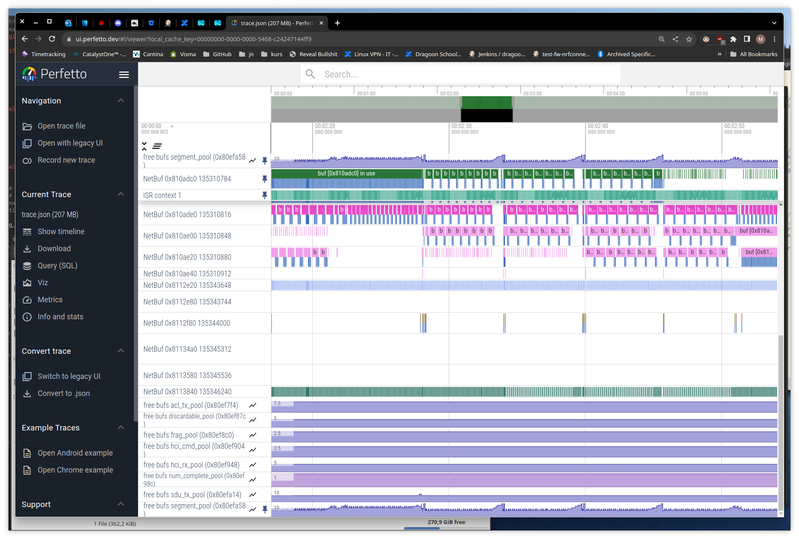
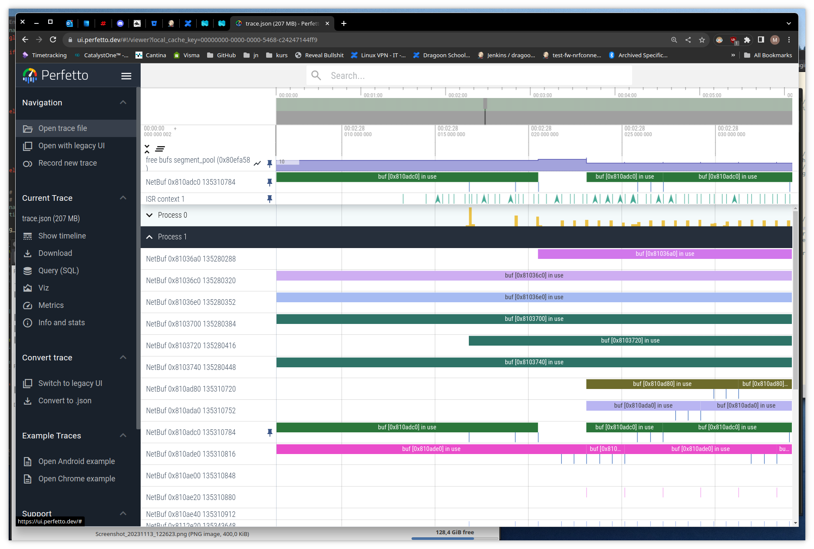
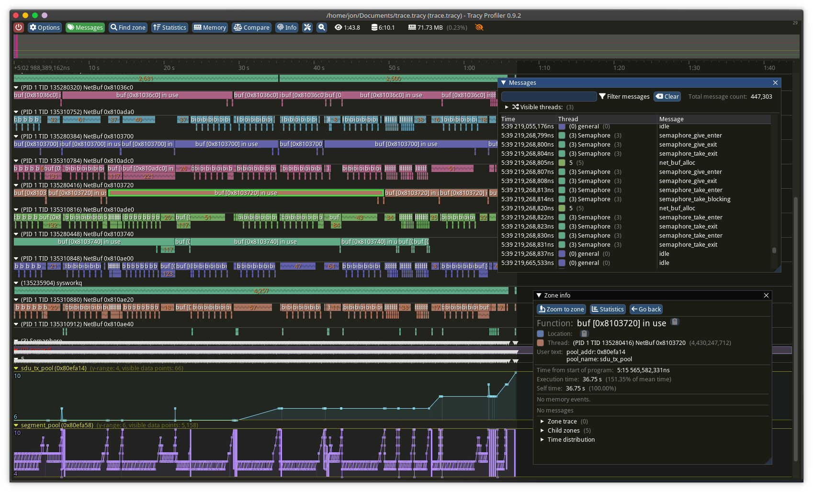

This post is an experiment in collecting and displaying trace data from a device running Zephyr RTOS.

<!--more-->

The Zephyr RTOS has [a tracing subsystem](https://docs.zephyrproject.org/latest/services/tracing/index.html) intended to collect kernel events at runtime.
It provides a littany of points on which a "tracing backend" can hook into. There are a few that are well integrated, for example [Segger SystemView](https://www.segger.com/products/development-tools/systemview/) and [TraceAlyzer](https://percepio.com/tracealyzer/).

There is a third one, called [CTF](https://barectf.org/docs/barectf/3.1/how-barectf-works/ctf-primer.html) (Common Trace Format), and that will be the subject of today's blog post.

This post brought to you by:
- The [babblesim framework](https://babblesim.github.io/), a joy to work with every day
- Innovation time (TM), which is 2 days per sprint where we can experiment with random stuff at work

The goal will be to collect and display trace data about network buffers graphically (think logic analyzer UI).

**TLDR: Skip to the end for some videos/screenshots and see [my ctf2ctf branch](https://github.com/jori-nordic/zephyr/commits/ctf2ctf) for the code backing this post.**

Table of contents
-----------------



## Common Tracing Format and netbuf events

I will refer to [my previous blog post](../2022-10-10/#zephyrlinux-ctf) for an introduction on CTF usage in Zephyr.

Here we want to add events to cover the allocation, reference counting and destruction of network buffers.
We want to be able to visualize alongside scheduler (ie ISRs, active threads) buffer utilization in order to identify starvation or other performance issues.

Feel free to skip this section if you're only interested in the visualization.

### Adding the hooks

We add hooks for these events:
- [allocation](https://github.com/jori-nordic/zephyr/blob/7d97f7e93c83fe060da6fe218740b68c3c40acfc/subsys/net/buf.c#L314-L323) / [destruction](https://github.com/jori-nordic/zephyr/blob/7d97f7e93c83fe060da6fe218740b68c3c40acfc/subsys/net/buf.c#L405-L413).
- [increasing](https://github.com/jori-nordic/zephyr/blob/7d97f7e93c83fe060da6fe218740b68c3c40acfc/subsys/net/buf.c#L534) / [decreasing](https://github.com/jori-nordic/zephyr/blob/7d97f7e93c83fe060da6fe218740b68c3c40acfc/subsys/net/buf.c#L496) the reference count

For allocation, we track the pool name, the number of buffers left in it and the buffer address.
For refs, we only track the buffer address and the number of current refs.

### Adding the events & CTF formatter

We are mostly interested in a proof of concept, so we skip good manners and define the event hooks only for the CTF backend, in [tracing_ctf.h](https://github.com/jori-nordic/zephyr/blob/7d97f7e93c83fe060da6fe218740b68c3c40acfc/subsys/tracing/ctf/tracing_ctf.h#L438).
```c
/* Buffers */
/* Forward-declaration, since buf.h includes this file */
struct net_buf;
void sys_port_trace_net_buf_get_enter(void *pool);
void sys_port_trace_net_buf_get_exit(void *pool, struct net_buf *buf);
void sys_port_trace_net_buf_destroy(void *pool, struct net_buf *buf);
void sys_port_trace_net_buf_ref(struct net_buf *buf);
void sys_port_trace_net_buf_unref(struct net_buf *buf);
```

Next, in [ctf_top.c](https://github.com/jori-nordic/zephyr/blob/7d97f7e93c83fe060da6fe218740b68c3c40acfc/subsys/tracing/ctf/ctf_top.c#L328-L376), we define the hook handers:
```c
static void _get_pool_name(struct net_buf_pool *pool, ctf_bounded_string_t *name)
{
	const char *pname = pool->name;

	if (pname != NULL && pname[0] != '\0') {
		strncpy(name->buf, pname, sizeof(name->buf));
		/* strncpy may not always null-terminate */
		name->buf[sizeof(name->buf) - 1] = 0;
	}
}

static uint32_t _get_pool_free_count(struct net_buf_pool *pool)
{
	return atomic_get(&pool->avail_count);
}

void sys_port_trace_net_buf_get_enter(void *pool)
{
	ctf_bounded_string_t name = { "" };
	_get_pool_name(pool, &name);

	ctf_top_net_buf_alloc((uint32_t)pool, _get_pool_free_count(pool), name);
}

void sys_port_trace_net_buf_get_exit(void *pool, struct net_buf *buf)
{
	ctf_bounded_string_t name = { "" };
	_get_pool_name(pool, &name);

	ctf_top_net_buf_allocated((uint32_t)pool, _get_pool_free_count(pool), (uint32_t)buf, name);
}

void sys_port_trace_net_buf_destroy(void *pool, struct net_buf *buf)
{
	ctf_bounded_string_t name = { "" };
	_get_pool_name(pool, &name);

	ctf_top_net_buf_destroyed((uint32_t)pool, _get_pool_free_count(pool), (uint32_t)buf, name);
}

void sys_port_trace_net_buf_ref(struct net_buf *buf)
{
	ctf_top_net_buf_ref((uint32_t)buf, (uint32_t)buf->ref);
}

void sys_port_trace_net_buf_unref(struct net_buf *buf)
{
	ctf_top_net_buf_unref((uint32_t)buf, (uint32_t)buf->ref);
}
```

Next, in [ctf_top.h](https://github.com/jori-nordic/zephyr/blob/7d97f7e93c83fe060da6fe218740b68c3c40acfc/subsys/tracing/ctf/ctf_top.h#L106-L111), we define:
- The event IDs:
```c
typedef enum {
    /* snip */
	CTF_EVENT_NET_BUF_ALLOC = 0x34,
	CTF_EVENT_NET_BUF_ALLOCATED = 0x35,
	CTF_EVENT_NET_BUF_DESTROYED = 0x36,
	CTF_EVENT_NET_BUF_REF = 0x37,
	CTF_EVENT_NET_BUF_UNREF = 0x38,
} ctf_event_t;
```
- [The serializers](https://github.com/jori-nordic/zephyr/blob/7d97f7e93c83fe060da6fe218740b68c3c40acfc/subsys/tracing/ctf/ctf_top.h#L335-L359)
```c
static inline void ctf_top_net_buf_alloc(uint32_t pool, uint32_t free, ctf_bounded_string_t name)
{
	CTF_EVENT(CTF_LITERAL(uint8_t, CTF_EVENT_NET_BUF_ALLOC), pool, free, name);
}

static inline void ctf_top_net_buf_allocated(uint32_t pool, uint32_t free, uint32_t buf, ctf_bounded_string_t name)
{
	CTF_EVENT(CTF_LITERAL(uint8_t, CTF_EVENT_NET_BUF_ALLOCATED), pool, free, buf, name);
}

static inline void ctf_top_net_buf_destroyed(uint32_t pool, uint32_t free, uint32_t buf, ctf_bounded_string_t name)
{
	CTF_EVENT(CTF_LITERAL(uint8_t, CTF_EVENT_NET_BUF_DESTROYED), pool, free, buf, name);
}

static inline void ctf_top_net_buf_ref(uint32_t buf, uint32_t count)
{
	CTF_EVENT(CTF_LITERAL(uint8_t, CTF_EVENT_NET_BUF_REF), buf, count);
}

static inline void ctf_top_net_buf_unref(uint32_t buf, uint32_t count)
{
	CTF_EVENT(CTF_LITERAL(uint8_t, CTF_EVENT_NET_BUF_UNREF), buf, count);
}
```

All that is left now is adding those new events to the CTF schema. This is done in [subsys/tracing/ctf/tsdl/metadata](https://github.com/jori-nordic/zephyr/blob/7d97f7e93c83fe060da6fe218740b68c3c40acfc/subsys/tracing/ctf/tsdl/metadata#L313-L362):
```
event {
    name = net_buf_alloc;
    id = 0x34;
    fields := struct {
        uint32_t pool;
        uint32_t free;
        ctf_bounded_string_t name[20];
    };
};

event {
    name = net_buf_allocated;
    id = 0x35;
    fields := struct {
        uint32_t pool;
        uint32_t free;
        uint32_t buf;
        ctf_bounded_string_t name[20];
    };
};

event {
    name = net_buf_destroyed;
    id = 0x36;
    fields := struct {
        uint32_t pool;
        uint32_t free;
        uint32_t buf;
        ctf_bounded_string_t name[20];
    };
};

event {
    name = net_buf_ref;
    id = 0x37;
    fields := struct {
        uint32_t buf;
        uint32_t count;
    };
};

event {
    name = net_buf_unref;
    id = 0x38;
    fields := struct {
        uint32_t buf;
        uint32_t count;
    };
};
```

## Capturing the trace

The [Zephyr tracing sample](https://docs.zephyrproject.org/latest/samples/subsys/tracing/README.html) shows how to configure trace output on a bunch of backends.

Here we will try two things: tracing a sample running on a real MCU (our case a nRF52840) over USB output, and tracing a Bluetooth test running on the babblesim board (ie `native_posix` superset).

The USB output can in some times be not fast enough, and in that case our trace will be incomplete and stacktraces might get messed up.
This is why we also trace something that uses the native output, as this output doesn't drop packets.

### Over USB

- Add this to your sample's `prj.conf`:
```conf
CONFIG_GPIO=y
CONFIG_USB_DEVICE_STACK=y
# Re-use the segger IDs to skip installing yet another udev rule
CONFIG_USB_DEVICE_VID=0x1366
CONFIG_USB_DEVICE_PID=0x1055
CONFIG_USB_DEVICE_INITIALIZE_AT_BOOT=n

CONFIG_TRACING=y
CONFIG_TRACING_CTF=y
CONFIG_TRACING_ASYNC=y
CONFIG_TRACING_BACKEND_USB=y
CONFIG_TRACING_HANDLE_HOST_CMD=y
CONFIG_TRACING_BUFFER_SIZE=4096

CONFIG_THREAD_NAME=y
CONFIG_THREAD_MONITOR=y
CONFIG_TRACING_OBJECT_TRACKING=y
CONFIG_TRACING_BUFFER_SIZE=8192
CONFIG_TRACING_CMD_BUFFER_SIZE=64

CONFIG_NET_BUF_POOL_USAGE=y
```

- You then need to add in the sample's `main.c`:
```c
#include <zephyr/usb/usb_device.h>
```

- And in the `main()`:
```c
int main(void)
{
	/* snip */
#if defined(CONFIG_USB_DEVICE_STACK)
	int ret;

	ret = usb_enable(NULL);
	if (ret) {
		printk("usb backend enable failed");
		return 0;
	}
	/* give some time to manually launch the capture script */
	k_sleep(K_SECONDS(3));

#endif /* CONFIG_USB_DEVICE_STACK */
	/* snip */
```

- Build and flash as usual.
- Run the capture script:
```bash
mkdir -p trace_output/
# Manually reset the board, and run the capture script. Hit Ctrl-C to stop collecting data.
python3 $(west topdir)/zephyr/scripts/tracing/trace_capture_usb.py -v 0x1366 -p 0x1055 -o trace_output/ctf_trace_0
```
- ...
- Profit!

### Over the native backend

This output backend doesn't drop packets, and can be used to instrument simulated Bluetooth tests.
The native executable, given the appropriate cmdline flags, will directly open and write to the binary trace file.

Again, shamelessly copying form the Zephyr Trace sample, we can add this to our [`prj.conf`](https://github.com/jori-nordic/zephyr/blob/7d97f7e93c83fe060da6fe218740b68c3c40acfc/tests/bsim/bluetooth/host/att/eatt_notif/prj.conf#L18-L30).
```conf
# Enable tracing & buffer lifetime tracking
CONFIG_TRACING=y
CONFIG_TRACING_CTF=y
CONFIG_TRACING_SYNC=y
CONFIG_TRACING_BACKEND_POSIX=y
# Is this really necessary?
CONFIG_TRACING_PACKET_MAX_SIZE=64

CONFIG_THREAD_NAME=y
CONFIG_THREAD_MONITOR=y
CONFIG_TRACING_OBJECT_TRACKING=y

CONFIG_NET_BUF_POOL_USAGE=y
```

And then add the `-trace-file` the commandline args, [like so](https://github.com/jori-nordic/zephyr/blob/7d97f7e93c83fe060da6fe218740b68c3c40acfc/tests/bsim/bluetooth/host/att/eatt_notif/test_scripts/eatt_notif.sh#L22-L23):
```bash
 Execute ./bs_${BOARD}_tests_bsim_bluetooth_host_att_eatt_notif_prj_conf \
  -v=${verbosity_level} -s=${simulation_id} -d=0 -testid=client -trace-file=${trace_filepath}_0
```

Run the executable, and presto, you got a `./trace_output/ctf_trace_0` binary trace file.

## Chrome Tracing Format and the Perfetto UI

The [Perfetto UI](https://ui.perfetto.dev) is a google chrome related project that provides a nice UI for offline trace file visualization. It [supports](https://perfetto.dev/docs/) a bunch of formats, with the easiest one to generate being the (json) Chrome Tracing Format.

### The format in a nutshell

It's simple json, the spec is [available as google doc](https://docs.google.com/document/d/1CvAClvFfyA5R-PhYUmn5OOQtYMH4h6I0nSsKchNAySU/preview). 

Here's how the format looks:
```json
evt = {
    "pid": int(pid),
    "tid": int(tid),
    "name": name,
    "ph": ph,
    "ts": ts,
    "args": {
        "dummy": 0,
    },
}
```

- `ph` is a single-letter event type code. E.g `X`, `i`, `B`, `E` as we'll see later.
- `ts` is the timestamp in microseconds, but it can be a float in order to get nanosecond resolution. E.g. `ts = 32.002` is fine.
- `args` is event metadata. Apart from the Count event type, we can put any keys we want into it.
- There is a caveat, that `args` needs at least one field for the event to be selectable in the perfetto UI, hence the `dummy` key.

Here's a quick rundown of the event types we'll use: 

#### Instant events

Can be used to represent an event happening at a given time.
Event code `i`.
We use them as the default event type, e.g. a semaphore getting pended on.

#### Complete events

Represents events that have a beginning and a duration.
Event code `X`, has an extra root field: `dur` with the duration in us.

Here's an event with PID 0, TID 1, called "my-duration-event". It starts at t=100us and ends at t=125us.

```json
evt = {
    "pid": 0,
    "tid": 1,
    "name": "my-duration-event",
    "ph": "X",
    "ts": 100,
    "dur": 25,
    "args": {
        "dummy": 0,
    },
}
```

#### Duration events

Represents events that have a beginning and an end. The obvious use is visualizing stacktraces/produce a flamegraph.
We don't trace function entry/exit (yet), but we use them to trace the lifetime of buffers.

There are always two events `B` and `E`, that can be nested. The order is important, that is every child `B` event has to end before its parent. It makes sense, as (unless using jumps) functions return in order.

#### Counter events

Used to graph a value over time. We will use it to graph buffer pool utilization.
Event code `C`.
There is an optional `id` root field, used for displaying a name for the counter graph.
Else the counter just uses the `name` field. You can have the same name multiple times as long as it's unique per-thread.

We use it to graph buffer pool utilization:
```json
evt = {
    "pid": 1,
    "tid": 5,
    "name": "free bufs",
    "ph": "C",
    "ts": 100,
    "args": {
        "segment_pool (0x80efa58)": 3,
    },
}
```

## The ctf2ctf script

We need to convert the binary trace file (Common Tracing Format) to a json trace file (Chrome Tracing Format).
Fortunately, there is already [a script in the Zephyr tree](https://github.com/zephyrproject-rtos/zephyr/blob/main/scripts/tracing/parse_ctf.py) that parses that binary format. All that is left is to "just" make it spit out json instead of text.

It is pretty straightforward, but with a few gotchas:
- Scheduler events can be "missing". E.g. you may not get an ISR exit event but rather a "thread switched in" or "idle" event. That means we have to track some state in the script.
- Some events are not easily representable, ie the buffer lifetime events.
- Beginning and End events happening at the same time confuse the UI. We need to [cheat a bit](https://github.com/jori-nordic/zephyr/blob/7d97f7e93c83fe060da6fe218740b68c3c40acfc/scripts/tracing/ctf2ctf.py#L243-L254) and advance the clock by a few nanoseconds in those cases. 

### Event matching

Here's the current scheme:
- Create logical event groups by using the CPU property. E.g. Buffer events go on CPU 1, Scheduler on CPU 0, you get it.
- Every scheduler/thread gets its own TID (obvi). The TID is then set to its RAM address.
- Use fake thread IDs per event type. For example semaphore events get TID 3, mutex get TID 2, etc..
- Buffer references are represented as flame graphs, each buffer gets its own TID
- Buffer pool usage is graphed as "Count" events

### Metadata

After constructing the json event dump, we can add special Metadata events to display things a bit nicer.
We will mostly use those events to name the different threads in the UI.
Event code is `M`.

For example, we store each new thread we encounter in a dict, and a simple for-loop adds their names as meta-events:

```python
def add_metadata(name, pid, tid, args):
    return {
        'pid': pid,
        'tid': tid,
        'name': name,
        'ph': 'M',
        'cat': "__metadata",
        'args': args,
    }

for k in g_thread_names.keys():
    trace_events.append(add_metadata("thread_name", 0, int(k), {'name': g_thread_names[k]['name']}))
```

### Running the script

You need to install a few dependencies for the script to work. Most importantly, the Babeltrace [Babeltrace bindings](https://babeltrace.org/docs/v2.0/python/bt2/).
It can't be installed from PyPi (or I haven't found how), but there is a package in Ubuntu 22.04:

`sudo apt install python3-bt2`.

To run the script, we will use 
```bash
# We assume we traced the `central_hr` Bluetooth sample and 
# generated a binary trace file in `trace_output/ctf_trace_0`
cd $(west topdir)/zephyr/samples/bluetooth/central_hr

# Copy the CTF metadata file + the binary trace file
mkdir -p ctf 
cp trace_output/ctf_trace_0 ctf/trace.bin
cp $(west topdir)/zephyr/subsys/tracing/ctf/tsdl/metadata ctf/
# As you'll see, the script is quite slow
time python3 $(west topdir)/zephyr/scripts/tracing/ctf2ctf.py -t ctf 
# Place the output in a handy location (used later)
cp out.json ~/Documents/trace.json
```

### Loading and operating the UI

Note that the json output can easily be a couple hundred Megabytes. 

Here is a smaller json trace file you can try loading (right-click save, else the browser will try to parse it): [trace.json](files/trace.json).

- open the UI at https://ui.perfetto.dev
- click "Open trace file" in the left banner
- select your .json trace file
- move with the keyboard: `w` and `s` for zooming, `a` and `d` for panning.
- try clicking on an event, a bottom pane opens with the data we put in `args`
- you can pin events at the top of the screen (hover the event name, a pin icon appears)





## The Tracy UI

The [Tracy profiler](https://github.com/wolfpld/tracy) is primarily intended to be embedded in games. 

It has a pretty nice (and very responsive) UI that we can use standalone though, and handily provides a conversion script for the chrome tracing format.

Unfortunately though, it's a build-it-yourself affair if you're on linux.
If running in windows, they provide pre-compiled versions [as releases](https://github.com/wolfpld/tracy/releases).

### Building it

Install the dependencies (we assume ubuntu 22.04 again):
```bash
sudo apt-get update && sudo apt-get -y install git make libdbus-1-dev libcapstone-dev libtbb-dev libdebuginfod-dev libxkbcommon-dev libegl-dev libwayland-dev meson
```

Clone the project and build the UI and the converter:
```bash
mkdir -p ~/tmp && cd ~/tmp
git clone https://github.com/wolfpld/tracy.git
cd ~/tmp/tracy/profiler/build/unix
make
cd ~/tmp/tracy/import-chrome/build/unix
make
```

### Loading and operating the UI

```bash
# We assume `~/Documents/trace.json` is the chrome trace file we generated using ctf2ctf.
cd ~/tmp/tracy/import-chrome/build/unix
./import-chrome-release ~/Documents/trace.json ~/Documents/trace.tracy

# Launch the UI
cd ~/tmp/tracy/profiler/build/unix
./Tracy-release
```

In the UI, click the "Open saved trace" and select the `~/Documents/trace.tracy` file that we generated earlier.
This time, zooming and panning is using the mouse + mousewheel.
Feel free to explore the UI, it's pretty intuitive.




If you just want to mess with the UI, here's a quite big trace file: [trace.tracy](files/trace.tracy).

## Next steps

A few ideas on where to go from here:
- make a "trace packet dropped" event for the CTF backend
- try to merge netbuf hooks upstream
- make a log backend that writes trace events
- manage to trace RADIO peripheral events
- skip json and generate Tracy format directly
- (even better) generate Tracy format on-device and do streaming trace

## Links

- Some more info about CTF: https://diamon.org/ctf/
- Generating perfetto's new tracing format (protobuf-based): https://perfetto.dev/docs/reference/synthetic-track-event
