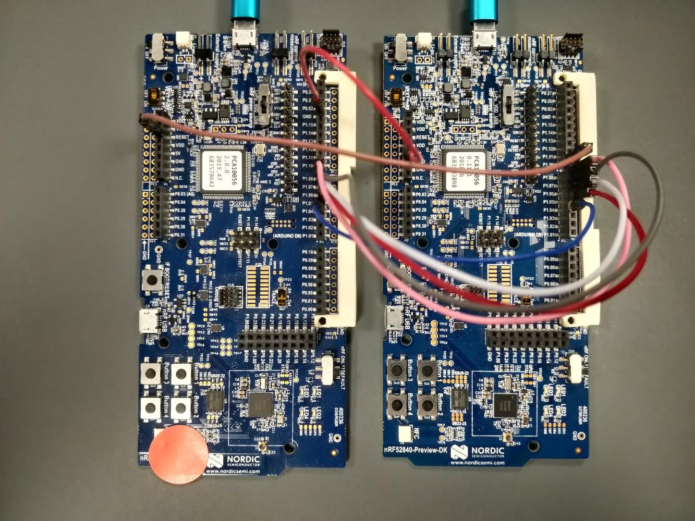
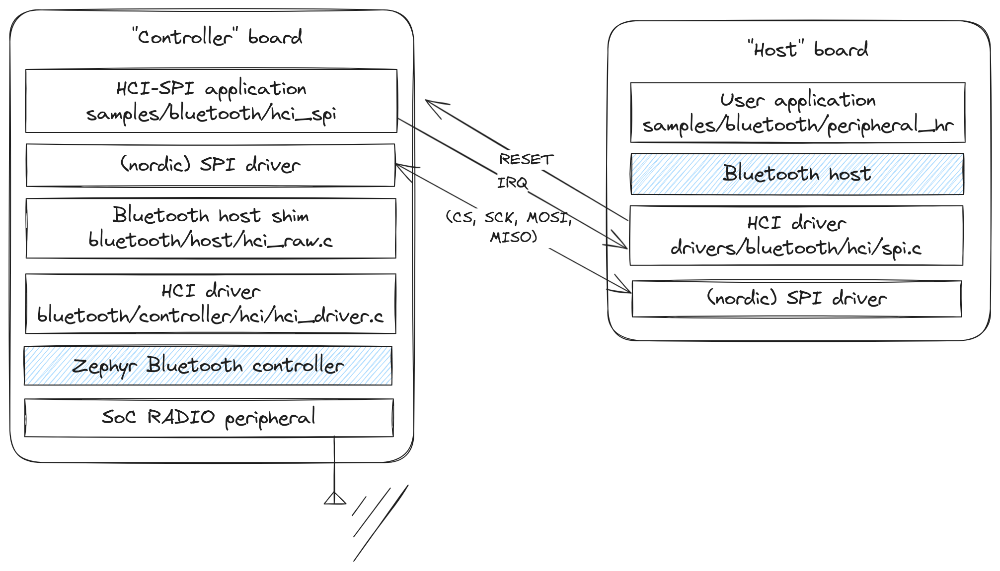
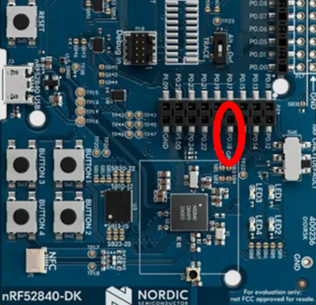

Today we will explain how to use the Zephyr Bluetooth stack on a board that doesn't have a radio.

<!--more-->

Say you want to use Bluetooth on a fast "crossover" MCU like the one on the [teensy 4](https://www.pjrc.com/store/teensy41.html).

This SoC doesn't have have a Bluetooth radio.

Fortunately, the Zephyr host can work with external Bluetooth controllers, communicating over a serial bus like UART or SPI.

This post is a tutorial on how to make this all fit together, using two [nRF52840dk](https://www.nordicsemi.com/Products/Development-hardware/nrf52840-dk) boards.

**See [the git branch](https://github.com/jori-nordic/zephyr/commits/blog-hci-spi-demo/) for the code backing this post.**

Table of contents
-----------------



## Bluetooth without a radio?

Yes. Sort of.

### Bluetooth layers

So the Bluetooth specification defines the stack as two big layers:

The controller: 
- Deals with the radio and packet scheduling minutiae. 
- Establishes a so-called "ACL link", which can be thought of as a "dumb" data pipe from one physical device to another.

The host:
- Multiplexes users (protocols) over this ACL link
- Also defines higher-level protocols for seamless operation between vendors.
This is the reason a, say, Polar heart-rate monitor is able to talk to a Garmin smartwatch without issues.

The application interacts with the host to make use of the Bluetooth functionality. Stuff like:
- advertising its name, device type, services etc 
- sending data over GATT. e.g. heart-rate BPM measurements.

### Split stack

The controller can be on a separate hardware device.
That is the case with the majority of Smartphones, laptop and desktop PCs. The controller usually sits behind a USB or UART link, and the host is implemented by the OS vendor, i.e. iOS, Android, Windows all have their in-house host stack.

Although the Zephyr Bluetooth is "full-stack" :p, it can still be split, and this is exactly what we'll do here.

You can buy a number of controller modules, some of them talk over [SPI](https://en.wikipedia.org/wiki/Serial_Peripheral_Interface).
For example, the [BlueNRG-M0L](https://www.digikey.no/en/products/detail/stmicroelectronics/BLUENRG-M0L/11205588) is supported by Zephyr.

## Zephyr SPI controller

Zephyr [includes a sample application](https://docs.zephyrproject.org/latest/samples/bluetooth/hci_spi/README.html
) that exposes its controller over an SPI interface.

## Hardware setup

Now I have neither a teensy nor a BlueNRG module, so for the sake of the exercise, I will use two [nRF52840dk boards](https://docs.zephyrproject.org/latest/boards/arm/nrf52840dk_nrf52840/doc/index.html) and pretend that one doesn't have a built-in radio.

### Connections

The two boards are connected like so

| signal | controller board | host board |
|--------|------------------|------------|
| SCK    | P1.08            | P1.08      |
| MOSI   | P1.07            | P1.07      |
| MISO   | P1.06            | P1.06      |
| CS     | P1.05            | P1.05      |
| IRQ    | P1.04            | P1.04      |
| RESET  | nRESET / P0.18   | P1.10      |
| GROUND | GND              | GND        |

 
Here's a picture, the controller sports a red sticker.



And a small diagram of what's going on in each board:



## Applications

We will use:
- the `samples/bluetooth/peripheral_hr` sample for the host board
- the `samples/bluetooth/hci_spi` sample for the controller board

## Devicetree

Zephyr inherited the [device-tree interface](https://en.wikipedia.org/wiki/Devicetree) from the linux kernel.
So that's where we define the connections between the two boards.

In zephyr one can apply so-called "overlay" devicetree fragments to an application.

In our case, we will use the board method, which consists in placing the dts fragment in `[app root]/boards/[board_name].overlay`.
That results in for e.g. the host board: `samples/bluetooth/peripheral_hr/boards/nrf52840dk_nrf52840.overlay`.

See the [official documentation](https://docs.zephyrproject.org/latest/build/dts/howtos.html#set-devicetree-overlays) for more information.

## Host board configuration

We need to instruct the Bluetooth host to use the HCI over SPI driver.
This is done by setting two kconfig options, `CONFIG_BT_CTLR=n` and `CONFIG_BT_SPI=y`.

Contents of `samples/bluetooth/peripheral_hr/boards/nrf52840dk_nrf52840.conf`:

```conf
CONFIG_BT_CTLR=n
CONFIG_BT_SPI=y
```

We also need to define two things in the devicetree: 
- the `zephyr,bt-hci-spi` node on the SPI bus
- the `pinctrl` configuration for that SPI bus

The HCI SPI driver `drivers/bluetooth/hci/spi.c` looks for a `zephyr,bt-hci-spi` node in the DTS to know on which bus/interface the controller listens on.

Contents of `samples/bluetooth/peripheral_hr/boards/nrf52840dk_nrf52840.overlay`:

```dts
   &spi1 {
      compatible = "nordic,nrf-spim";
      status = "okay";

      pinctrl-0 = <&spi1_default_alt>;
      /delete-property/ pinctrl-1;
      pinctrl-names = "default";

      cs-gpios = <&gpio1 5 GPIO_ACTIVE_LOW>;

      bt-controller@0 {
         status = "okay";
         compatible = "zephyr,bt-hci-spi";
         reg = <0>;
         spi-max-frequency = <2000000>;

         /* different scheme than pinctrl: IRQ is on P1.04 */
         irq-gpios = <&gpio1 4 (GPIO_ACTIVE_HIGH | GPIO_PULL_DOWN)>;

         reset-gpios = <&gpio1 10 GPIO_ACTIVE_LOW>;
         reset-assert-duration-ms = <420>;
      };
   };

   &pinctrl {
      spi1_default_alt: spi1_default_alt {
         group1 {
            /* schema: (name, port, number)
             * only change the port and number.
             * e.g. here: SCK is on P1.08
             */
            psels = <NRF_PSEL(SPIM_SCK, 1, 8)>,
               <NRF_PSEL(SPIM_MOSI, 1, 7)>,
               <NRF_PSEL(SPIM_MISO, 1, 6)>;
         };
      };
   };
```

We then build and flash the application:
```bash
cd samples/bluetooth/peripheral_hr
west build -b nrf52840dk_nrf52840
west flash
```

## Controller board configuration

Since the controller application's whole purpose is to expose the controller over SPI, we don't have to provide extra configuration, apart from the DTS fragment. 

This time, the node we need to provide is `zephyr,bt-hci-spi-slave`.
There are a couple differences:
- no RESET pin: this is because the reset wire is connected to the SoC's actual reset line
- CS is set in the `pinctrl` instead of a pin array in the spi device configuration. This is because we only support one `spi-slave` device per bus, unlike the master which can talk to multiple devices on the same bus.

Another note is that on the nRF52840dk, the pin labeled "RESET" on the top-left is not active by default, there is a jumper to cut. See the [bridge configuration](https://docs.nordicsemi.com/bundle/ug_nrf52840_dk/page/UG/dk/solder_bridge.html) for which one.

If you don't have a soldering iron, you can just connect it somewhere else. There is a direct connection to it in the horizontal double-wide connector towards the bottom.



Contents of `samples/bluetooth/hci_spi/boards/nrf52840dk_nrf52840.overlay`:

```dts
   &spi1 {
      compatible = "nordic,nrf-spis";
      status = "okay";
      def-char = <0x00>;

      pinctrl-0 = <&spi1_default_alt>;
      /delete-property/ pinctrl-1;
      pinctrl-names = "default";

      bt-host@0 {
         compatible = "zephyr,bt-hci-spi-slave";
         reg = <0>;

         /* different scheme than pinctrl: IRQ is on P1.04 */
         irq-gpios = <&gpio1 4 (GPIO_ACTIVE_HIGH | GPIO_PULL_DOWN)>;
      };
   };
   
   &pinctrl {
      spi1_default_alt: spi1_default_alt {
         group1 {
            /* schema: (name, port, number)
             * only change the port and number.
             * e.g. here: SCK is on P1.08
             */
            psels = <NRF_PSEL(SPIS_SCK, 1, 8)>,
               <NRF_PSEL(SPIS_MOSI, 1, 7)>,
               <NRF_PSEL(SPIS_MISO, 1, 6)>,
               <NRF_PSEL(SPIS_CSN, 1, 5)>;
         };
      };
   };
```

We then build and flash the application:
```bash
cd samples/bluetooth/hci_spi
west build -b nrf52840dk_nrf52840
west flash
```

## Testing

Reset the controller board first, then the host board. The host application should then start advertising.

You can either use the `samples/bluetooth/central_hr` app on another board or the [nRF connect app](https://www.nordicsemi.com/Products/Development-tools/nrf-connect-for-mobile) to connect and try out the application.
It should show up as "Zephyr Heartrate Sensor" and allow you to subscribe to and receive synthetic heart-rate measurements.

### Stack overflow

It is possible that the stack usage in the vendor SPI driver exceeds what the HCI SPI driver has configured.
In that case you'll be greeted by a nasty MPU fault error.

You can tweak the stack size by setting those two configs:
```conf
# Need to set this to override the default stack size
CONFIG_BT_HCI_TX_STACK_SIZE_WITH_PROMPT=y

# Increase this as necessary
CONFIG_BT_HCI_TX_STACK_SIZE=1024
```

## Closing thoughts

That's it! You should now have a Bluetooth stack split over two boards or modules, communicating over SPI.

I wrote this mostly as a reference for myself, hopefully it's also useful to others :)
