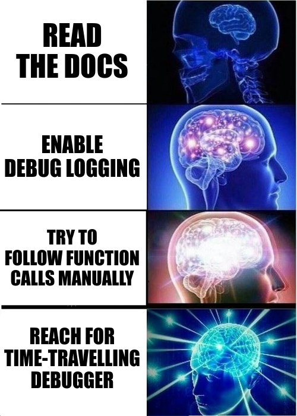
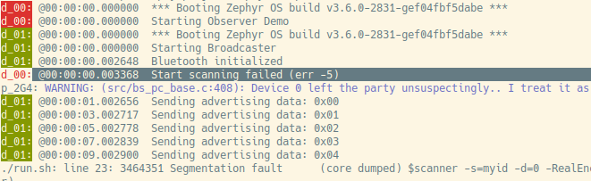
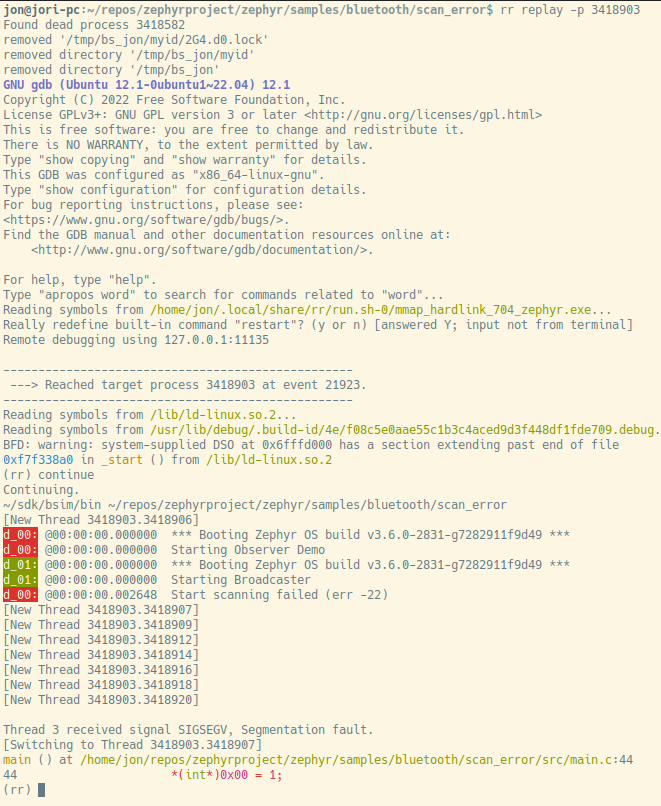

Today we will debug a Bluetooth application by using [the rr debugger](https://rr-project.org/).


<!--more-->

# Table of contents



## What is rr

See the [Official website](https://rr-project.org/).

You can think of it as a GDB backend that also allows executing a program backwards 🤯.

To do that, rr records a program's execution and allows replaying as many times as necessary. Recording alone is useful, as there is less time spent repeating the steps reproducing the bug on every execution.

That sounds awesome and it is! I tried to use it a few years ago but never got it to work. At the time I think I needed a newer kernel or there was always some problem preventing it to record properly.

After a colleague at work tried it without issues, I decided to try it again. Thanks [Aleksander](https://awas.bearblog.dev/)! [Théo](https://www.theobattrel.fr/index.html?lang=en) also helped me remember the right commands.

## Environment

We will be using:
- Ubuntu 22.04 (not cool enough for nixos or arch lol)
- Zephyr at [jori-nordic/rrewinding-time](https://github.com/jori-nordic/zephyr/tree/rrewinding-time/)
- Babblesim at the revision listed in the [zephyr west manifest](https://github.com/jori-nordic/zephyr/blob/rrewinding-time/west.yml#L37).

We assume
- The Zephyr environment is [set-up correctly](https://docs.zephyrproject.org/latest/develop/getting_started/index.html).
- Babblesim is compiled and [set-up correctly](https://babblesim.github.io/fetching.html).
  - `BSIM_OUT_PATH` and `BSIM_COMPONENTS_PATH` *have* to be set.

## Bluetooth terms

Here's some definitions so y'all that don't know Bluetooth can still follow along.
Don't try to make sense of the abbreviations, naming is a hard problem after all..

(This is a simplification)
- A Bluetooth device *advertises* when it wants to be connected to.
- A Bluetooth device *scans* when it wants to connect to an *advertiser*
- The [Bluetooth stack is split](https://docs.zephyrproject.org/latest/connectivity/bluetooth/bluetooth-arch.html#ble-layers) into a Host and a Controller
  - The Host: provides application-level interfaces (e.g. GATT)
  - The Controller: deals with on-air scheduling and reliable packet delivery
- L2CAP: Routes data from upper layers. Multiplexes logical channels over a single LE connection (also called ACL link)
- ATT (ATTribute Protocol): Defines a set of commands to interact with data in an Attribute table
- GATT: (General ATTribute profile): The aforementioned table where the application data lives
- GATT characteristic: a location/row in that table. Here we will read heart-rate measurement data
- Subscriptions and notifications: are a GATT concept. Basically you subscribe to a peer's row in the data table and the peer sends events when the data changes

## Installing rr

See the [Building and Installing](https://github.com/rr-debugger/rr/wiki/Building-And-Installing#packages) page.

For us on ubuntu 22.04, we only have to do this:
```bash
# Install rr
sudo apt install rr

# Allow rr to use the perf counters to do its thing
sudo sysctl kernel.perf_event_paranoid=1
```

Then test that it works by recording a simple program, e.g. `rr record true`.

### Newer Intel CPUs

On my new-ish work laptop, rr doesn't work.
It fails with this error:
```
jon@jori-laptop-24:~/tmp/rr/obj$ rr record true
[FATAL /home/ubuntu/rr/src/PerfCounters_x86.h:124:compute_cpu_microarch()] Intel CPU type 0xb06a0 unknown
```

[Building](https://github.com/rr-debugger/rr/wiki/Building-And-Installing#project-building) from source is painless, but rr still doesn't work:
```
jon@jori-laptop-24:~/tmp/rr/obj$ ./bin/rr record echo "test"
rr: Saving execution to trace directory `/home/jon/.local/share/rr/echo-0'.
[FATAL src/PerfCounters.cc:401:check_working_counters()]
Got 0 branch events, expected at least 500.

The hardware performance counter seems to not be working. Check
that hardware performance counters are working by running
  perf stat -e r5111c4 true
and checking that it reports a nonzero number of events.
If performance counters seem to be working with 'perf', file an
rr issue, otherwise check your hardware/OS/VM configuration. Also
check that other software is not using performance counters on
this CPU.
=== Start rr backtrace:
./bin/rr(_ZN2rr15notifying_abortEv+0xff)[0x569d488860af]
./bin/rr(_ZN2rr12FatalOstreamD1Ev+0x67)[0x569d4873ff57]
./bin/rr(_ZN2rr12PerfCounters5startEPNS_4TaskEl+0xb37)[0x569d487666d7]
./bin/rr(_ZN2rr4Task16resume_executionENS_13ResumeRequestENS_11WaitRequestENS_12TicksRequestEi+0x88e)[0x569d4885b1ae]
./bin/rr(_ZN2rr13RecordSession13task_continueERKNS0_9StepStateE+0x8f7)[0x569d48776697]
./bin/rr(_ZN2rr13RecordSession11record_stepEv+0x687)[0x569d48780607]
./bin/rr(_ZN2rr13RecordCommand3runERSt6vectorINSt7__cxx1112basic_stringIcSt11char_traitsIcESaIcEEESaIS7_EE+0x1dde)[0x569d4877012e]
./bin/rr(main+0x507)[0x569d48747fe7]
/lib/x86_64-linux-gnu/libc.so.6(+0x29d90)[0x7790de229d90]
/lib/x86_64-linux-gnu/libc.so.6(__libc_start_main+0x80)[0x7790de229e40]
./bin/rr(_start+0x25)[0x569d486bbfe5]
=== End rr backtrace
Aborted (core dumped)
```

That's [due to the new E cores](https://github.com/rr-debugger/rr/issues/3338) that don't support performance counters.

The solution is to pin rr to a (or multiple) non-efficency cores.

First find out which CPU is "normal". A hint is that they have a higher max frequency:
```bash
lscpu -e
```

```
CPU NODE SOCKET CORE L1d:L1i:L2:L3 ONLINE    MAXMHZ   MINMHZ      MHZ
  0    0      0    0 0:0:0:0          yes 5200,0000 400,0000 1004.540
  1    0      0    0 0:0:0:0          yes 5200,0000 400,0000  992.580
  2    0      0    1 4:4:1:0          yes 5200,0000 400,0000 1002.222
  3    0      0    1 4:4:1:0          yes 5200,0000 400,0000 1044.793
  4    0      0    2 8:8:2:0          yes 3900,0000 400,0000 1015.239
  5    0      0    3 9:9:2:0          yes 3900,0000 400,0000 1007.324
  6    0      0    4 10:10:2:0        yes 3900,0000 400,0000 1042.788
  7    0      0    5 11:11:2:0        yes 3900,0000 400,0000 1089.223
  8    0      0    6 12:12:3:0        yes 3900,0000 400,0000 1066.810
  9    0      0    7 13:13:3:0        yes 3900,0000 400,0000 1270.641
 10    0      0    8 14:14:3:0        yes 3900,0000 400,0000 1084.343
 11    0      0    9 15:15:3:0        yes 3900,0000 400,0000 1045.547
```

Then pin rr to the right group of cores, like so:
```bash
taskset -c 0-3 ./bin/rr record true
```

It should work now:
```
jon@jori-laptop-24:~/tmp/rr/obj$ taskset -c 0-3 ./bin/rr record true
rr: Saving execution to trace directory `/home/jon/.local/share/rr/true-1'.
```

## Debugging a simulated Bluetooth device

### Story

You're an application developer that wants to use the Zephyr RTOS Bluetooth stack:
- You want to start a scanner
- You get an `-EIO` error from the [well-documented](https://github.com/jori-nordic/zephyr/blob/rrewinding-time/include/zephyr/bluetooth/bluetooth.h#L2273) (😅) host API
- Where does it come from, what does it mean?
- Instead of reading more docs, you reach for rr



### Reproducing the error

Our entrypoint will be running [run.sh](https://github.com/jori-nordic/zephyr/blob/rrewinding-time/samples/bluetooth/scan_error/run.sh).

[build.sh](https://github.com/jori-nordic/zephyr/blob/rrewinding-time/samples/bluetooth/scan_error/build.sh) will build two images and [run.sh](https://github.com/jori-nordic/zephyr/blob/rrewinding-time/samples/bluetooth/scan_error/run.sh) will run a short simulation for them to interact.
The two images are a Bluetooth advertiser, and a Bluetooth scanner. The scanner unfortunately doesn't start and reports an enigmatic `-EIO` error.



For the sake of the blog post, we will pretend we don't have logs or other means of debugging this error.
We also trigger a segfault when that error happens, in order to speed up debugging.

### Finding the root cause

The strategy will be simple:

- Record the whole simulation with rr, i.e. wrap `run.sh` directly
- Start a replay session and attach to the scanner device's process
- Reverse-step until we hit the source of the error

Step one, record:
```bash
# Go to the right place
cd $(west topdir)/zephyr/samples/bluetooth/scan_error

# Build the two images
./build.sh

# Run and record the simulation with rr
rr record ./run.sh
```

rr should output the name of the recording, like so
```
jon@jori-pc:~/repos/zephyrproject/zephyr/samples/bluetooth/scan_error$ rr record ./run.sh
rr: Saving execution to trace directory `/home/jon/.local/share/rr/run.sh-0'.
```

Step two, replay:
```bash
# List all the recorded sessions
rr ls

# List all the processes in our session.
# In our case, the run's name is `run.sh-0`.
# We can call `rr ps run.sh-0` to get the process list, but
# since it's the latest trace, we can just omit the name like so
rr ps
```

We get this list:
```
PID     PPID    EXIT    CMD
3448342 --      0       ./run.sh
3448343 3448342 0       west topdir
3448348 3448342 0       west topdir
3448350 3448342 0       /home/jon/sdk/bsim/components/common/stop_bsim.sh
3448351 3448350 0       realpath /tmp/bs_jon//
3448352 3448350 0       find /tmp/bs_jon -name *.lock
3448353 3448350 0       head -n1 /tmp/bs_jon/myid/2G4.d1.lock
3448354 3448350 0       tail -n1 /tmp/bs_jon/myid/2G4.d1.lock
3448355 3448350 0       rm -v /tmp/bs_jon/myid/2G4.d1.lock
3448356 3448350 0       head -n1 /tmp/bs_jon/myid/2G4.d0.lock
3448357 3448350 0       tail -n1 /tmp/bs_jon/myid/2G4.d0.lock
3448358 3448350 0       rm -v /tmp/bs_jon/myid/2G4.d0.lock
3448359 3448350 0       rm -rf -v /tmp/bs_jon
3448360 3448342 -11     /home/jon/repos/zephyrproject/zephyr/samples/bluetooth/scan_error/build/zephyr/zephyr.exe -s=myid -d=0 -RealEncryption=0 -rs=70
3448361 3448342 -9      /home/jon/repos/zephyrproject/zephyr/samples/bluetooth/broadcaster/build/zephyr/zephyr.exe -s=myid -d=1 -RealEncryption=0 -rs=90
3448362 3448342 0       ./bs_2G4_phy_v1 -s=myid -D=2 -sim_length=10000000
```

We want to attach to the scanner, so that will be PID `3448360`:
```bash
# Attach to the scanner process
rr replay -p 3448360
```

We are dropped into a GDB session. If we `continue` we end up with the segfault.



Then we can use the magic powers of `reverse-` gdb commands to go forwards and backwards in time to help us find the root cause.



What we did in that screencast:
- Start the `rr replay` session
- `continue` to get to the segmentation fault in `main.c`
- `reverse-step` to step backwards in time
- We end up in `printk()`. we don't care about that, so we `reverse-fin` to roll back time until before `printk()` was called. We want the `bt_le_scan_start()` call in `main.c`
- `reverse-step` a bunch of times, we end up in `bt_hci_cmd_send_sync()`
- We now know the issue is not in the Bluetooth host. We add a breakpoint `break bt_send` as we know that's where the host will send a command to the controller
- `reverse-continue` until we hit `bt_send()`
- `continue` until we exit the function
- `reverse-step` a whole bunch of times, with some `reverse-fin`s
- We finally end up in `le_set_ext_scan_param()` in the controller's `hci.c`
- We are in an early return, we print the locals `phys` and `phys_bitmask`
- We see that we are setting coded PHY in `phys` but the controller doesn't support it in `phys_bitmask`
- The if condition above hints that we should enable `CONFIG_BT_CTLR_PHY_CODED`
- We add `CONFIG_BT_CTLR_PHY_CODED=y` to our `prj.conf` and the error is gone

## Now with a real device

That's nice and all, but I want to develop a Bluetooth product that interacts with other devices in the real world. Can rr help me for that too?

Unfortunately, rr doesn't work on the small ARM-based system-on-chip devices used for Bluetooth.

But! Thanks to the `native_sim` Zephyr target, we can [split our application in half](https://docs.zephyrproject.org/latest/connectivity/bluetooth/bluetooth-tools.html#bluetooth-qemu-native):
- One half runs on the ARM Bluetooth chip. That's the Controller.
- The other half runs on the beefy-ass Intel CPU that supports rr

This split is good, as most of our application logic will be implemented above the Bluetooth Host. And so will be easily debuggable with rr.


Thanks to the flexible build system and unified driver API, it's even possible to do a sort of "reverse-semihosting" and use physical sensors on the big computer. Maybe I'll do a blog post on that next :)

### Story

This time, you are in my shoes. You are a contributor to the Zephyr host and are trying to write a blog post on rr. **You need to find a bug**.
You have an old android device (version 10), you just play around with it and the bt-shell and see if you can observe something weird.

You connect to [your app](https://play.google.com/store/apps/details?id=no.nordicsemi.android.mcp&hl=en&gl=US) on an Android phone and subscribe to the heart-rate monitor characteristic.

You also trigger pairing/bonding. You then start seeing errors all over the logs:
`"ATT channel not connected"`.
Easy, you think, just grep for it in the code. Welp there are 4 exact matches.

Fortunately, you have recorded the whole interaction with rr...

### Recording the bug

#### Prepare the controller

```bash
# Build and flash the controller to a connected nRF52840 devkit
pushd $(west topdir)/zephyr/samples/bluetooth/hci_uart
west build -b nrf52840dk/nrf52840
west flash

# Attach the controller to Linux, but tell it to not talk to it
sudo btattach -B /dev/ttyACM0 -S 1000000 -R
```

#### Prepare the Bluetooth shell

```bash
# Build for the native_posix target. This doesn't include the controller.
pushd $(west topdir)/zephyr/tests/bluetooth/shell
west build -b native_posix -S xterm-native-shell
```

#### Record the trace

Start the shell like so:

```bash
# Instal deps of `xterm-native-shell`
# Used by the executable to spawn an xterm window with the bluetooth shell
sudo apt install xterm screen

# Necessary for attaching to the Bluetooth controller
sudo setcap 'cap_net_admin+ep' ./build/zephyr/zephyr.exe

# Start recording the Bluetooth shell
# Since we have extra capabilities, we need to pass extra options to rr
taskset -c 0-3 sudo -EP --preserve-env=HOME rr record --setuid-sudo ./build/zephyr/zephyr.exe -attach_uart -wait_uart --bt-dev=hci1
```

Then in the spawned `xterm` window:
```bash
bt init
bt advertise on
hrs simulate on
```

Then on the Android device, connect and subscribe to heart-rate notifications.
We start getting simulated heart-rate values.

We try pairing (bonding), and it works. Except we now have this scary-looking ATT error in our logs. It seems though, that the communication still works, as the heart-rate values keep on updating... Hmmm..



### Finding the root cause

We `ctrl-c` to exit the bt-shell process.

Then attach to the shell process, like before:
```
(zephyr) jon@jori-laptop-24:~/repos/zephyrproject/zephyr/tests/bluetooth/shell$ rr ps
PID	PPID	EXIT	CMD
975597	--	0	./build/zephyr/zephyr.exe -attach_uart -wait_uart --bt-dev=hci1
975599	975597	0	sh -c xterm -e screen /dev/pts/10 &
975600	975599	2	xterm -e screen /dev/pts/10
975613	975600	0	screen /dev/pts/10
975614	975613	-9	(forked without exec)
(zephyr) jon@jori-laptop-24:~/repos/zephyrproject/zephyr/tests/bluetooth/shell$ rr replay -p 975597
```



Follows a debugging session where we are able to step forwards and backwards in time, allowing us to inspect the state at our leisure.

- `continue`
- Error logs are printed.
- `break log_output_process`, and `reverse-continue`. That should point to where the log was fired from.
- `backtrace`. The error is generated by [chan_send()](https://github.com/jori-nordic/zephyr/blob/rrewinding-time/subsys/bluetooth/host/att.c#L283)
- The channel that is not connected is `0x80fe100`
- Alright, let's see when it is disconnected: `break att_chan_detach`
- `reverse-continue`. we hit `att_chan_detach` but it's for another channel, `0x80fe250`
- `reverse-continue` again. we get back at the start of the program.
- it seems the channel is never properly closed, but in a "zombie" state
- we get back to `att_chan_detach` and go up the stack a bit. It's called from [reject_cmd](https://github.com/jori-nordic/zephyr/blob/rrewinding-time/subsys/bluetooth/host/l2cap.c#L2082) in `l2cap.c`.
- we read the code and don't understand what this `ident` business is about.
- we read the Bluetooth spec. Aha, it's a command identifier. Multiple channels can "depend" on a command.
- we allocate/mark the ident when we send the command, let's try breaking on that.
- we land in [l2cap_ecred_conn_req()](https://github.com/jori-nordic/zephyr/blob/rrewinding-time/subsys/bluetooth/host/l2cap.c#L544) where we see **a bunch** of channels being mapped to the same `ident` value that the reject command mentions
- It all clicks, we found the bug

When the connection is secured, the host tries to connect Enhanced ATT channels. It's not super important how it works, but basically the stack will then have a list of channels it can send GATT notifications (our heart-rate data) over.

The stack will loop over all those channels and try to send on each of them, hence the many similar errors.
Problem is the channels never actually got established, as the peer (android) is too old and doesn't support enhanced L2CAP channels. It just replied with a `REJECT_RSP`.

The bug is that instead of looping over the list of channels that match `ident` in that `REJECT_RSP`, we only take the first one and close only that channel. The other channels stay in a zombie state, as candidates for sending stuff on, but not actually able to.

Thanks to rr, the bug has been fixed in https://github.com/zephyrproject-rtos/zephyr/pull/71872 .



## Conclusion

Time-travel debugging feels a bit like being in the future, or some alien tech. I feel just like when I first discovered debugging. Many thanks to the developers of this tool.

We saw that we not only can debug simulations, but with some craftiness also record and replay bugs stemming from an interaction in the real world.

Definitely something to add to your tool chest if you ask me!

rr is sponsored by [Pernosco](https://pernos.co/), which is even more interesting.. Check it out!
