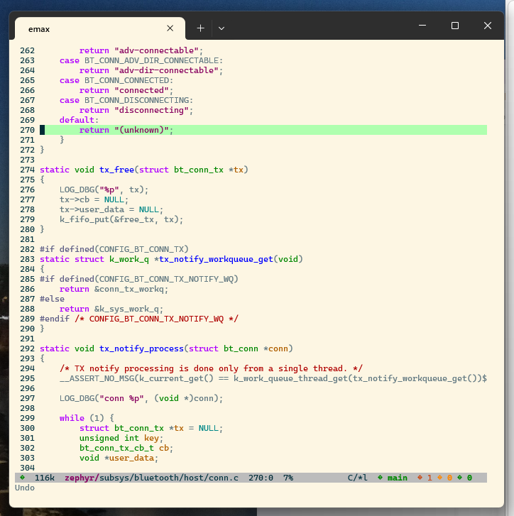
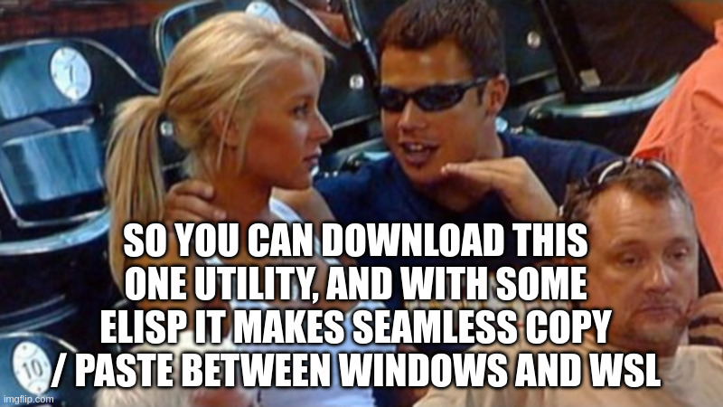
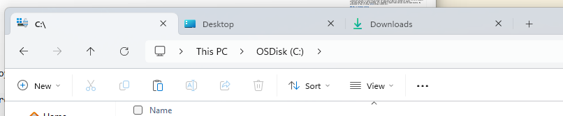
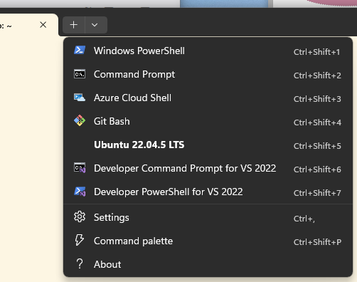
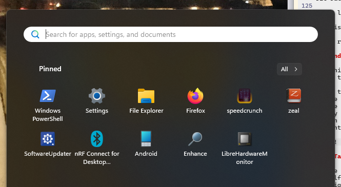
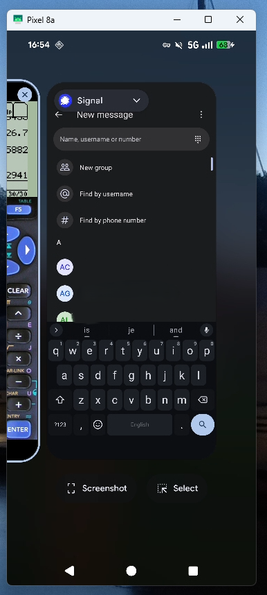
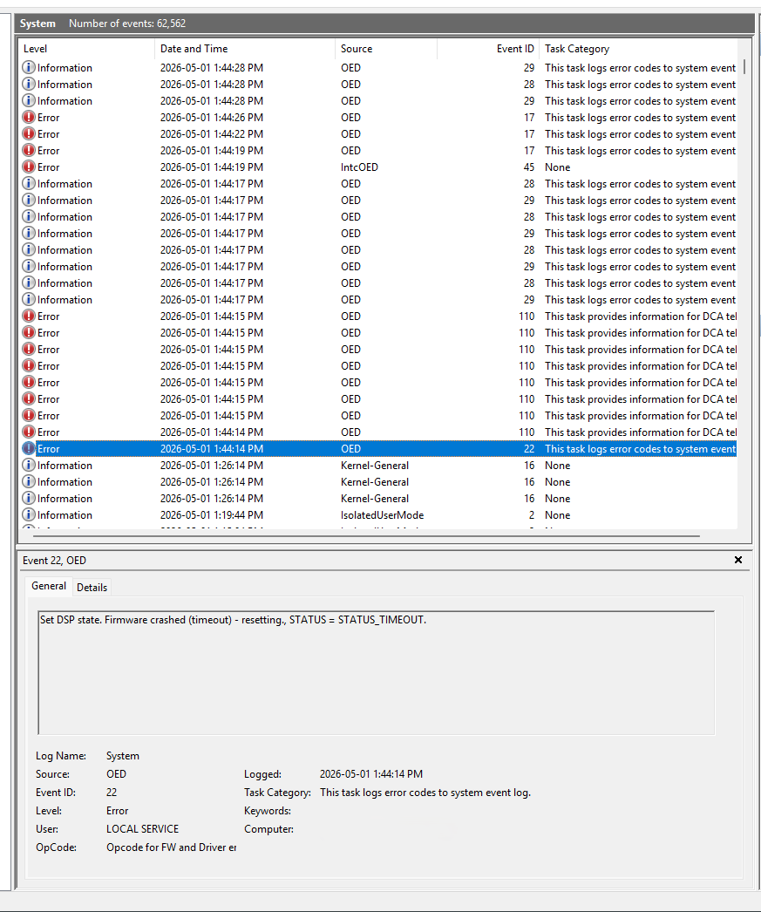

Windows is making great strides in usability and is on the verge of being a good enough developer desktop. In this article we'll explore what has progressed, and what is still to be done.

Warning: this post may contain traces of copium.

<!--more-->

_yes this is a joke post, but with useful info_

# Table of contents



## Intro

I was fortunate enough to be allowed to use Desktop Linux (TM) on my work machines for a while. Well, not anymore.

My new employer is quite larger than the previous and maintains a big fleet of windows laptops. It makes sense, as most of the workforce is not developers and needs windows applications for day to day work. IT also says windows is more secure-able than linux. 

Long story short, I now have to use windows. If you are in the same boat, follow along and you might pick up some useful tidbits.

## Linux with extra steps

We can use WSL! This is great. Since I last used it (WSL1), it has gotten much better.



### The good

- it has way better filesystem perf
- we can use and choose from multiple distros
- it has X11 support
- very good interop: can call programs and transfer files very easily, even mount network shares through windows.
- docker works! 
- VSCode integration is seamless
- it's a VM, so you can take snapshots
- they have a proper terminal (more on that later)

### The less good

- GUI support is there but not great. Apps definitely don't feel native, and don't handle scaling very well on HiDPI screens. E.g. you often have to restart apps. Because of that I don't use GUI apps at all.
- usb passthrough is not seamless yet. The plumbing seems to be there but not the porcelain. Expect command-line fiddling. Although there are some GUIs that sort of work, but nothing first party. 
- darn slashes. They (MS) made an effort in supporting them mostly everywhere but you still run into some places where you have to convert paths to "\\". Same for the reverse: expect paths with backslashes to break half the time when used in WSL scripts due to quoting.
- git repo usage is tricky: editing the same repo cloned in windows from WSL and windows runs into issues e.g. with line endings. I make use of per-directory configs and it's a bit annoying at times.
- while windows filesystem interop works, it is excruciatingly slow. Expect **multi-second pauses** in non-trivial repos for `git status`.

### The bad

- since WSL2 is now a VM you have to decide how much RAM to give it. Windows 11 (+ all the extra endpoint protection software) is quite a memory hog. So compilation jobs are starved for memory.
- the whole WSL VM can get terminated. It's happened a couple times and you lose all bash history. My workaround to that is using [atuin](https://atuin.sh/).

### WSL <=> Windows interop

I use ~~arch btw~~ emacs for code editing and was missing a few creature comforts.



#### copy-paste

Turns out you don't even have to install anything, WSL can call windows binaries just fine. You just need a way to call `clip.exe` with the contents as arguments and Bam! the contents end up in the windows clipboard ready to be pasted into Teams. Synergy!

Here is the elisp I use for that. It hooks into the yank event using `advice-add`.

```elisp
(defun send-to-windows-clipboard (text)
  (shell-command-to-string (concat "printf -- %s " (shell-quote-argument text) " | clip.exe")))

;; Define a function to send the last yanked text to the shell command 'clip'.
(defun rico-send-last-yank-to-clip ()
  "Send the last yanked text to the shell command `clip`.
This command gets the first element of the `kill-ring`, which is
the last text that was yanked or killed, and pipes it to `clip`."
  (interactive)
  (unless kill-ring
    (user-error "Kill ring is empty"))
  (let ((text (car kill-ring)))
    (send-to-windows-clipboard text)
    (when (called-interactively-p 'interactive)
      (message "Copied: %s" text))
    nil))

(defun r-kill-ring-hook (&rest args)
  (rico-send-last-yank-to-clip))

(advice-add 'kill-new :after #'r-kill-ring-hook)
;; (advice-remove 'kill-new #'r-kill-ring-hook)
```

#### Ctrl-enter

I use this extensively for org mode and magit. Very disappointing that it doesn't work, but it's not windows' fault this time. Apparently this *cannot* work in terminals, period.

I `M-x-magit-diff-visit-worktree-file` instead like a caveman. It works.

#### Opening web links

I use (a teensy bit of) org-mode, but make heavy use of external links. Emacs will call into xdg-open for opening web links, so we need a way to forward this to windows.

I use [wslu](https://github.com/wslutilities/wslu) for that. After installing it, you need to point the `BROWSER` env var to it in your `~/.bashrc`.

```shell
export BROWSER=wslview
```

Now hitting [enter] on any link in org-mode opens the link in the running MS Edge instance. Calling `xdg-open .` in the terminal will also spawn a windows explorer window in the current directory. Handy for copying files around, eg, build artifacts.

#### Network mounts

You can also [mount network shares](https://learn.microsoft.com/en-us/archive/blogs/wsl/file-system-improvements-to-the-windows-subsystem-for-linux) directly (or [using CIFS](https://woshub.com/mount-drives-in-wsl/)) like so:
```
sudo mount -t drvfs '\\server\share' /mnt/share
```

TBH I don't use that functionality very much, and copy files with explorer directly.

#### USB passthrough

Use [this GUI](https://github.com/nickbeth/wsl-usb-manager) with [usbipd-win](https://learn.microsoft.com/en-us/windows/wsl/connect-usb) to pass USB devices. So far, no issues.

### VM Snapshots

Save the whole WSL image to a file using [WSL export](https://learn.microsoft.com/en-us/windows/wsl/basic-commands#export-a-distribution):

```shell
wsl --list
wsl --export <Distribution Name> <FileName>
```

This is handy for e.g. saving a clean image after spending days setting up a dev environment.

## Window management / desktop

### Windows is catching up!

After more than a decade, we can finally enjoy some linux-desktop-isms:



- explorer now has tabs. no more shuffling around 20 explorer windows. Seems like a tiny thing but makes a big difference day-to-day.
- built-in tiling support. I know win7 had it but it was very basic.
- alt-space brings up a "launcher" similar to KDE that actually reliably finds applications and can do basic math. You do need powertoys installed, but it's first-party so I count it as integrated.
- a usable package manager: I've been happily surprised that many apps now install with a "winget" one-liner.
- a proper terminal emulator, "[Windows Terminal](https://github.com/microsoft/terminal)"
  - they actually put some care into it, it is nice to use and feature-complete vs Konsole. At least the features I actually use.
  - ctrl-f search 
  - ctrl-shift-k clears the buffer
  - tabs, vert/horiz splits
  - HiDPI works great
  - any tab can be a different session type: e.g., WSL, Git Bash, cmd.exe, powershell.


  
### But still has some ways to go

There are a few old features of KDE that I miss:

- drag or resize from anywhere in the window by holding a hotkey. This also works on GNOME BTW.
- button to keep window on-top of anything else
- very very limited taskbar behavior
  - can't "ungroup" icons. KDE even allows toggling this with middle-click per-program.
  - only have choice between grouped icons or individual full-window-title elements.
- session doesn't restore open programs on boot
  - annoying as it reboots quite often due to instability
  - it might _seem_ like it does, but no, it's just some programs auto-starting.
- first-party keyboard shortcuts system
  
But not all is lost!

I found [resizer2](https://github.com/alvesvaren/resizer2) for resizing. And something else for alt-tabbing. Read on below.

### Speed focus

For a system that is called "windows" it is remarkably slow to move between application windows. Yes, even with alt-tab, getting to a particular app is non-deterministic.

On the glorious linux desktop, I had gotten used to a "speed"-focus setup where I would just hit win/super+[key] that would bring up specific applications without alt-tabbing or searching the name in overview. E.g. win-f focuses firefox, win-c focuses vscode, etc..

Armed with Google Gemini and two free evenings, I cobbled together a win32 app to sort-of approximate the functionality I previously had. It is somewhat buggy but works well enough for day-to-day usage. It sits in the system tray and quits when its icon is clicked.

Note: okay I mostly ran a loop of user-testing the code gemini gave me and describing the wrong behavior. It got lost quite a bit but the program got there eventually after a few small manual tweaks.

[focus.c](https://github.com/narvalotech/scratchpad/blob/mano/windows/speedfocus/focus.c)

For reference, here is the [linux implementation (X11)](https://github.com/narvalotech/scratchpad/blob/mano/scripts/xfocus.sh) and [wayland version](https://github.com/narvalotech/scratchpad/blob/mano/scripts/wfocus.sh). KDE has shortcuts set up to call this script with a hardcoded search string, e.g. "firefox", "code", etc..

And I recently found out that [a way more polished macos app](https://lowtechguys.com/rcmd/) exists that does the same thing. Of course it does. MacOS always has the best apps.

### Android phone use

Something not related to windows per-se, more about the company firewall. Chat apps are blocked, so I have to use my phone :/ I guess that's not a bad thing for privacy anyways.

I use the great [scrcpy](https://github.com/Genymobile/scrcpy) to mirror the screen over ADB. It supports mouse gestures, keyboard input and text copy-paste.

Here is how to integrate it nicely into windows:
- make [some minor modifications](scrcpy.vbs) to their [VBS script](https://github.com/Genymobile/scrcpy/blob/master/doc/windows.md).
- make a shortcut to the vbs script. right-click, assign a phone icon. rename to "Android".
- copy shortcut to "%appdata%\microsoft\Windows\Start Menu"
- open start menu, search "Android"
- right-click, "pin to start"

Voila! All you gotta do is plug in the phone and make two clicks. 





## Hardware

Now for the less fun part. I thought linux was bad. Hoo boy, windows is worse. Way worse.

My colleagues just sigh, reboot their laptop and move on. I asked and apparently it was actually worse before windows 11!

- Laptops randomly bluescreen (yes in 2026)
- Bluetooth works half the time
- MS Teams messes with sound drivers when people join. I see "Hang on I don't have audio" messages at least once a day.
- Sleep is broken. 80% of the time the laptop doesn't go to sleep and goes red-hot in my backpack. The laptop can't hold a charge sleeping over the weekend, I have to plug it in.
- Windows' solution to critical battery? Don't force sleep like linux, that'd be crazy, no, shut down the PC and lose all the work instead.
- Thermals are broken: on my workstation-class PC, you either live with the fans blowing at 100% even when idle or with nerfed performance. No in-between. All this yapping about by intel of their performance and efficiency cores just to waste it all like this SMH. There is a workaround, see below.
- Docking and undocking is fraught with peril: 1 out of 10 times, the PC bluescreens, or loses ethernet, or loses USB devices.
- Undocking a PC with a closed lid *does not* put it to sleep. If you want to quickly shove your PC in a backpack, better be ready to open the lid, wait 10s that it settles, close it, wait 10s again that the fans stop spinning and then hope "connected sleep" doesn't turn it back on. Spoiler: it will.

Contrasting this with linux running on a recent (2025) thinkpad at my last job:
- Audio worked on every call, thanks to pipewire. Yes, bluetooth headphones as well.
- Undocking a closed laptop put it to sleep as one would expect
- Suspend-then-hibernate made sure I still had 80% battery life on monday
- I only heard the fans when compiling, and got the full clock speed without having to fiddle with settings
- In 9 months, the laptop only crashed 3 times. And that was with MS Teams. I bet it wouldn't have crashed without it.

Microsoft and OEMs really need to get their act together. Laptop suspend has been figured out 20 years ago on macbooks and I wanna say at least 10 years ago on linux. Time to get a grip.

### Setting the brightness

Now one thing that works is DDC/CI. I use [Twinkle Tray](https://twinkletray.com/) to adjust my external display's brightness throughout the day. This worked great a few months ago but a recent windows update broke it: when I undock and then dock back later it is unable to detect the display and has to be restarted.

### Fixing the thermals (and performance)

Run this [powershell script as admin](https://github.com/narvalotech/scratchpad/blob/mano/windows/ThermalControl.ps1) (trust me bro).

I don't know powershell, this was most definitely vibe-coded 😅. It didn't work at first though so I fixed the dell cli utility arguments.

What it does is very simple, it watches the machine CPU load. If it crosses a threshold (25% I think) then it immediately forces the "UltraPerformance" mode which unblocks the max CPU frequency. If the utilization falls below the threshold for a long time (2 mins) then it forces the "Quiet" mode which lowers the max frequency and shuts down the fans.

The thermals on that machine aren't great anyways, I actually have the laptop lid closed, upside down to get good enough airflow. I guess they wanted to make an XPS and forgot they were making a workstation computer.

### Root-causing the audio crashes

 

This one is fun. It happens sporadically, and to random colleagues as well. Maybe once a month.


You'll have working audio. Then join an MS Teams meeting. After a few seconds, the whole audio subsystem crashes and all the drivers disappear from the Device Manager 🤯.

What I figured out is that teams will toggle a bunch of audio streams and DSP filters when someone joins a call. This in turn crashes the intel DSP which is in firmware. It never recovers, only a reboot fixes it.

Since this is firmware, not a lot to fix on my end..



## Conclusion

Let's ignore the very sad state of affairs on the hardware side.. And windows updates, let's ignore those too.

I feel weird saying this, but windows is kind of okay? For software development, the gold standard is still a proper Linux Desktop ™️ of course. We all know we have small fixes/hacks here and there on our linux desktops anyways, having to do this on windows too is par for the course.

Microsoft did make an effort. With the Terminal, the tightly-integrated first-party linux VM (WSL2) and a good first-party editor-slash-debugger (VS Code) this developer doesn't feel so out of place after using linux exclusively the last few years.

**Maybe this *is* the year of the Windows (software developer) Desktop after all!**

## Links

Links scattered around the page, in a single place:

- [atuin](https://atuin.sh/): shell history that actually works
- [wslu](https://github.com/wslutilities/wslu): tighter integration with WSL2
- [mount network shares](https://learn.microsoft.com/en-us/archive/blogs/wsl/file-system-improvements-to-the-windows-subsystem-for-linux) in WSL
- [WSL USB Manager](https://github.com/nickbeth/wsl-usb-manager) does what it says on the tin
- [WSL USB help page](https://learn.microsoft.com/en-us/windows/wsl/connect-usb)
- [WSL VM image export](https://learn.microsoft.com/en-us/windows/wsl/basic-commands#export-a-distribution)
- [Windows Terminal](https://github.com/microsoft/terminal) is an actually good terminal
- [resizer2](https://github.com/alvesvaren/resizer2): resize and move windows the civilized way
- [speedfocus script (wayland)](https://github.com/narvalotech/scratchpad/blob/mano/scripts/wfocus.sh): focus window quick quick
- [speedfocus win32](https://github.com/narvalotech/scratchpad/blob/mano/windows/speedfocus/focus.c): same but buggier, on windows
- [rcmd (macos)](https://lowtechguys.com/rcmd/): same but better, on macos
- [scrcpy](https://github.com/Genymobile/scrcpy): use your android phone on your desktop
- [scrcpy VBS script](https://github.com/Genymobile/scrcpy/blob/master/doc/windows.md): launch scrcpy with a click
- [Twinkle Tray](https://twinkletray.com/): control external monitor brightness
- [ThermalControl.ps1](https://github.com/narvalotech/scratchpad/blob/mano/windows/ThermalControl.ps1): "fix" the bad Dell thermals

