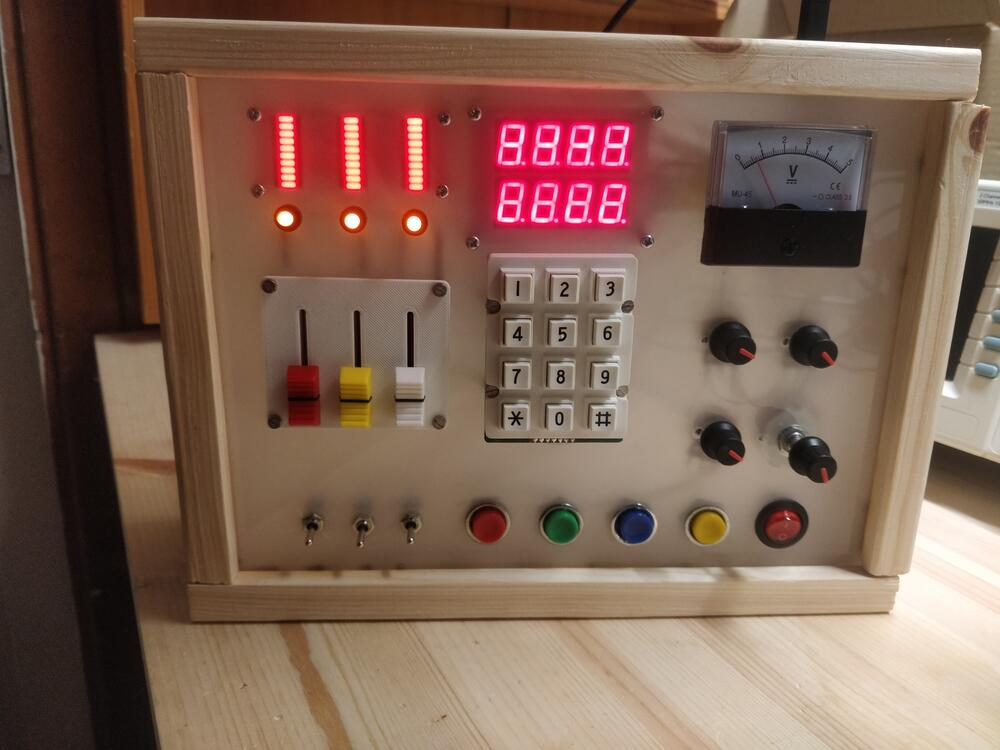
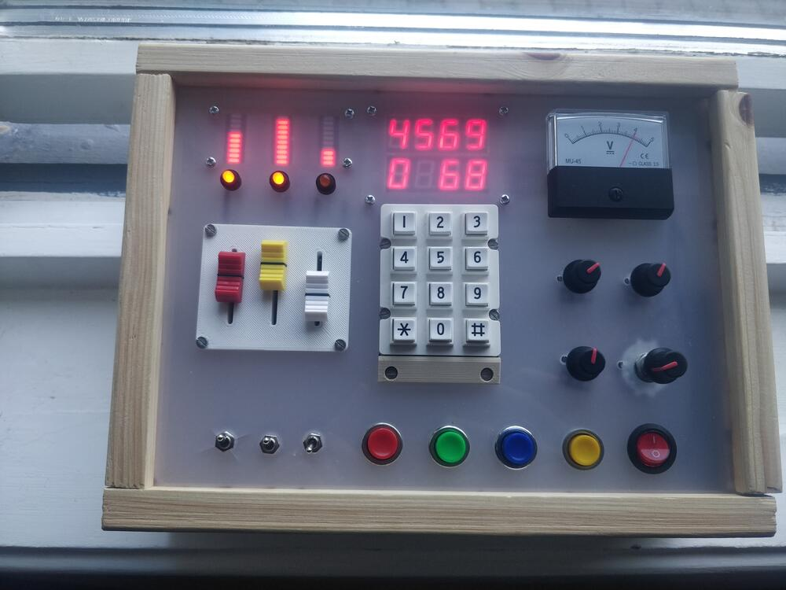
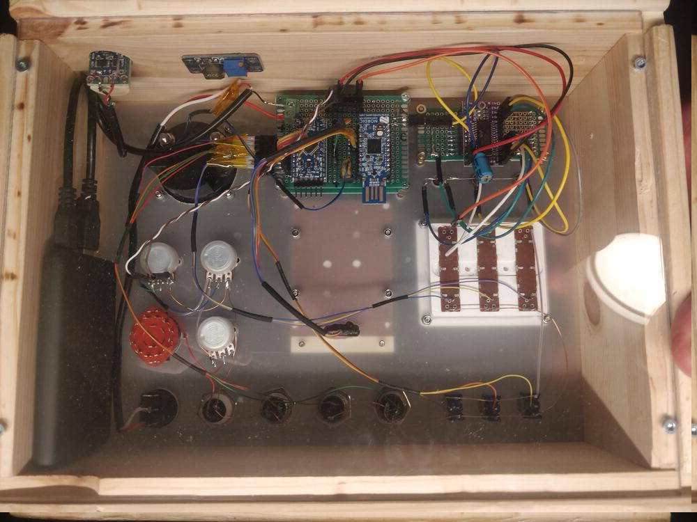
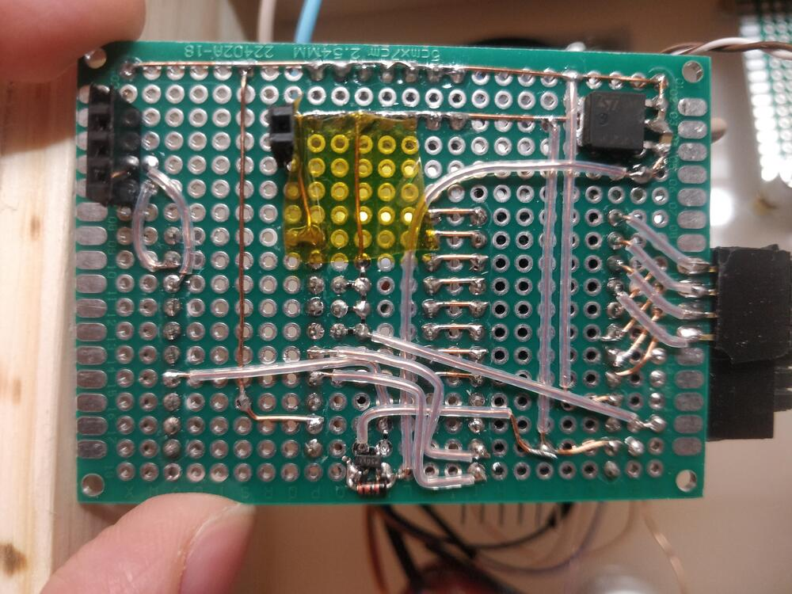
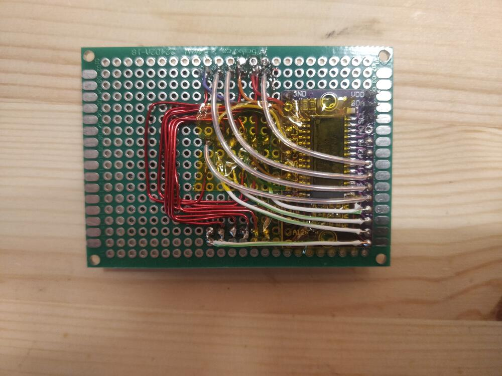
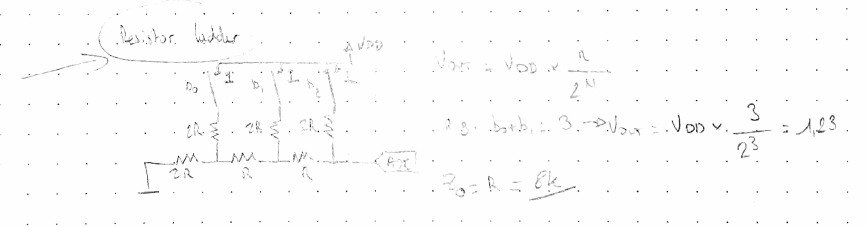
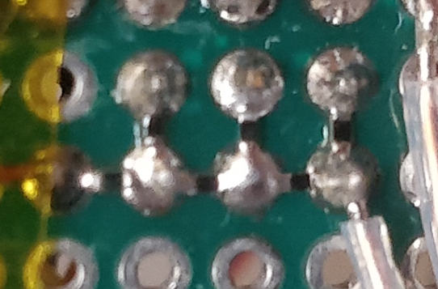
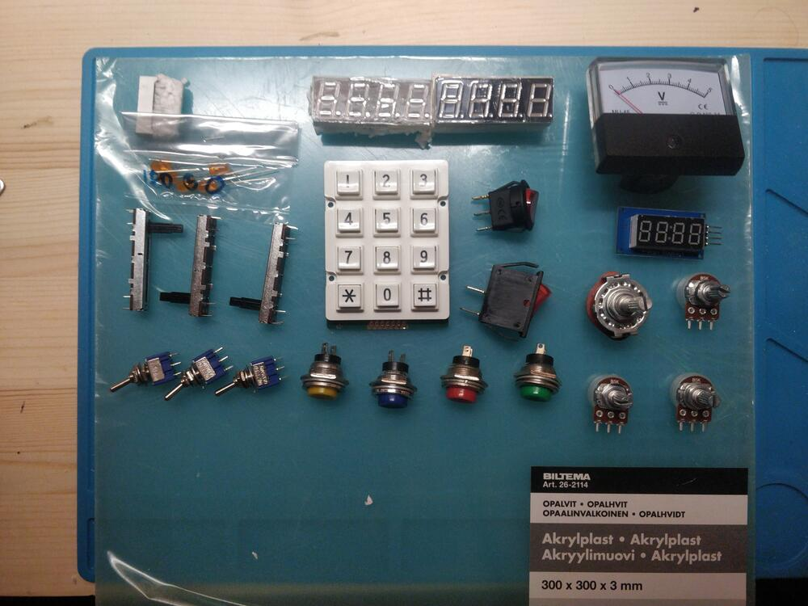
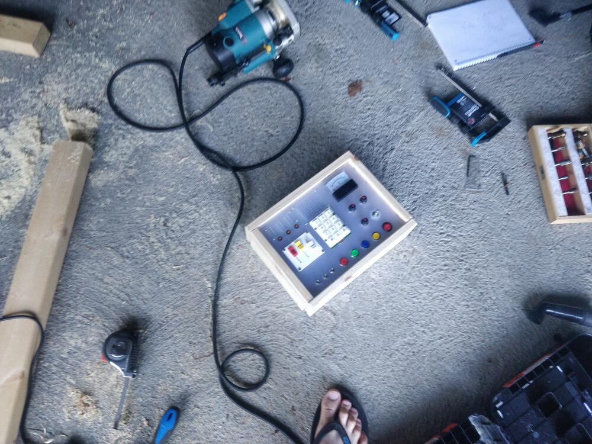

Intro
-------

A board with a bunch of inputs and outputs I made for my daughter.

It features:
- Inputs
  - 3x4 keypad
  - 3 sliding pots
  - 3 rotary pots
  - 1 rotary selector switch
    (not wired for now)
  - 3 toggle switches
  - 4 pushbuttons
  - 1 red power button

- Outputs
  - analog needle gauge / meter
  - 3 red led bargraphs
  - 3 orange leds
  - 2 4char 7-seg led displays
  
The inputs drive the outputs in an intuitive way. It doesn't actually control anything right now, but I'm thinking of repurposing it as a midi controller or something when she gets bored with it.

Electronics
-----------

I initially wanted to do everything on a raspi pico, but it doesn't have enough ADC channels.

So instead there is an Arduino pro mini (3V / 8MHz) that reads all the inputs and sends the values in binary over serial.
A Nordic nRF52840 dongle reads the input data and drives the outputs.

This way it's future-proof, as the dongle allows me to implement wireless functionality later. E.g. controlling a Lego train or something. I can also add DFU, and could maybe also upgrade the arduino FW over BLE (given enough time, ha).

I thought I was smart and would save some time by making the whole circuit as I went on perfboard. Bad idea. Took way more time and tedious work than if I had just bit the bullet and made a proper PCB, they're so cheap nowadays.
I.e. I mixed up the columns and rows when soldering the display board, and had to re-do eeevery single connection ugh.

Ran out of GPIO for the toggle switches. They are now connected as a crude R2R DAC to another ADC pin of the Arduino.

Initially had a repurposed phone battery (+DCDC) as power source, but changed to a usb powerbank. Can be recharged with a standard usb-C cable.

Mechanical
----------

Translucent acrylic front, that allows the LED displays to shine through.
Transparent acrylic back, showing my 👌 wiring.
The frame of the box is made of simple pine wood. I had some shelves lying around...

Some 3d printed parts: 
- small bezel for the keypad
- usb-c connector housing
- backboard for the slider pots

[Freecad files (+stl)](zip/freecad.zip)  

Project files
-------------

Dongle FW made using Zephyr RTOS. A bit overkill, but that's what I work with every day so pretty comfortable with it.
Nice bonus is the LED driver chip is supported out of the box.

Arduino FW is made using Arduino (no fancy AVR ASM here :p). I did observe some missed keys in the keypad scanning library, but since the display loop is fast enough, the missed keys are not a problem in practice.

[Project firmware](zip/software.zip)  

Demo
----

Quick demo video:



Misc notes
----------

Ordered components from a distributor I used to use 10 years ago, Futurlec. I think they officially jumped the shark, they displayed wrong stock values, the push buttons were really low-quality (one broke 10mins in) and ordering was a long email exchange.
Next time I'll just go with aliexpress + lcsc :)

[Project BOM](pdf/bom.pdf)  

Some random notes I made when making this: 
[Project notes](pdf/notes.pdf)  
