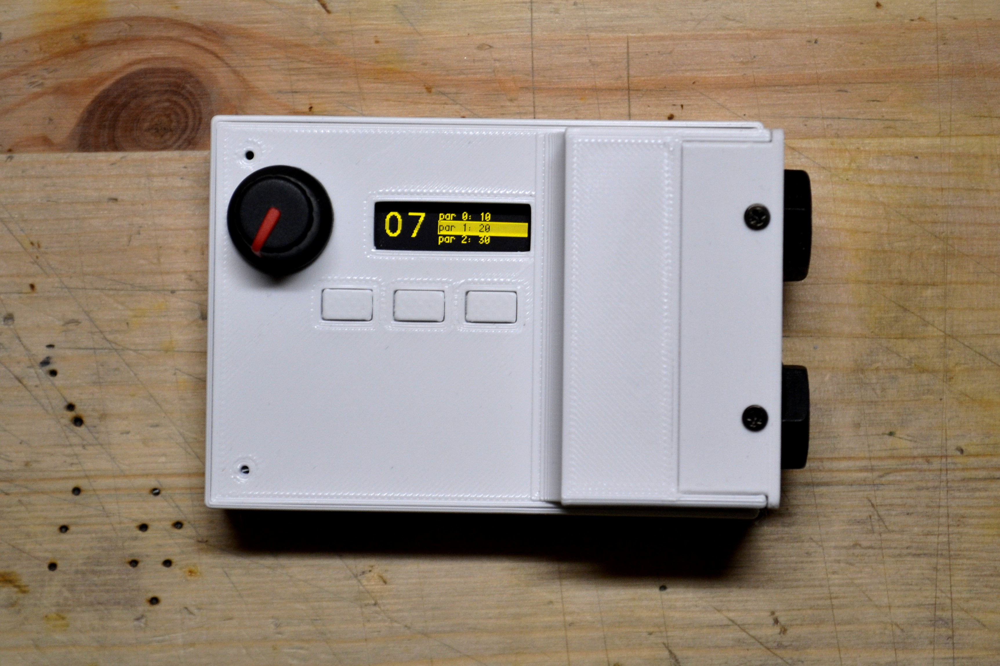
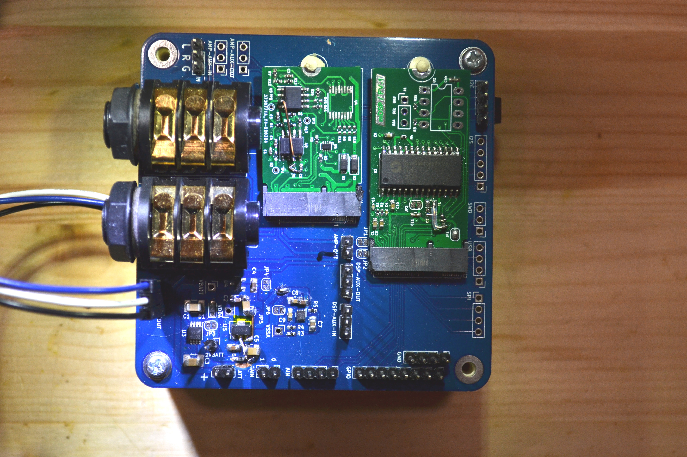
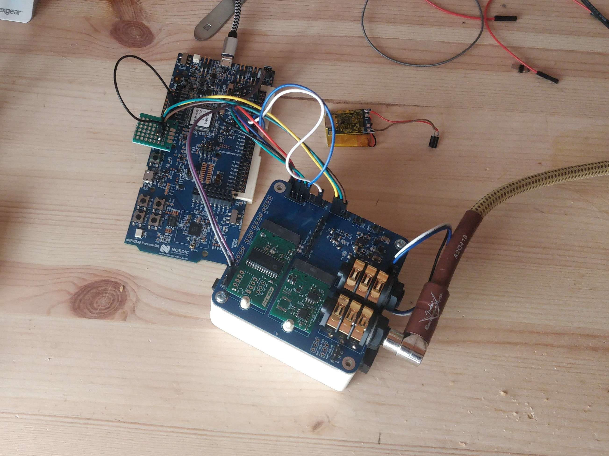
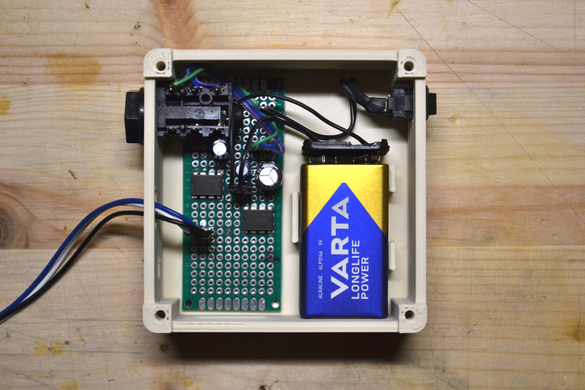
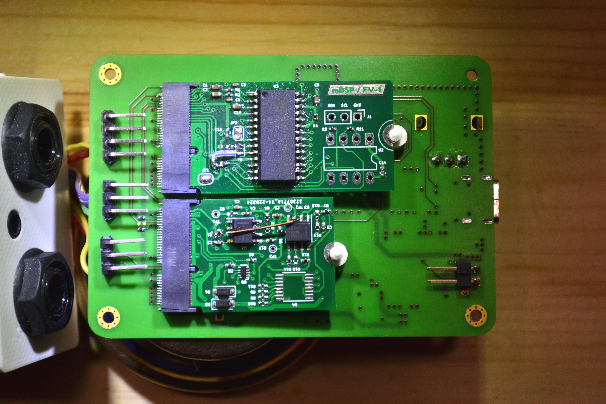
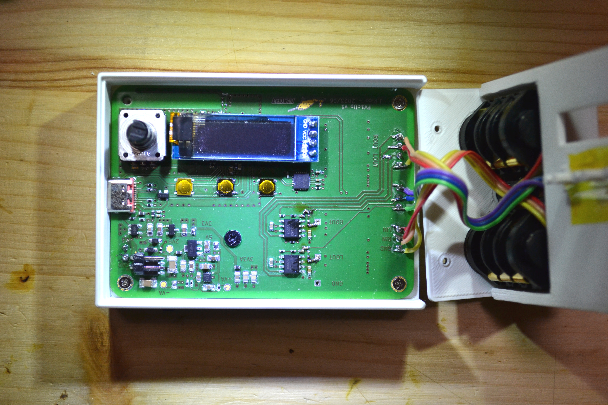
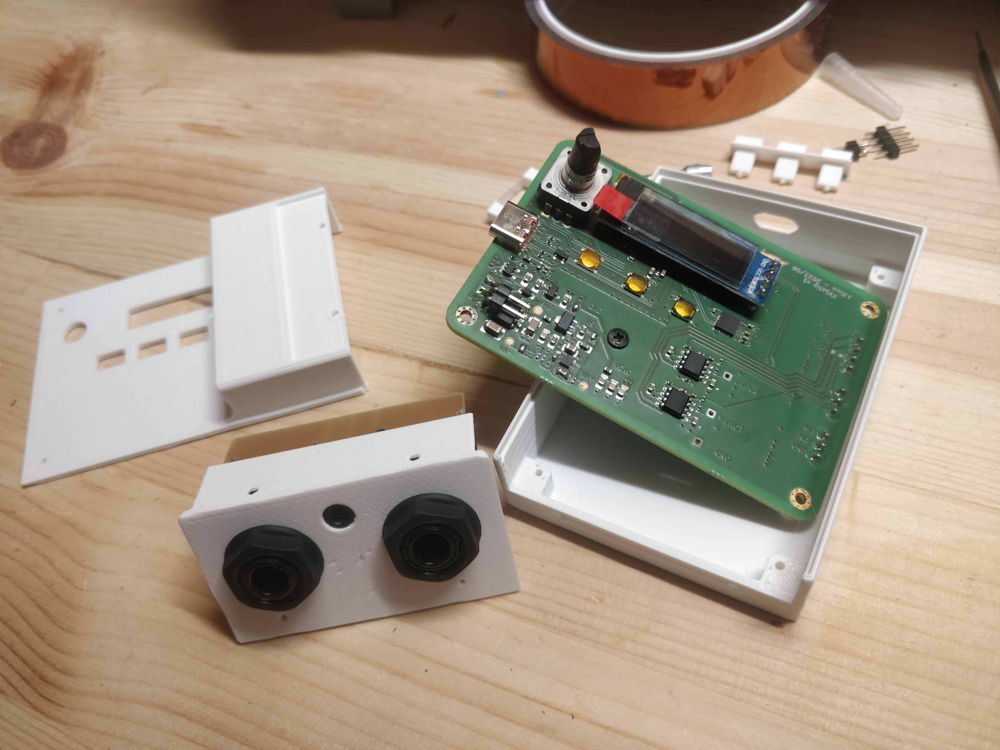

A wearable guitar effects processor. Based on the Spinsemi FV-1 chip.



# Outline



## Status

Progress as of 2024-05-11:

- [ ] [Firmware](https://github.com/narvalotech/fvclip)
  - [x] EEPROM emulation
  - [x] Display interface
  - [x] Reading buttons/encoder
  - [x] UART program and parameter transfer
  - [ ] Bluetooth program transfer 
- [x] [FV1 Assembler](https://github.com/narvalotech/fvl)
- [x] DSP board
- [ ] Graphical interface

## Story

Wanted a pocketable guitar effects unit.
Also dissatisfied of the state I left [fvpedal](../fvpedal) in.

My wishlist:
- Use of FV1 effects chip
- Setting of parameters via bluetooth
- Headphone output
- Line-in with audio passthrough
- Rechargeable battery, 5-hour runtime
- USB-C connector for power and data
- Accelerometer for controlling effects
- Easy operation (no menu diving)

## Electronics

This time around I wanted to try a more modular approach to development.

A motherboard with interchangeable cards for the DSP and the pre-amp would give some good advantages:
- test the card on a "development" motherboard with more interfaces & testpoints
- swap out the cards with a more powerful or better version later
- cheaper manufacturing: the (bigger) motherboard can have lower design tolerances

### Connector

The first step is choosing a connector for the cards. I wanted something I could easily re-use.
Settled on a m.2 connector, with a custom pinout.

I tried my best to at least have the power rails be the same, but there are so many different m.2 standards that it proved impossible. I think at least that plugging the custom cards into a NVME port shouldn't fry anything.



| Name     | Bot | Name  | Top |
|----------|-----|-------|-----|
| GND      |   1 | VBAT  |   2 |
| GND      |   3 | VBAT  |   4 |
| GND      |   5 | VUSB  |   6 |
| GND      |   7 | VUSB  |   8 |
| GND      |   9 | 3V3   |  10 |
| GND      |  11 | 3V3   |  12 |
| GND      |  13 | 1V8   |  14 |
| GND      |  15 | 1V2   |  16 |
|          |  17 |       |  18 |
| AVNEG    |  19 | AVPOS |  20 |
|          |  21 |       |  22 |
| AGND     |  23 |       | KEY |
|          | KEY |       | KEY |
|          | KEY |       | KEY |
|          | KEY |       | KEY |
|          | KEY | MCLK  |  32 |
| D+       |  33 | LRCK  |  34 |
| D-       |  35 | SCLK  |  36 |
| GND      |  37 | SDIN  |  38 |
| SWDIO    |  39 | SDOUT |  40 |
| SWDCLK   |  41 | GND   |  42 |
| MOSI     |  43 | SCL0  |  44 |
| MISO     |  45 | SDA0  |  46 |
| SCK      |  47 | SCL1  |  48 |
| SS       |  49 | SDA1  |  50 |
| GP4      |  51 | GP0   |  52 |
| GP5      |  53 | GP1   |  54 |
| GP6      |  55 | GP2   |  56 |
| GP7      |  57 | GP3   |  58 |
| AIN0     |  59 | AIN1  |  60 |
| AIN2     |  61 | AIN3  |  62 |
| GND      |  63 | GND   |  64 |
| AUX-LOUT |  68 | LOUT  |  67 |
| AUX-ROUT |  66 | ROUT  |  65 |
| AGND     |  69 | AGND  |  70 |
| AUX-LIN  |  74 | LIN   |  73 |
| AUX-RIN  |  72 | RIN   |  71 |
|          |  75 |       |     |


### Motherboard

The motherboard contains the power supply, headphone amps and audio connectors.
I started with a development board that allowed me to test everything worked smoothly.

[PDF schematic](files/breakout.pdf)




I forgot the headphone amps, so hand-wired two LM386s and placed them in a box below.



Using this board I was able to develop the firmware, having easy access to all the signals and busses I needed.
I used an nRF52840 devkit to do so.

The real motherboard ([schematic](files/clip.pdf)) is smaller and has more stuff on it:
- Bluetooth SoC: nRF52840
- 6-axis motion unit: MPU-6050
- USB-C connector
- LiPo charger: STC4054
- Headphone amps: FM8002A

A neat trick is routing the SWD lines through the SBU1/2 signals. With a [special adapter board](img/usb-swd.jpg), it allows attaching a debugger without taking the whole thing apart. 




### DSP board

[Schematic](files/dsp.pdf)

The DSP is on an m.2 2245-format board. I chose the bigger size to accomodate future DSPs that might need the extra room for support components, like codecs regulators etc.

I -carefully- salvaged the FV-1 chip from the fvclip project's PCB. I don't even know if they sell them anymore.
I also added a footprint for the EEPROM in case emulating it with the MCU would fail.

For some reason, the crystal had trouble starting up. It started up whenever I put my finger on it though. So I tried a bunch of different capacitor values, but still wouldn't start on its own.

In the end, I ended up re-routing the XTAL signal to the connector and driving it from the microcontroller. It's not very high, at 48kHz.

### Pre-amp board

[Schematic](files/amp.pdf)

Guitar signals are very low (around 20-50mVpp), so we need a pre-amplifier board before the signal can be fed to the DSP.

This board is sized 2230, as it needs less components.
There are two OPA1642 Op-Amps and an analog multiplexer for selecting the gain.

Unfortunately, forgot to order the multiplexer so had to make the gain fixed. I also had to [bypass the first amp](img/amp-mods.jpg) as it made the signal super-sensitive to the Guitar's volume pot noise.

## Case design

I made the case using [cadquery](https://cadquery.readthedocs.io/en/latest/quickstart.html#quickstart).
The 3D export from KiCad was very useful, as cadquery can import it and I could just model the case around it.
Thanks to that, the print worked on the first try!



## Software

The fun stuff 💻💾

There are two reasons the FVpedal project failed.
- I didn't manage to upload custom programs to the FV1
- I had no idea how to make an assembler for the programs

There's really something about finally having the knowledge to complete a 10-year-old project!

Made with the two best programming languages ever designed: [C](https://en.wikipedia.org/wiki/C_(programming_language)) and [Common Lisp](https://en.wikipedia.org/wiki/Common_Lisp). Fight me 🔥

### Firmware

Most of the heavy lifting is done by ZephyrRTOS's integrated drivers.
Apart from the EEPROM emulation, I didn't have to write any drivers 🥳

The [input subsystem](https://docs.zephyrproject.org/latest/services/input/index.html) takes care of the [rotary encoder and the buttons](https://github.com/narvalotech/fvclip/blob/476b849aa320afa573247e07102ff6dfa4223e44/boards/arm/fvclip/fvclip.dts#L16-L45).

The [character frame-buffer](https://docs.zephyrproject.org/latest/hardware/peripherals/display/index.html#monochrome-character-framebuffer) API combined with the [ssd1306 driver](https://github.com/narvalotech/fvclip/blob/476b849aa320afa573247e07102ff6dfa4223e44/boards/arm/fvclip/fvclip.dts#L126-L141) make for a good enough display interface.

The EEPROM [is emulated](https://github.com/narvalotech/fvclip/blob/476b849aa320afa573247e07102ff6dfa4223e44/src/eeprom.c#L114) pretty easily. The only caveat is that at the time, Zephyr didn't have support for acting as an I2C peripheral. I had to use the nrfx driver directly instead.

Commands are [received over UART](https://github.com/narvalotech/fvclip/blob/476b849aa320afa573247e07102ff6dfa4223e44/src/serial.c#L210-L216), using a very bare-bones wire format. The only two commands implemented are downloading a new program and changing the emulated potentiomenter values fed to the FV1.

The FV1 potentiometer inputs are driven with the world's worst DAC, [a PWM signal](https://github.com/narvalotech/fvclip/blob/476b849aa320afa573247e07102ff6dfa4223e44/src/dsp.c#L84-L94) fed into an RC filter.

The only missing piece is generating the FV1 clock, and that's achieved using TIMER + PPI.

```c
static void setup_dsp_clock(void)
{
	#define FVCLKPIN 22	/* P0.22 -> DSP GP5 -> FV1 X1 */
	#define MYTIMER NRF_TIMER3 /* Hopefully free? */
	#define CLK_HP_US 26   /* ~19kHz TODO: increase */
	#define GPIOTE_CH_INVALID 0xFF
	#define PPI_CH_INVALID 0xFF

	/* Use TIMER + PPI + GPIOTE to synthesize a 48kHz clock on DSP GP5. We
	 * have to play ball and use the HAL allocation fns for PPI / GPIOTE
	 * since we're running in an RTOS.
	 */

	/* step 1: configure TIMER */
	MYTIMER->BITMODE = 0;           /* 16-bit width */
	MYTIMER->PRESCALER = 4;         /* 1 MHz - 1 us */
	MYTIMER->MODE = 0;              /* Timer mode */
	MYTIMER->SHORTS = 1 << 0; /* CC[0] resets the timer value */
	MYTIMER->CC[0] = CLK_HP_US; /* one tick = half clock cycle */

	/* step 2: configure GPIOTE */
	uint8_t gch = GPIOTE_CH_INVALID;
	uint32_t err = nrfx_gpiote_channel_alloc(&gch);
	__ASSERT_NO_MSG(err == NRFX_SUCCESS);
	__ASSERT_NO_MSG(gch != GPIOTE_CH_INVALID);
	NRF_GPIOTE->CONFIG[gch] = 3; /* Task mode */
	NRF_GPIOTE->CONFIG[gch] |= FVCLKPIN << 8;
	NRF_GPIOTE->CONFIG[gch] |= 0 << 13; /* Port 0 (line not necessary for P0) */
	NRF_GPIOTE->CONFIG[gch] |= 3 << 16; /* Toggle pin on TASKS_OUT */
	NRF_GPIOTE->CONFIG[gch] |= 0 << 20; /* Initial pin value is LOW */

	/* step 3: configure PPI link */
	uint8_t pch = PPI_CH_INVALID;
	err = nrfx_ppi_channel_alloc(&pch);
	__ASSERT_NO_MSG(err == NRFX_SUCCESS);
	__ASSERT_NO_MSG(pch != PPI_CH_INVALID);

	NRF_PPI->CH[pch].EEP = (uint32_t)&MYTIMER->EVENTS_COMPARE[0];
	NRF_PPI->CH[pch].TEP = (uint32_t)&NRF_GPIOTE->TASKS_OUT[gch];
	NRF_PPI->CHENSET = 1 << pch;

	/* step 4: start the timer and output clock on pin */
	MYTIMER->TASKS_CLEAR = 1;
	MYTIMER->TASKS_START = 1;
}
```

### FV1 Assembler

Armed with my [new hammer](https://gigamonkeys.com/book/) I was in search of a nail to bang it on.
Making an assembler for an obscure instruction set seemed like the perfect match for a forgotten programming language.

It's around 500 lines of naive CL code. But hey, it works.

#### Features

- Assemble an FV1 program formatted in s-expressions to intel-hex format
- "Macro" assembler: s-exps are resolved recursively
- Export program to C header
- Dump all the possible instructions and their encoding
- Send assembled program over UART to DSP

#### Example program

soft-dist.fvl
```
(equ tovrx reg0)
(equ sigin reg1)

(rdax adcl 1.0)
(wrax sigin 1)

(rdax sigin 1)
(log -1 -3/16)
(exp 1 0)
(wrax tovrx 1)
(mulx tovrx)
(rdax tovrx -2)
(mulx sigin)
(sof -2 0)
(sof 1.999 0)

(wrax dacr 0)
(wrax dacl 0)

(nop)
```

And I used this non-sensical instruction list to test my encoding:

```
(and #x101) ; Some and instruction
(sof 1.0 -0.5) ; Some sof instruction
(sof .25 -.125)
(sof -0 #x7ff) ;; Some other sof instr (test list)
(sof -0 $7ff) ;; Some other sof instr (test list)
(wrax DACL 0)
(rdax ADCR 1.0)

(skp RUN jump-here-please)
; fun with parameters
(cho-rda RMP0 (bor COMPC REG #x01) (lognot (bor %0001_0000 $0C)))
(skp (bor ZRO GEZ) 2)

(equ my-alias $01)
(wldr 0 -2 my-alias)
(equ my-alias %10)
(wldr 0 -2 my-alias)
(equ my-alias 3)
(wldr 0 -2 my-alias)

; test signed int
(label jump-here-please)
(wldr 0 -32768 1)
(wldr 0 -2 1)

; memory
(mem delay-left 2048)
(mem delay-right 1024)
(rdax ADCR 1.0)
(wra delay-left 0.25)
(wra (mem-middle delay-left) 0.25)
(wra delay-left^ 0.25)
(wra (mem-end delay-right) 0.5)
(wra delay-right# 0.5)

; end-of-file
```

#### Encoding instructions

Instruction definitions are loaded from a [simple text file](https://github.com/narvalotech/fvl/tree/2e1e9194ad5fb381927d1ae141971eedc1af97cd/fv1-opcodes.lisp). 

Every opcode is then made an instance of the `FV1-OP` class:

```cl
(defclass fv1-op ()
  ((mnemonic :initarg :mnemonic :accessor mnemonic)
   (opcode   :initarg :opcode   :accessor opcode)
   (desc-op  :initarg :desc-op  :accessor desc-op)
   (desc     :initarg :desc     :accessor desc)
   (params   :initarg :params   :accessor params :initform nil)))
```

It's a bit verbose I guess, and the accessor functions are not really necessary.
This is the equivalent in python:

```python
class Fv1Op:
    def __init__(self, mnemonic, opcode, desc_op, desc, params=None):
        self.mnemonic = mnemonic
        self.opcode = opcode
        self.desc_op = desc_op
        self.desc = desc
        self.params = params
```

Similarly, the parameters for the instruction are instances of the `FV1-PARAM` class

```cl
(defclass fv1-param ()
  ((name   :initarg :name   :accessor name)
   (pos    :initarg :pos    :accessor pos)
   (width  :initarg :width  :accessor width)
   (form   :initarg :form   :accessor form)
   (range  :initarg :range  :accessor range :initform nil)
   (op-mne :initarg :op-mne :accessor op-mne)))
```

Here it how `AND` looks like in the text file and in the inspector:

```
(and #b01110 (("M" 8 24 uint nil))
      "ACC & MASK"
      "AND will perform a bitwise 'and' of the current ACC and the specified 24b
  MASK." )
```

```
#<FV1-OP {10031E0B73}>
--------------------
Class: #<STANDARD-CLASS COMMON-LISP-USER::FV1-OP>
--------------------
 Group slots by inheritance [ ]
 Sort slots alphabetically  [X]

All Slots:
[ ]  DESC     = "AND will perform a bitwise 'and' of the current ACC and the specified 24b   MASK."
[ ]  DESC-OP  = "ACC & MASK"
[ ]  MNEMONIC = AND
[ ]  OPCODE   = 14
[ ]  PARAMS   = (#<FV1-PARAM {1003522763}>)

```

Clicking on `PARAMS` in the inspector opens up the parameter list, which for this instruction only has one entry:

```
#<FV1-PARAM {1003522763}>
--------------------
Class: #<STANDARD-CLASS COMMON-LISP-USER::FV1-PARAM>
--------------------
 Group slots by inheritance [ ]
 Sort slots alphabetically  [X]

All Slots:
[ ]  FORM   = UINT
[ ]  NAME   = "M"
[ ]  OP-MNE = AND
[ ]  POS    = 8
[ ]  RANGE  = NIL
[ ]  WIDTH  = 24

```

