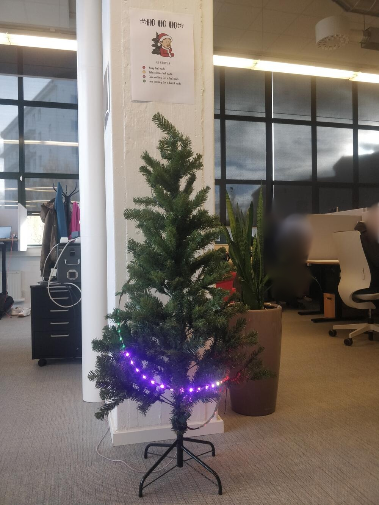
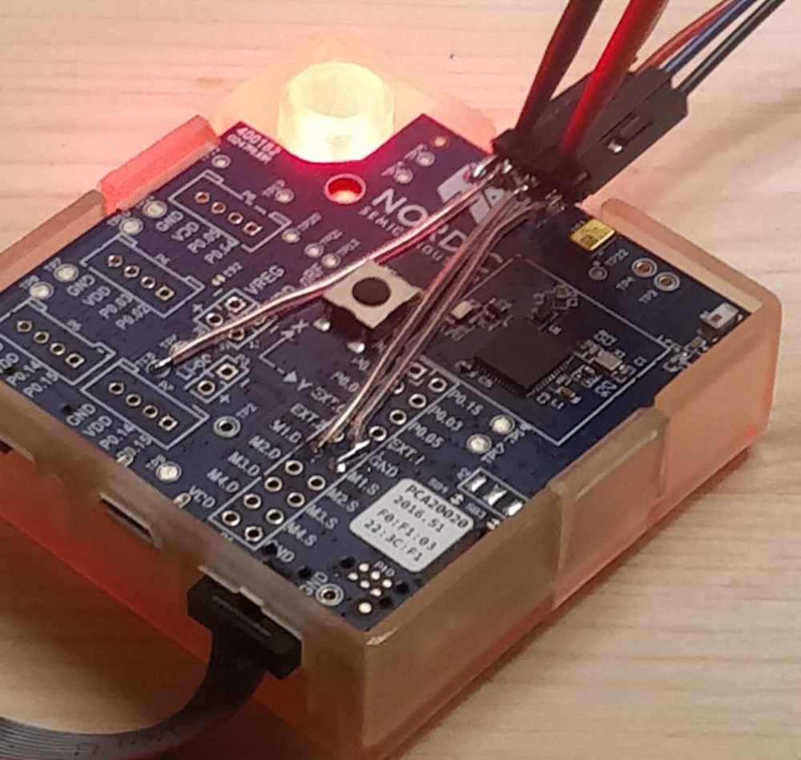
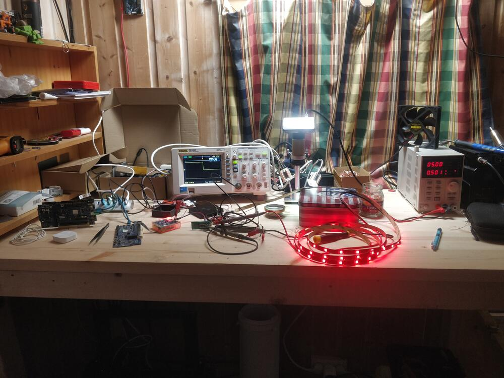
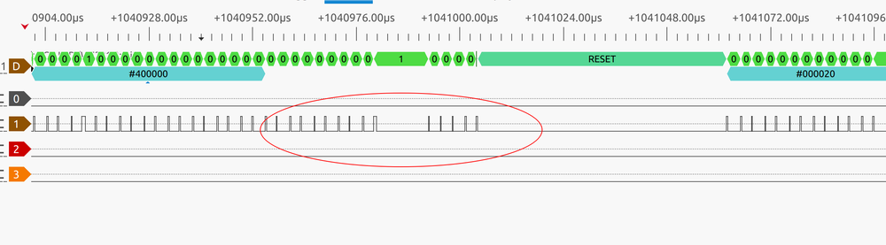
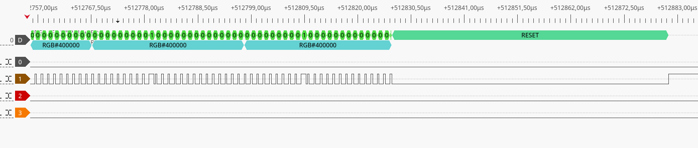

An LED strip (on a xmas tree) that displays the current job queue.



## The idea

Some years back I bought a strip of WS2812 addressable LEDs that I wanted to use for a christmas tree, displaying the number of hits for a given hashtag on twitter. I never took the time to do it but my family had a pcmasterrace-approved amount of RGB on the tree that winter.

Last year (or was it the year before?) we had a pretty hectic CI, with job queues in the hours, so I thought it'd be nice to have some visualization of the current CI load/queue. But doing a web dashboard is no fun, and I thought, hey why not finally do this christmas tree thing, it's only been what, 8 years?

At first I thought of having each LED show the status of a build on the main branch of the nordic SDK or the bluetooth stack that we produce, but then that would be pretty static since it gets built only a few times a day (at most).

So I thought a bit more of what could be useful and also more dynamic; a thing I really wanted to know when pushing a build was if it was going to take 5 minutes to be picked up by a test/build node, or 5 hours.

Then that meant showing the queue in some way with the limited number of LEDs available. The first thing would be checking what data I could easily glean from Jenkins.

## The API

Jenkins has a web API, that returns JSON. Most web pages in the interface [have their JSON counterpart](https://www.jenkins.io/doc/book/using/remote-access-api/).
The tricky part is actually knowing the right URLs for the data we're trying to get.

To access this, we need a username + password combo, with the password hopefully not being our AD/LDAP password, but rather a token that has to be generated on our user's page.

A few python libraries turned up after some duckduckgo-ing, and I selected [python-jenkins](https://python-jenkins.readthedocs.io/en/latest/) as it seemed to be a thin-enough convenience wrapper around the native API.

The next step was to get the data we're interested in, namely the current job queue and the status of each executor/node.

### Job queue

The jobs I'm interested in execute on nodes that have labels `build-ncs` for the build cycle, and `test-ble` for the hardware test cycle. 
Jenkins exposes a `why` key with a string saying why the job isn't running yet. 

We can then filter jobs that are waiting on a node by looking for `Waiting for next` in that string.
We can then separate the jobs that are waiting on a test node from the ones waiting on a build node by also looking for the corresponding label in the same string.

```python
def get_queue(server):
    qi = server.get_queue_info()
    test = []
    build = []
    for job in qi:
        why = job.get('why')
        if 'Waiting for next' in why:
            if 'test-ble' in why:
                test += [job]
            elif 'build-ncs' in why:
                build += [job]
    return {'queue': qi, 'test': test, 'build': build}
```

### Node status

The next piece of data is the current execution status of each build and test node.
We want to know how many nodes are currently busy with existing jobs, to get a sense of how long our build will be waiting in the queue.

The python library exposes a method to get all nodes `get_nodes(server)`, but while the API call it makes behind the scenes returns a lot of info on the node, it only returns the name and whether it is offline or not.

What I did is copy that function out of the library and return the whole response from the jenkins API.

```python
def get_nodes_extrainfo(server, depth=0):
    """Low-level method to return the whole node info structure
    instead of just the name and status.
    """
    nodes_data = json.loads(server.jenkins_open(
        requests.Request('GET', server._build_url(jenkins.NODE_LIST, locals()))))
    return nodes_data["computer"]
```

Then it's a matter of extracting if the node is either busy, idle or offline. The API has the `idle` and `offline` keys, and if both aren't set, we can deduce that the node is busy with a job.

```python
class NodeState(enum.IntEnum):
    OFFLINE = 0
    IDLE = enum.auto()
    BUSY = enum.auto()

def extract_info(name, info):
    idle = info['idle']
    offline = info['offline']
    if offline:
        status = NodeState.OFFLINE
    elif idle:
        status = NodeState.IDLE
    else:
        status = NodeState.BUSY
    return {'name': name, 'status': status}
```

Then it's a matter of extracting the data for the nodes we're interested in.

```python
def get_nodes(server):
    nodes_build = []
    nodes_test = []
    # st = time.time()
    nodes = get_nodes_extrainfo(server)
    # print(f'req time: {time.time() - st}')
    for node in nodes:
        try:
            name = node['displayName']
        except:
            continue
        if not (('build-' in name) or ('test-' in name)):
            continue
        info = node
        labels = info['assignedLabels']
        for label in labels:
            if 'build-ncs' in label['name']:
                nodes_build += [extract_info(name, info)]
            if 'node-test-ble' in label['name']:
                nodes_test += [extract_info(name, info)]
    return {'build': nodes_build, 'test': nodes_test}
```


## Talking to the LEDs

The next question is how do we connect these python bits to the actual LED strip on the tree?
I had two options:
1. use a raspberry pi, run the data script on it, and wire the LEDs directly to its GPIOs.
2. use a transmitter connected to my desktop PC and a receiver on the tree connected to the LEDs.

Option 1 was discarded because although easier technically:
- it would restrict where I could put the tree, as it'd need to be not far away from an ethernet jack 
- I only had raspi zeros, so I'd  need to buy a usb-ethernet dongle
- attaching random linux computers on the internal IT network isn't a really good idea anyways.

Option 2 it is!
Since I work with Bluetooth LE, the obvious choice was to use it for data transfer.

### Transmitter

The PC-to-transmitter link uses a nRF52832 DK on my desk, connected over it's onboard UART-to-USB converter, so it appears as a bog standard serial port.
A simple wire format is enough:

| keyword | length  | crc   | data            |
|---------|---------|-------|-----------------|
| 'UART'  | 16-bits | 8-bit | N bytes of data |

With the data represented as an array of structs per-led:
```c
struct led_data {
	uint8_t r;
	uint8_t g;
	uint8_t b;
	uint8_t fx;
} __packed;
```

This LED string data then gets sent over Bluetooth, there are 68 LEDs, so that makes 272 bytes to transfer.

Here were the options if using a connection:
- use a custom service / characteristic for the LED strip
- use Nordic Uart Service (GATT)
- use a dynamic L2CAP channel to send the raw data

And without establishing a connection:
- LED strip payload over periodic advertising
- LED strip payload over extended advertising

As I wanted to keep things simple, I discarded the options that required a connection, and tried to make periodic advertising work.
There are some samples demonstrating how to use the Zephyr Bluetooth API to setup a periodic advertiser and to sync a scanner on the other side.

The problem that I discovered is that while the maximum advertising data length wasn't being hit (1650 bytes), the payload did require splitting over multiple advertising data elements, since they can at most be 255 bytes.
This causes an issue because it is forbidden to update split advertising data when the advertiser using it is running/active.
There are then two options: 
- do the splitting on the application side, adding some metadata to the payload to re-assemble it later
- stop the advertiser, update the data, and restart it. The problem is that the sync on the other side will be lost.

In order to keep it simple, I decided to go with a normal extended advertiser, and abandon periodic advertising even if that meant that timing-based effects, like blinking and fading wouldn't be possible any more. I mean, they would still be possible, but a fixed number of effects would have to be implemented on the receiver board.

The main thread runs a loop that waits on a data payload to be received over serial (using a semaphore), then stops the current advertiser, copies the data from the serial buffer into the advertising data buffer, and restarts the advertiser. 

### Receiver

On the receiver side, we need to scan continuously, and read and update the LED data when the correct advertiser is detected.
To make things simple (common theme it seems), the data is read from any advertiser with the name `santa`.

Here's the advertising data callback:
```c
#define PEER_NAME "santa"
static void scan_recv(const struct bt_le_scan_recv_info *info,
		      struct net_buf_simple *buf)
{
	char le_addr[BT_ADDR_LE_STR_LEN];
	char name[NAME_LEN];

	(void)memset(name, 0, sizeof(name));

	struct net_buf_simple_state state; 
	net_buf_simple_save(buf, &state); // 1
	bt_data_parse(buf, data_cb, name); // 2
	net_buf_simple_restore(buf, &state); // 3

	if (strncmp(PEER_NAME, name, strlen(PEER_NAME))) { // 4
		return;
	}

	bt_data_parse(buf, led_data_cb, NULL); // 5
	led_idle_animation(false); // 6
}
```

1. The state of the buffer containing the advertising data is 'saved', that is a backup of the metadata is done.
2. `bt_data_parse()` is called, with a callback that will write the name of the device to `name`.
3. The advertising data's buffer is rolled back to the previous state, so it can be parsed again later
4. `name` is compared to an expected name (`PEER_NAME`, which is defined as `"santa"`).
5. Then the data is parsed once again, this time looking for the LED payload:
6. We assume the payload was read, and `led_idle_animation(false)` is called to refresh the LEDs with the new payload.

The payload copying is very naive, we expect any manufacturer-specific adv data to be the right format and the right length. Didn't even bother to change the `switch-case` to an `if`:
```c
static struct led_data strip[NUM_LEDS];
/* snip */

static bool led_data_cb(struct bt_data *data, void *user_data)
{
	switch (data->type) {
	case BT_DATA_MANUFACTURER_DATA:
		LOG_HEXDUMP_DBG(data->data, data->data_len, "ad data");
		memset((uint8_t*)strip, 0, sizeof(strip));
		memcpy((uint8_t*)strip, data->data, MIN(data->data_len, sizeof(strip)));
		return false;
	default:
		return true;
	}
}
```

The interesting part of the receiver is the LED control.

### LED control

For the receiver board, I had a [Thingy:52](https://docs.zephyrproject.org/latest/boards/arm/thingy52_nrf52832/doc/index.html) that was fished from a bin in the office and was looking for something to do with it.

The LEDs work with a 5-volt logic level, so I'd have to make or buy a level shifter. I didn't have any more transistors at home and the only level shifter I had was some crazy-small SMD package.
Fortunately, the thingy has onboard N-channel MOSFETs, which makes my life easier since that means the only extra component needed would be a low-value pull-up resistor.



Then it was just a matter of hooking up a scope to check the signal didn't look like a potato (spoiler, it did). After going down to a fairly low-value resistor (~100 ohms), the signal looked much more square.



Another lucky shot was finding out zephyr already had a WS2812 driver.

As those LEDs are a bit fiddly, you have to respect some timings and most driver implementations are hacks around DMA + a fast peripheral like SPI. The in-tree driver is no exception, as it is using SPI to clock out the right bit sequence.

But that'd be too easy, I actually found out (or rather was reminded, I already had an encounter with this) that the SPI peripheral on nRF52832 is not well behaved:

It clocks out some garbage data at the end of transmissions, and sometimes inserts a small pause in the clocked out data. Now that isn't a problem when _actually_ using SPI, because the peripheral you are talking to will just ignore anything after the SS/CS signal is de-asserted, and will also only read out data form the MOSI line when there is an actual clock pulse on SCK.



The problem is that the LEDs are hung right off this MOSI line, and any garbage (or extra delays) on it will be interpreted as data, since it doesn't know when the signal is valid or not. 
In practice, that meant that the whole strip output wildly different colors that what was being asked 1 out of 5 times; with a refresh of a few 100ms, it felt like the inside of a disco, so a bit too distracting for the office.

I could've fixed it with an AND gate in hardware, but there might be a better solution.

I knew there was another serial peripheral that I could use, I2S, so I searched around, and found a blog post describing exactly what I wanted: [Driving WS2812B LEDs using I2S on the Nordic nRF52832 BLE SoC](https://electronut.in/nrf52-i2s-ws2812/). It's like someone read my mind haha!

This very nice post has illustrations and code on how to use the I2S peripheral to clock out the bitstream that the LED strip needed, the only hiccup being it being from 2017, so using the legacy nRF5 SDK instead of the Zephyr-based NRF Connect SDK.

So I hacked together a proof of concept using the configuration found in that post and an I2S sample found in Zephyr. It seemed to work really well with a cleaner output than the SPI peripheral!

Some downsides though (that don't really matter here): the memory usage is twice bigger than the SPI variant because of a limitation of the I2S driver interface, and the `reset` pulse length can't be as short as with SPI.



Next step was to make a proper Zephyr driver, and add it to the project, since I didn't want to wait for it to be merged upstream. That's why the code in the project's repo might look different than what will be/is in the zephyr repo.

I did have some issues when choosing the right macro to read from the device tree, since making the slighest mistake results in the compiler barfing an indecipherable soup of macro errors. 
The best way of troubleshooting this is unfortunately not trying to understand those errors but rather grep for example macro uses in the kernel tree :(.

To add an out-of-tree device driver, we need:
- the devicetree binding definition (a `.yaml` file)
- the driver implementation (sources)
- a Kconfig file to select it
- some CMake to tie it all together

Here's how the project tree looks like:
```
.
├── boards
│   └── thingy52_nrf52832.overlay
├── CMakeLists.txt
├── drivers
│   └── led_strip
│       ├── CMakeLists.txt
│       ├── Kconfig
│       └── ws2812_i2s.c
├── dts
│   └── bindings
│       └── worldsemi,ws2812-i2s.yaml
├── Kconfig
├── prj.conf
└── src
    ├── i2s_led.h
    ├── led.c
    ├── led.h
    └── main.c
```

The driver has been submitted upstream, but I haven't bothered updating the project's version yet.

## Visualization

So the only thing left is to come up with a useful visualization for the CI status. 
I didn't have enough LEDs to display the status of every single build node, but did for test nodes.

This is the scheme I came up with:
- an LED per-test node, red when busy, yellow when idle
- each job waiting for a test node shows a purple LED
- each job waiting for a build node shows a green LED

The test nodes are the scarce resource, so if there are not enough LEDs to show all the jobs waiting on test nodes and all the jobs waiting on the build nodes, the jobs waiting for test nodes get priority and push out the ones waiting for build.

Also made [a small legend :)](files/jenkins.pdf)

## Code

Well, that's about it folks, here's a link to the code:

[narvalotech/jenkins-juletre](https://github.com/narvalotech/jenkins-juletre)
