Summary
-------

Designed as a follow-up to [Ledwatch](../ledwatch).

A modular (smart)watch system. The concept is splitting modern smartwatch functions into modular PCBs with mezzanine connectors, to be able to try different sensor/mcu/display combos without having to redesign everything from scratch each time.  

A minimum system would be 2 boards: core board + display board. This is what I have begun designing, with a nRF52-based core board and a serial RGB led display board.

But one can imagine for example:
1. Top board: Color LCD + driver, NFC transceiver + coil
2. Middle board: ARM SoC w/ BLE & secure coprocessor, IMU
3. Bottom board: Heart-rate sensor, wireless charger
4. LiPo battery

Or for a lower-power system:
1. Top board: Segment LCD
2. Middle board: MSP430 MCU, low power accelerometer
3. Lithium coin cell

The one I'm building right now:
1. Top: 24 RGB leds, 5V DCDC, ambient light sensor
2. Middle: ARM SoC w/ BLE, 3V DCDC, accelerometer, Motor driver, LiPo charger
3. LiPo battery

Specs
-----

Components:
- BLE SoC: [~~nRF52832~~](https://www.nordicsemi.com/Products/Low-power-short-range-wireless/nRF52832) [nRF52840](https://www.nordicsemi.com/Products/Low-power-short-range-wireless/nRF52840)
- Leds: [APA102-2020](https://www.adafruit.com/product/3341)
- Accelerometer: [LIS3DH](https://www.st.com/en/mems-and-sensors/lis3dh.html)
- Charger: [bq21040](http://www.ti.com/product/BQ21040)
- Core DCDC: [TPS62743](http://www.ti.com/product/TPS62743) (mistake in schematic it seems)
- LED DCDC: [TPS610997](http://www.ti.com/product/TPS61099) (5V fixed)
- 3-5V level shifter: [NTB0102GF,115](https://www.digikey.com/product-detail/en/nxp-usa-inc/NTB0102GF115/568-5570-1-ND/2531048)
- Tactile switches: [EVQ-P3401P](https://www3.panasonic.biz/ac/e/search_num/index.jsp?c=detail&part_no=EVQP3401P)
- Pusbuttons: [Casio F-91W](https://en.wikipedia.org/wiki/Casio_F-91W) (using just the buttons & mini o-rings)
- Ambient light sensor: [APDS-9306-065](https://www.broadcom.com/products/optical-sensors/ambient-light-photo-sensors/apds-9306-065)
- Motor driver: [LC898302AXA](https://www.onsemi.com/products/power-management/motor-drivers/motor-drivers-brushless/lc898302axa)
- Load switches: [FPF1203LUCX](https://www.onsemi.com/products/power-management/load-switches/fpf1203l)
- Battery: 125mAh LiPo
- Connector female: [513380274](https://www.digikey.com/product-detail/en/molex/0513380274/WM3353CT-ND/2405694)
- Connector male: [559090274](https://www.digikey.com/product-detail/en/molex/0559090274/WM3450CT-ND/2405679)
- Devkit & programmer/debugger: [nRF52-DK](https://www.nordicsemi.com/Software-and-Tools/Development-Kits/nRF52-DK)

Project files
-------------

Core board (never actually assembled):  
[Schematic PDF](pdf/rgbw.pdf)  
[Kicad project ZIP](zip/rgbw.zip)

Core board (nRF52840 version):  
[Schematic PDF](pdf/rgbw840.pdf)  
[Kicad project ZIP](zip/rgbw840.zip)

Display board:  
[Schematic PDF](pdf/fp-rgb.pdf)  
[Kicad project ZIP](zip/fp-rgb.zip)  

Charger/Debug board:  
[Schematic PDF](pdf/chg-rgb.pdf)  
[Kicad project ZIP](zip/chg-rgb.zip)  

Board assembly:
[Exploded view PDF](pdf/assembly.pdf)

CAD files:  
[1st version - solidworks](zip/solidworks.zip)  
[2nd version - freecad](zip/freecad.zip)  

Table of contents
-----------------



Mechanical
----------

The body was designed in SolidWorks, I tried another workflow for designing the PCB & enclosure:

1. Sketch out watch shape in [Inkscape](https://inkscape.org/)
2. Create rough component shape to test fit
3. Refine watch shape
4. Design schematic in KiCad
5. Import watch shape in KiCad layout
6. Create rough 3d models for all components
7. Place & route PCB, checking 3d view for conflicts
8. Export STEP file from KiCad layout
9. Export DXF from inkscape
10. Import STEP of the two PCBs in SolidWorks
11. Test fit of PCBs
12. Import DXF in SolidWorks, sketch a rough watch body volume
13. Align PCB models with watch body
14. Finish designing watch body

Again, printed at shapeways, and the models seems to fit quite nicely, I guess we'll see for sure when I actually build it entirely !

[Assembly STEP file](3d/watch_assembled.step)



Having the (rough) 3d models of the component was very helpful for two reasons: 
- I could verify that my footprints were correct
- It really helped for component placement.

To be able to quickly generate package models, I finally bit the bullet, learned a bit of [OpenSCAD](https://www.openscad.org/), and created basic shapes (BGA, DFN, QFN) that could be easily reprogrammed. You can download the small library I made for this project here:  
[OpenSCAD source files ZIP](3d/openscad.zip)

Core board
----------

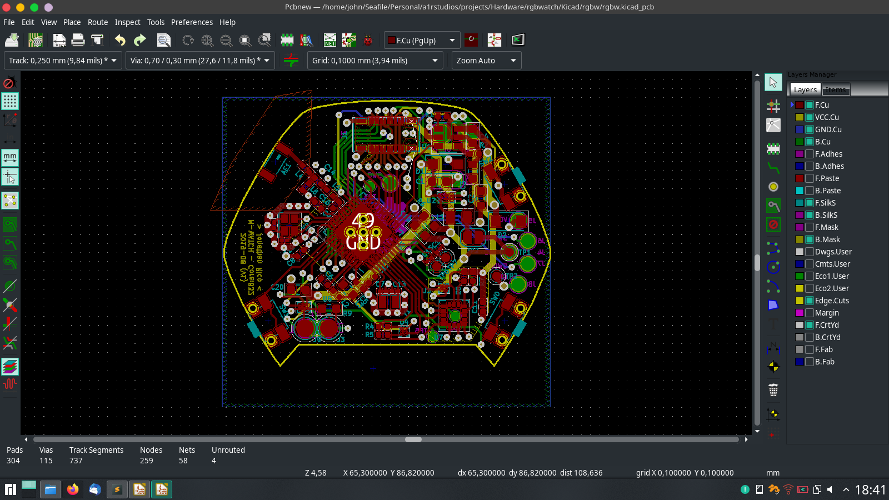

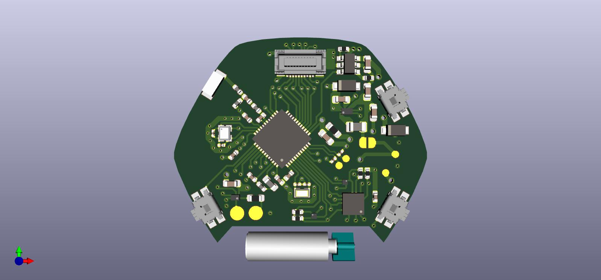

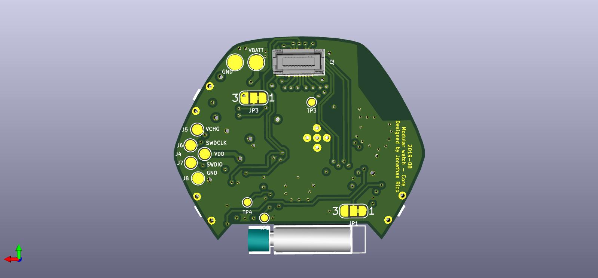

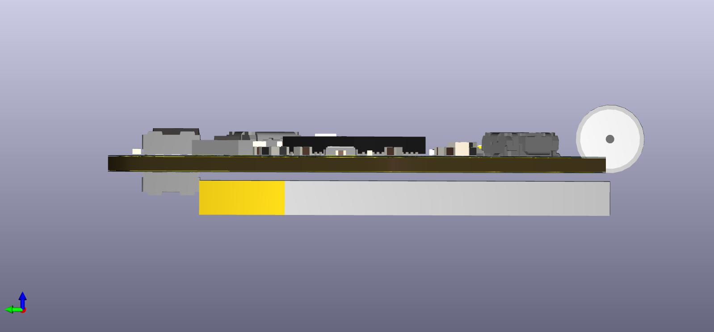

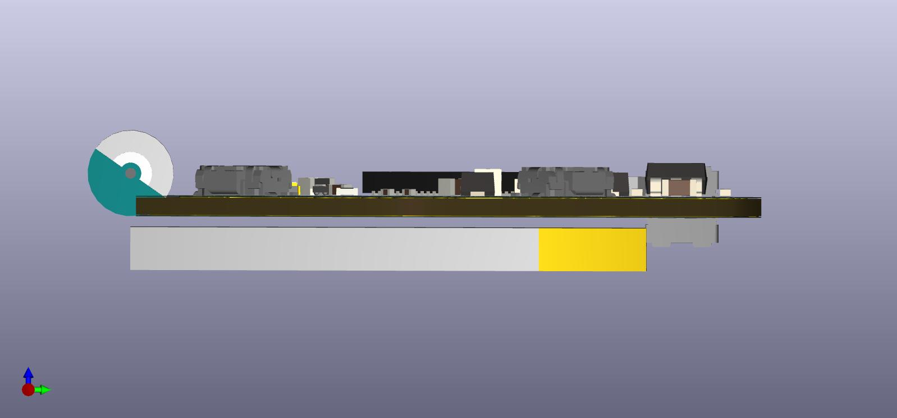

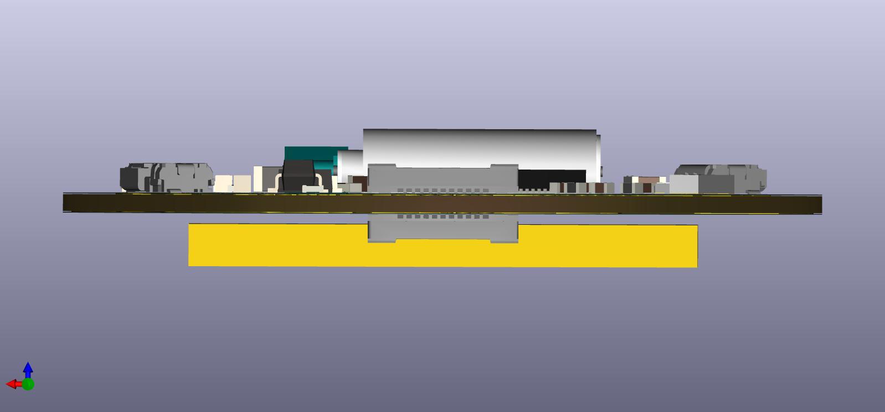

Display board
-------------

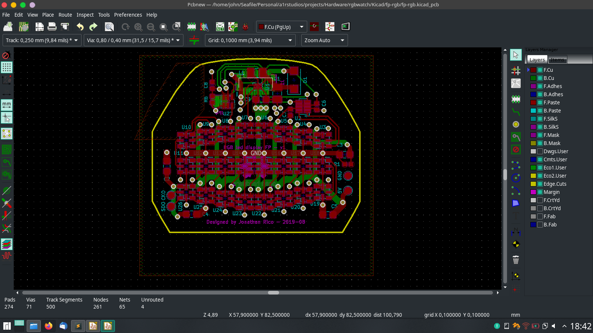

display & core connected:

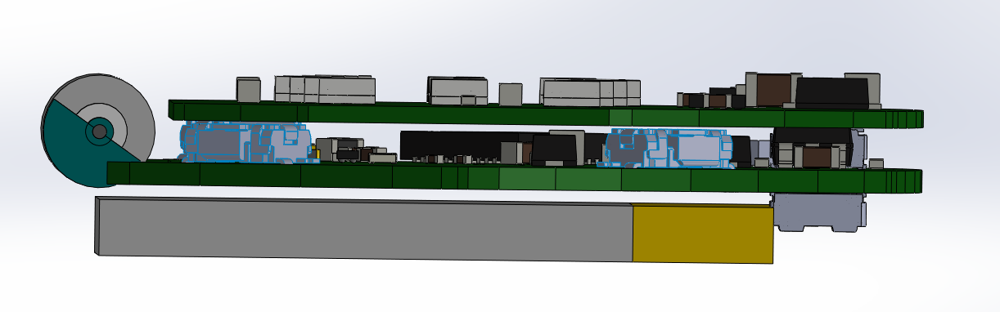

Debug board
-----------

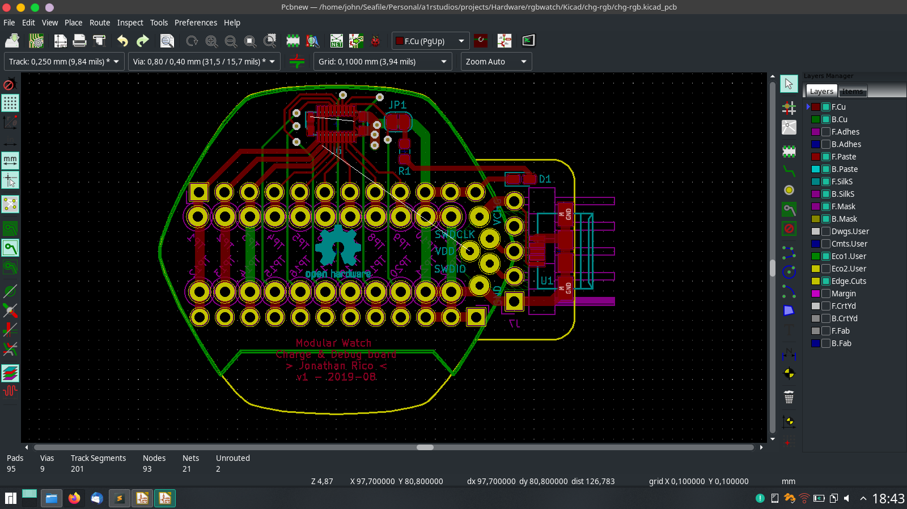

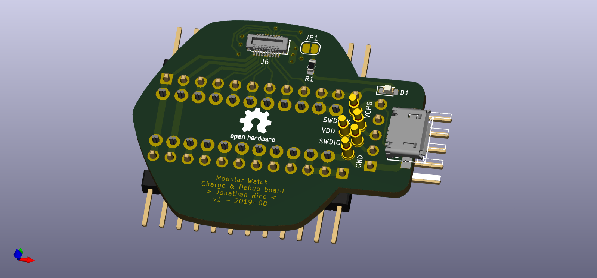

Project status (2020-01-06)
---------------------------

Due to my recent job change & relocation to Norway, I had to give away some essential tools before leaving (limited space in suitcases), and as such, this project is now on pause.

I will try to get a headstart on programming though, as it doesn't require any hardware except the dev kit which I already have.

Status update (2020-08-19)
--------------------------

A few updates:

A few months ago, my manager at Nordic offered to have the PCBs fabbed, and
that I buy the components & do the assembly.

BUT I had to do an express redesign to use the
[nRF52840](https://www.nordicsemi.com/Products/Low-power-short-range-wireless/nRF52840
) instead of the 832 (trickier because of the IC package).

I received half of the PCBs a month ago (if I remember correctly), ordered the
stencils from [Elecrow](https://www.elecrow.com/pcbstencil.html), and the
components from DigiKey.

I still haven't received the main board (with the MCU) yet, but I can still
start programming using the [nRF52 DK](https://www.nordicsemi.com/Software-and-Tools/Development-Kits/nRF52840-DK
).

Front panel
-----------

I managed to do the reflow soldering, on the ceramic cooktop (again), but had a
few issues with the smallest component (U1: 1x1.2mm, 6pads), so I had to rework
it a bit. I still haven't figured out where to buy 98% alcohol in norway yet, so
the boards were not cleaned properly.

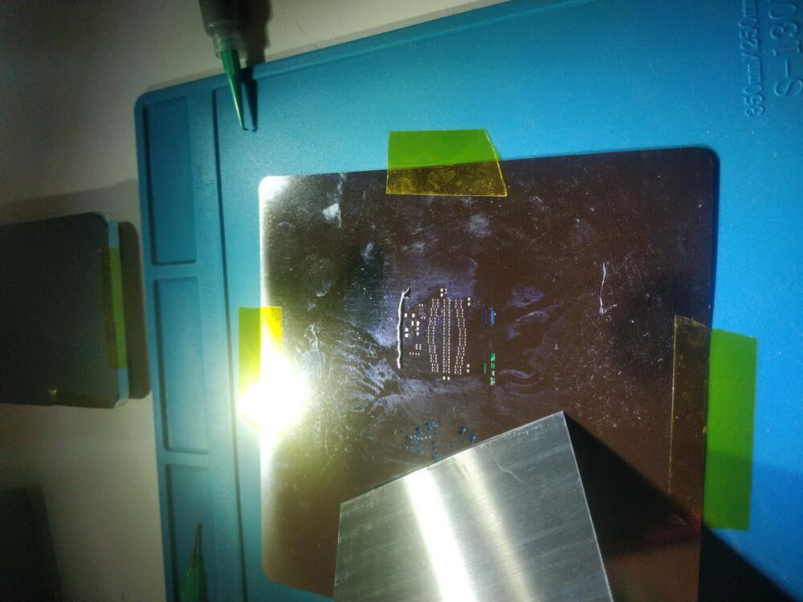

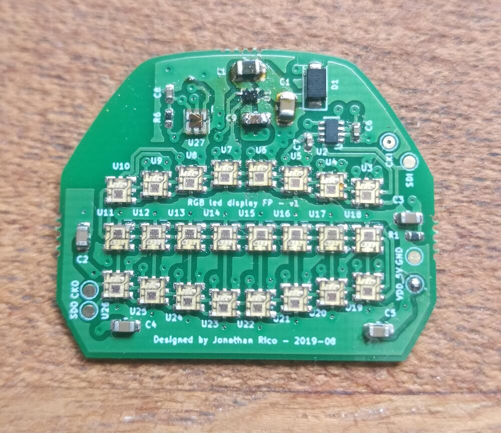

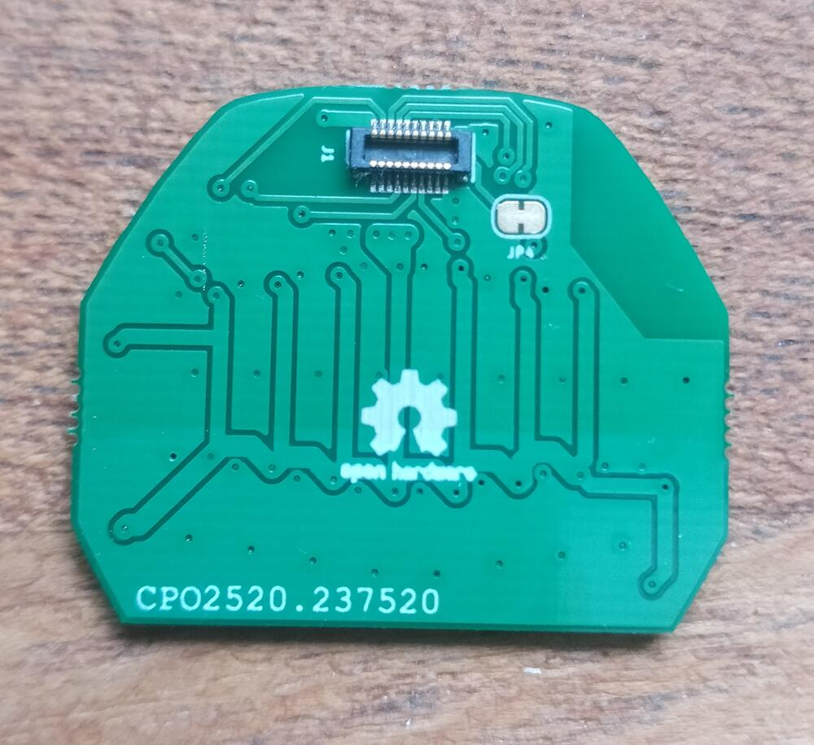

Debug board
-----------

I found out that the charge and debug board had the connector mirrored, but
since no IOs were explicitely labeled and there are no components on this board
I could just connect the front-panel upside-down, like you can see in the videos.

This board is pretty handy, I can program/debug the RGB display without having to
solder wires directly to the board.

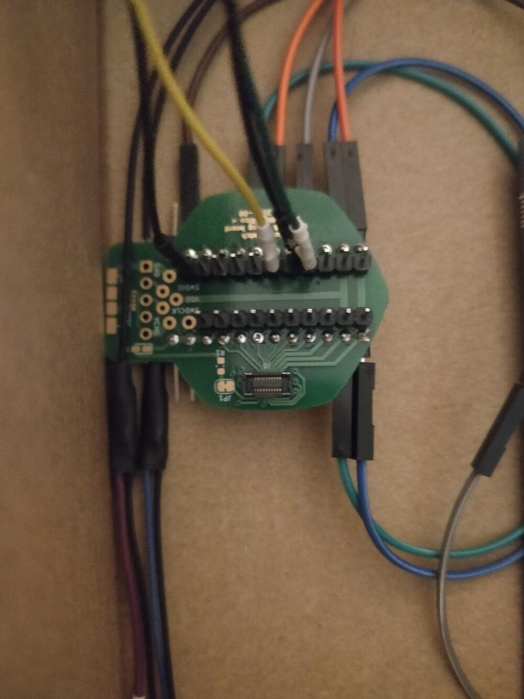

Videos
------

A quick test of the RGB animation: this just cycles through the colors, pretty
rapidly so I can sport if there are SPI communication issues.
***


A test of the bcd display code ported from the ledwatch project. I tried to slow
down the video on the animation this time.
***


A test with the Nordic SDK BLE Blinky example, where I can trigger the animation
via the Blinky android app.
***


Status update (2021-04-05)
--------------------------

### Main board reflow

Long time since I updated this page :p
Anyway, I received the main (mother?) board pcbs and successfuly reflowed it sometime in october 2020. Tried to record a video at the same time but almost burned the components, oops !
***


I did not have to touch-up a lot of components, only a few upside-down inductors and two bridges on the display connector.
I then was able to successfully flash the nrf52840 SoC with the software I had before, just had to sort out some GPIO issues since the devkit obviously didn't have the same pin assignments as the final board.

Hello world !
***


Accelerometer responding properly
***


Running from battery
***


Unfortunately, in my enthusiasm I forgot to reset all of the power supply's preset to something sensible and pressed the wrong button... blasted the whole pcb with 30V@3A and smoked all the components on the Vbatt rail :/
So I had to change those components, and now I'll remember to check my presets haha.

### Watch shell / body

Since I did not order the pcbs myself, I did not have any control over the thickness, and I had designed the case for a display PCB of 0.6mm and a main PCB of 0.8mm.
The display PCB's real thickness was .8mm, so still manageable, but the main PCB was double the size, at a standard 1.6mm.
This caused the case to not be able to close, so I adjusted the back of the case, but unfortunately, the button holes did not align with the buttons on the pcb.

Also, a few weeks ago, I finally had nuked my windows 7 dual-boot (with solidworks) that was taking way too much space and that I was using at most once every 3 months.

So long story short, I had to redraw the front and back of the case using FreeCAD. I found out about [realthunder's fork](https://github.com/realthunder/FreeCAD_assembly3/releases), that addressed most of the issues that I had with freecad: topo naming and a sane assembly workflow.

The drawing workflow was a bit rough over the edges, having to convert from SVG to the Draft workbench and then to the Sketcher workbench to finally create a part, but I'm happy overall,
as it was way more stable than last time I used it in 2017, i.e. not crashing every 10mins. 

The biggest thing I missed was the ability to scale and mirror the sketch geometry.
Another rough module is the chamfer / fillets, but I think this is more the kernel than freecad's fault. 
I had to resort to loft/sweeps to do the equivalent of a curved chamfer in solidworks.

I still wouldn't pick freecad over solidworks for a commercial product, but I think it'll be my go-to CAD program for hobby stuff from now on, and it saves me from having to maintain a working/up-to-date windows install (yuck!).

### Assembly glamour shots 

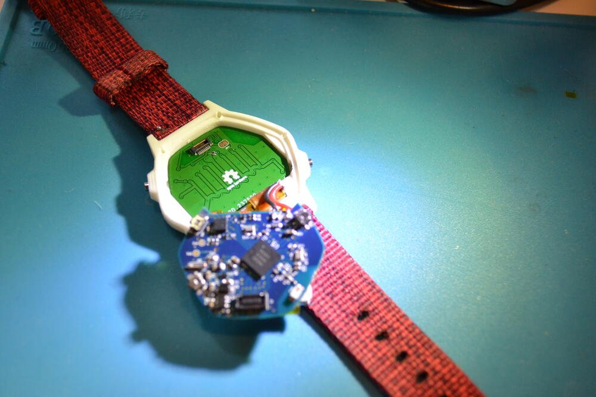
[High res](img/photos/hr/as_disp_back.JPG)
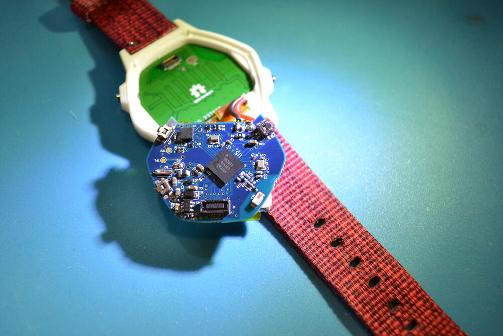
[High res](img/photos/hr/as_core2.JPG)
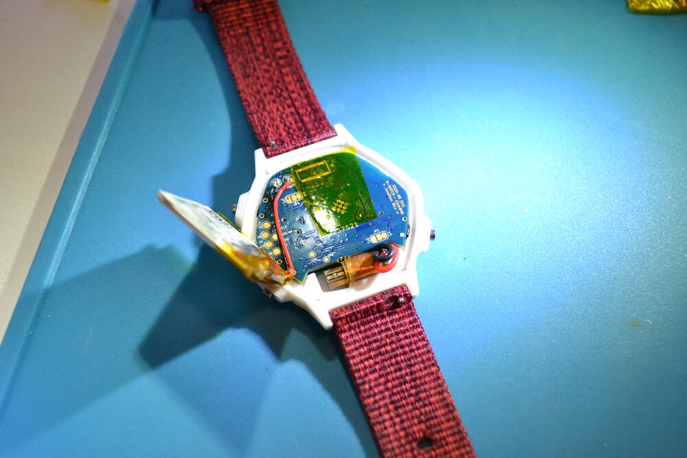
[High res](img/photos/hr/as_core_back.JPG)
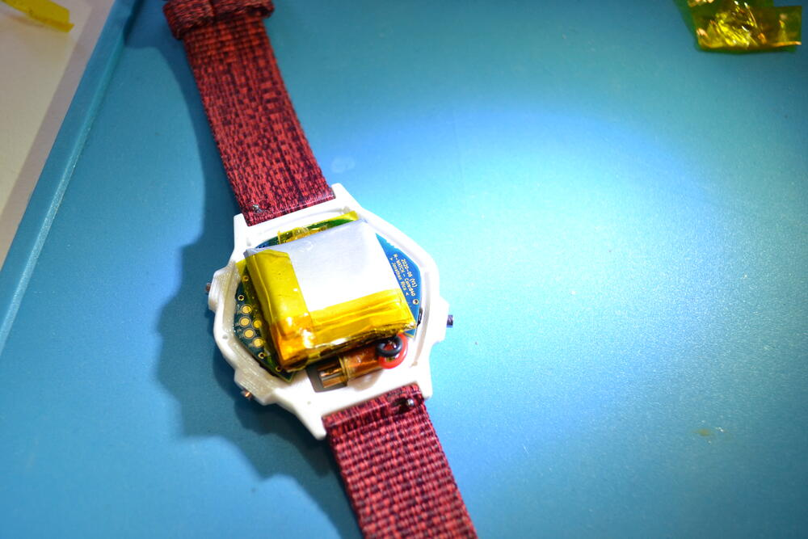
[High res](img/photos/hr/as_battery.JPG)

### Cradle

I also designed a cradle to easily charge and flash/debug the watch without having to disassemble it everytime:
The plan was to have some pogo pins on the cradle, contacting another set of pogo pins set in the back of the case, which then would make contact with pads on the main PCB.

I was also planning to embed tiny rare-earth magnets on the back of the case to make the watch snap to the cradle.
This strategy was to avoid having to have a custom fragile (maybe flex) PCB for the contact points, so to be able to disassemble the watch without being overly cautious.

So that's the theory, in practice, it was kind of a ~~disaster~~ less-than-ideal solution.

First off, I did not have the magnets, so I had to use rubber bands (lol) to make the pins press agains the watch.

Then, I did not have super-tight manufacturing tolerances, so I designed it to be a bit floating so I could make contact. But then it's super finicky to move the watch just right to be able to flash via SWD.

And then there is the issue of actually attaching the damn internal pogo pins to the back of the case. I used superglue, but then I had to detach them (because of the whole pcb-too-thick thing) and glue them to another back. Problem is that the glue went over the contacts (on the outside) and I had to scrape it off, so now it's not making good contact anymore, and I scraped all of the coating on one of the pins so it oxidizes.

Case in point: I recently re-printed the case (my 8mo daughter killed the first one) and had to reattach the internal pogo pins, and now I can't even flash the damn thing without taking it apart. Luckily I now have zephyr and DFU but still.

Anyway, here's a picture
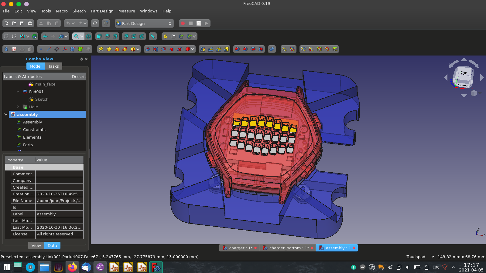

And how it looks like in real life
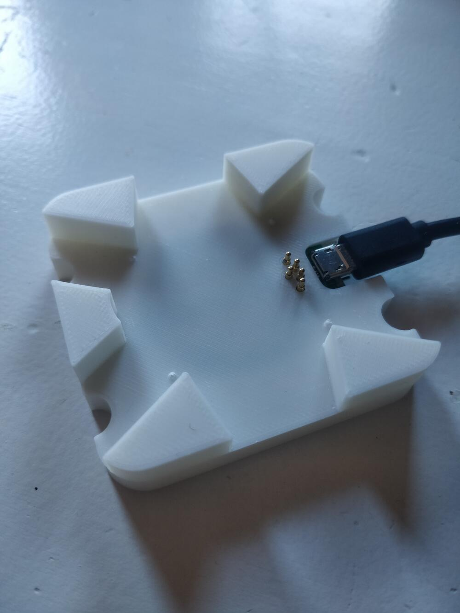
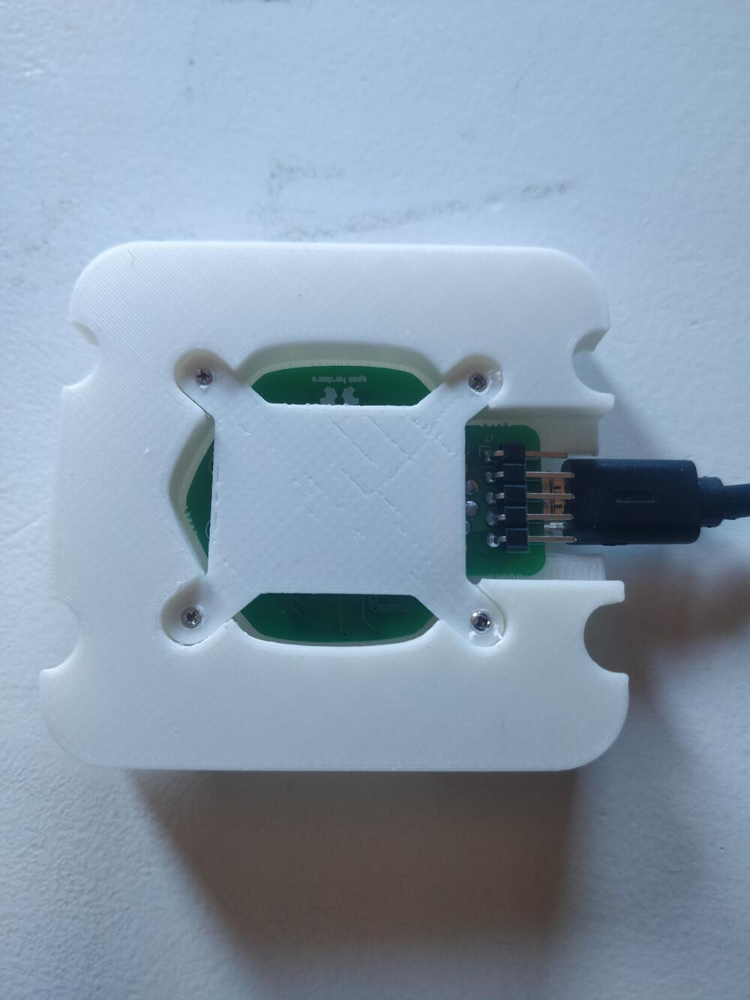
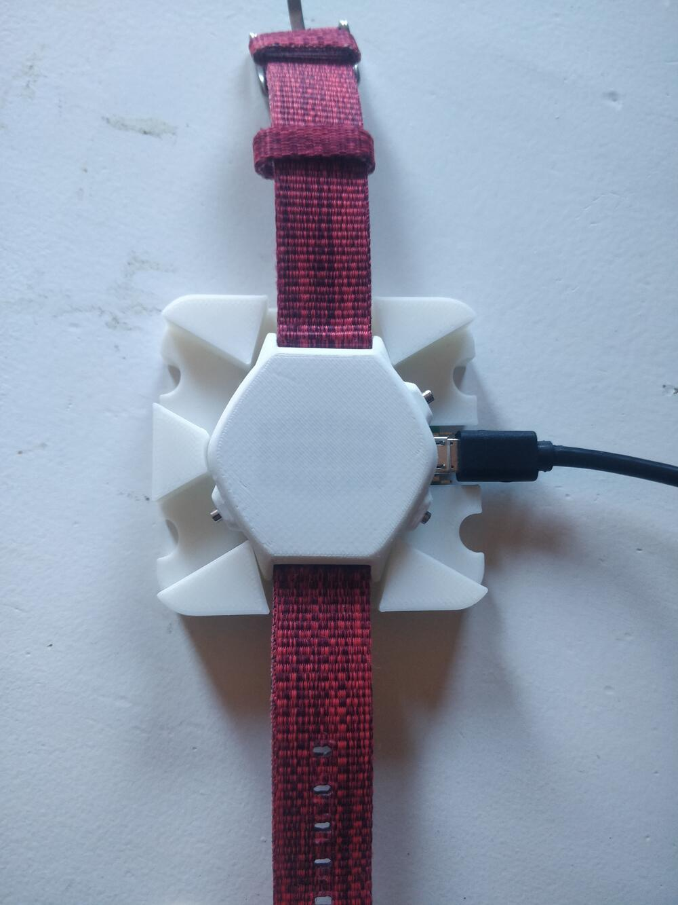

So for the next watch (nrf53-based), I am not making the same mistake: I'll be using a waterproof usb-c connector + a bus switch to flash/debug with a special cable.
[Schematic sneak peek](pdf/W53.pdf)  

### Nordic Connect SDK / Zephyr

I started to port the firmware to [Zephyr / NCS](https://developer.nordicsemi.com/nRF_Connect_SDK/doc/latest/nrf/introduction.html) in november, and had feature parity mid-december (tough to find time to work on projects with a small kid haha).

Initially, I had some issues with the drivers, and I didn't find the driver subsystem to be very mature, e.g. basic things like re-initializing a stuck i2c peripheral is (was?) basically impossible by design.
I first started with the APA102 led driver in the zephyr distribution, but had to revert to my own (when I did the softdevice version) because of missing features.

I'm still on the fence for the accelerometer driver, zephyr's is very basic, doesn't support filtering, gestures stuff like that. So maybe I'll revert back to mine, maybe I'll add those features to the zephyr upstream driver, we'll see how much time I have.

Another pain point was the DFU / image signing setup. I started with version 1.4 of NCS, and the documentation was not very clear to say the least, it was a bit like asking a question in the french administration, you get referred to a whole lot of places, but the info is either not relevant, or contradicts the info you get in other places.

I was somehow able to make it work, because I wasn't the only poor sap that had to deal with that, so there were a few devzone tickets and I could read the CMakeLists to make sense of the signing logic.

Luckily NCS 1.5 has improved on that front and docs are a bit more clear on the steps needed to implement signed OTA DFU.

Other than those two issues, I'm loving zephyr/NCS:
- power management / sleep *just works*, no more fiddling around
- nice RTOS, docs & sources are easy to reason about
- batteries included: part of the distributions are a lot of drivers and subsystems, from console I/O to bluetooth/thread/zigbee stacks, to (okay) sensor drivers.
- first-class linux support for build system
- no tedious makefiles to edit (like with the previous nRF5 SDK)
- portability! you can compile your application to either the devkit or the final PCB, with a single "-b" command-line flag. If you did your homework correctly with the devicetree it just works.

I'll soon (-ish) have a short "Getting started with NCS/Zephyr" guide to summarize the steps I had to take to go from devkit to custom PCB with bluetooth and signed OTA DFU.

### Software features

I've been wearing the watch for at least 2 months now, doing the dishes, havving my daughter trying to eat it (lol) and it held up good so far.
I have to admit, I got a bit distracted with my next project, and the current "dumb" watch feature set is enough for me right now, so I did not take the time to develop all the bluetooth/smart features I wanted. 

I did implement the bluetooth CTS (Current Time Service) though to be able to auto-set the time when my android connects to it. But yeah, I think part of my non-motivation is that it feels too much like my day job, only on my own time.

Anyway, the repo is here, with an up to date list of features: https://github.com/narvalotech/rgbw_zephyr

No comments of course, that'd be too easy haha !
Also you'll see a lot of commits trying to fix a buggy metronome feature, I wanted a soundbrenner copycat (i.e. vibrating metronome) but found out that the motor is not strong enough for me to sync while playing guitar, so I'll be removing it later.

### Android app

Also started to look into programming an app to set the time, and do other nifty stuff, like FIDO/U2F, but haven't gotten the time to fully dive into the android app development world. Maybe this summer, or I can also take a look at flutter, we'll see.

