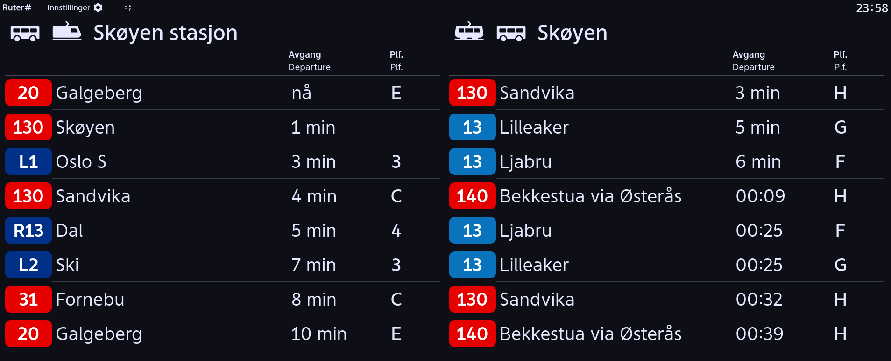

Adventures in Ruter API land 🚆🚌:

A no-BS train & bus timetable website, tailored for my family.

Code at https://github.com/narvalotech/no-rush

```
---- Blommenholm -> work ----
16:21 [rail] line L1 to Oslo S
16:51 [rail] line L1 to Oslo S
17:21 [rail] line L1 to Oslo S
17:51 [rail] line L1 to Oslo S

---- Blommenholm -> sandvika ----
15:59 [rail] line L1 to Asker
16:28 [rail] line L1 to Asker
16:58 [rail] line L1 to Asker
17:28 [rail] line L1 to Asker

---- Nationaltheatret ----
16:02 [metro] line 5 to Vestli
16:13 [rail] line L1 to Asker
16:16 [metro] line 5 to Vestli
16:30 [metro] line 5 to Vestli
16:43 [rail] line L1 to Asker
16:44 [metro] line 5 to Vestli
16:59 [metro] line 5 to Vestli

---- Hasle ----
16:02 [metro] line 5 to Ringen via Tøyen
16:16 [metro] line 5 to Ringen via Tøyen
16:31 [metro] line 5 to Ringen via Tøyen
16:46 [metro] line 5 to Ringen via Tøyen
17:01 [metro] line 5 to Ringen via Tøyen
17:16 [metro] line 5 to Ringen via Tøyen
17:31 [metro] line 5 to Ringen via Tøyen
17:46 [metro] line 5 to Ringen via Tøyen
```

# Outline



## Why not use the app

I had switched jobs in october, and found myself commuting a bunch. I have a
train->subway transfer, and did not want to memorize the timetables for both to
know whether I should run or not when getting off the train.

We live in Oslo, and [Ruter](https://ruter.no) handles public transport here.
They have an app and website that they somewhat recently redesigned to use
humoungous amounts of whitespace (as is the design trend lately).

This means that I had to _every single time_:
- tap to open the app
- wait for it to load a map that I don't use
- scroll down to the favorites section
- tap the train/metro, for the correct direction
- finally read the departure time

Now that app is _fine_ if you are exploring the transit system and don't really
know where you're going or what bus/metro/train you're going to take. But it is
really frustrating if you know exactly what you want.

Also, I needed an excuse to play with the transit API 😄

## The API

EnTur is nice enough to maintain an open API.

The displays at the stations are just running google chrome in kiosk mode,
showing a javascript front-end that uses this very API. I mean it certainly
looks like they use the API, but not 100% sure.

Ruter also is nice enough to allow anyone to build their own station display,
[at this address](https://mon.ruter.no/). You can customize it with a
combination of trains, busses, trams, you name it.



So, back to the API:

The current version is hosted at
[api.entur.io/journey-planner/v3/GraphQL](https://api.entur.io/journey-planner/v3/GraphQL)
and is of the GraphQL variety. They also have a [query
builder](https://api.entur.io/GraphQL-explorer/journey-planner-v3) that serves
as up-to-date documentation for all the fields.

There are some other documentation pages, but I've found playing around the
query builder to be the fastest way to grok the API.

There are two main APIs (actually more like three):

- point-to-point journey planner
- transit stop information
- transit stop search

The first two are co-located at the same "journey planner v3" endpoint.

We already have a few routes we know, and are interested in the departure times.
So that's a combination of the stop search API (in order to get the IDs of the
stops) and the stop information API to get the departure times.

An API call to get the departures for a given ID looks like this:

```
query ($id: String!) {
  stopPlace(
    id: $id
  ) {
    name
    id
    estimatedCalls {
      expectedDepartureTime
      actualDepartureTime
      destinationDisplay {
        frontText
      }
      serviceJourney {
        line {
          publicCode
          transportMode
        } } } } }
```

That returns json with data for each departure.

```
{
  "data": {
    "stopPlace": {
      "name": "Oslo S",
      "id": "NSR:StopPlace:337",
      "estimatedCalls": [
        {
          "expectedDepartureTime": "2025-04-21T00:16:00+02:00",
          "actualDepartureTime": "2025-04-21T00:16:00+02:00",
          "destinationDisplay": {
            "frontText": "Ski"
          },
          "serviceJourney": {
            "line": {
              "publicCode": "L2",
              "transportMode": "rail"
            }
          }
        },
        {
          "expectedDepartureTime": "2025-04-21T00:17:00+02:00",
          "actualDepartureTime": "2025-04-21T00:17:00+02:00",
          "destinationDisplay": {
            "frontText": "Stabekk"
          },
          "serviceJourney": {
            "line": {
              "publicCode": "L2",
              "transportMode": "rail"
            }
          }
        },
```

So that's the API. Now let's figure out how to talk to it.

## Implementation choices

I [discovered](https://gigamonkeys.com/book/) common lisp a few years ago and
the development experience (ie "conversing" with the program) has really grown
on me. This [strangeloop talk](https://www.youtube.com/watch?v=8Ab3ArE8W3s)
touches on some similar points about "dead" programs.

Soooo, this whole thing could've been 1-200 lines of python with some
appropriate libs. But I'm an idiot and wanted to use lisp "in production".

## Writing GraphQL without writing GraphQL

_Feel free to skip this section if you have parenthesisitis._

At first, I'm thinking I'm reading JSON. Turns out GraphQL looks like JSON from
a distance, but is not.

Since I would be building queries from lisp, the natural format is an
[s-expression](https://en.wikipedia.org/wiki/S-expression).

Looking a bit at the structure of the query above, a pattern emerges: the
GraphQL string is a list (or tree) of elements that each have:

- a name
- a list of optional parameters
- a list of children elements

Let's make a cursed s-exp -> graphql converter:

```
(defun args->str (arglist)
  (if arglist
      (format nil "(~{~A~^, ~})"
              (mapcar (lambda (arg)
                        (format nil "~A: ~A" (car arg) (cdr arg))) arglist))
      ""))
      
(defun sexp->gql (sx stream)
  (let* ((el (car sx))
         (name (nth 0 el))
         (params (nth 1 el))
         (children (nth 2 el)))

    (format stream " ~A" name)

    (when params
      (format stream (args->str params)))

    (when children
      (format stream " {")
      (sexp->gql children stream)
      (format stream " }"))

    (when (> (length sx) 1)
      (sexp->gql (cdr sx) stream))))
```

With a simple example:

- "a", "b" and "c" are the top-level elements
- "c" has two parameters: "p1" and "p2"
- "c" has two child elements, "c1" and "c2"

```
(sexp->gql
 '(("a")
   ("b")
   ("c"
    (("p1" . 10)
     ("p2" . 1000))
    (("c1")
     ("c2"))))
 *standard-output*)
```

Translates to 

```
a b c(p1: 10, p2: 1000) { c1 c2 }
```

Sure it's a lot more to type and looks uglier for now, but at least I can use
CL's quote-templating. It's a work in progress okay!

## Building the query

Now that we have a way to build a query, we need to use a template that has the
fields we're interested in.

We want: the departure time for sure, the name/number of the line and its direction.

The main parameter is the stop ID (which we'll get to in a minute). Some
optional params are the number of responses and how far in the future to query.

```
(defun gql-departures (nsr-id &key (max 5) (seconds (* 2 60 60)))
  (let ((quoted-id (format nil "\"~A\"" nsr-id)))
    `(("stopPlace" (("id" . ,quoted-id))
       (("name")
        ("id")
        ("estimatedCalls" (("numberOfDepartures" . ,max)
                           ("timeRange" . ,seconds))
                          (("expectedDepartureTime")
                           ;; ("actualDepartureTime") ; always empty it seems
                           ("destinationDisplay" ()
                                                 (("frontText")))
                           ("serviceJourney" ()
                                             (("line" ()
                                                      (("publicCode")
                                                       ("transportMode")))))))
        )))))
```

With default params and stop ID "NSR:StopPlace:59651"

```
(make-gql (gql-departures "NSR:StopPlace:59651"))
```

Expands to: 

```
query {
  stopPlace(id: "NSR:StopPlace:59651") {
    name
    id
    estimatedCalls(numberOfDepartures: 5, timeRange: 7200) {
      expectedDepartureTime
      destinationDisplay {
        frontText
      }
      serviceJourney {
        line {
          publicCode
          transportMode
        }}}}}
```

Remember how I said that GraphQL is not JSON? Well, once the query is built, we
still have to wrap it in a JSON payload for the API. The schema is simple if I
may say so: there is a single key, "query" that has the GraphQL payload as
value.

```
(defun package-gql (gql-str)
  "Package a GraphQL query string into a json object ready for sending."
  (json:encode-json-alist-to-string (list (cons "query" gql-str))))

(defun make-gql-json (params)
  (package-gql (make-gql params)))
  
(make-gql-json (gql-departures "NSR:StopPlace:59651"))
```

Which gives us the final API payload:

```
{"query":"query { stopPlace(id: \"NSR:StopPlace:59651\") { name id estimatedCalls(numberOfDepartures: 5, timeRange: 7200) { expectedDepartureTime destinationDisplay { frontText } serviceJourney { line { publicCode transportMode } } } } }"}
```

Now we need to parse the JSON response..

## Extracting data from the response

### Parsing

I use `cl-json` to parse the response into an assoc-list. 

```
(defun send-query (query-json-str)
  (let* ((data query-json-str)
         (url "https://api.entur.io/journey-planner/v3/GraphQL"))
    (format t "Send query: ~A~%" data)

    (json:decode-json-from-string
     (octets-to-string
      (drakma:http-request url
                           :method :post
                           :content-type "application/json"
                           :accept "application/json"
                           :connection-timeout 2
                           :content data)))))
```

Here's how (parts of) a parsed query looks like for skøyen station:

```
((:DATA
  (:STOP-PLACE (:NAME . "Skøyen stasjon") (:ID . "NSR:StopPlace:59651")
   (:ESTIMATED-CALLS
    ((:EXPECTED-DEPARTURE-TIME . "2024-10-06T23:01:04+02:00")
     (:ACTUAL-DEPARTURE-TIME) (:DESTINATION-DISPLAY (:FRONT-TEXT . "Skøyen"))
     (:SERVICE-JOURNEY
      (:LINE (:PUBLIC-CODE . "130") (:TRANSPORT-MODE . "bus"))))
    ((:EXPECTED-DEPARTURE-TIME . "2024-10-06T23:02:10+02:00")
     (:ACTUAL-DEPARTURE-TIME)
     (:DESTINATION-DISPLAY (:FRONT-TEXT . "Lillestrøm"))
     (:SERVICE-JOURNEY
      (:LINE (:PUBLIC-CODE . "L1") (:TRANSPORT-MODE . "rail"))))
    ((:EXPECTED-DEPARTURE-TIME . "2024-10-06T23:04:00+02:00")
     (:ACTUAL-DEPARTURE-TIME) (:DESTINATION-DISPLAY (:FRONT-TEXT . "Dal"))
     (:SERVICE-JOURNEY
      (:LINE (:PUBLIC-CODE . "R13") (:TRANSPORT-MODE . "rail"))))))))
```

### Slicing and dicing

One thing I really like is that the Common Lisp
[REPL](https://en.wikipedia.org/wiki/Read%E2%80%93eval%E2%80%93print_loop)
allows me to inspect any object, all the way down to hitting the bytes backing
the object in memory. It's just like having a debugger's "local variables"
window open, but without having to hit pause.

When exploring a data format, this allows me to save the whole response into a
variable. Then I can take a subset of that data, and start writing the functions
without having to hit the API again and again. If you read the source (it's only
500L), you'll see traces of this workflow.

I know it's possible to do in e.g. python, but I find it to have less friction
in the [CL + Emacs](https://malisper.me/debugging-lisp-part-2-inspecting/) environment. 

Okay, okay, it's also easy in javascript. But we don't talk about javascript.
_Damn they have some good dev tools_.

With lisp proselytism out of the way (λ > 🦀), let's go back to work: we have
some departure times but we are not interested in _all_ of them.

We want to build a focused time table, grouped by line+destination combo. Let's
build some functions to filter that response:

```
(defun is-transport-mode (modes element)
  "Tests if the element's :TRANSPORT-MODE matches one of the MODES"
  (let ((result nil)
        (el-mode (extract-type element)))
    (dolist (test-mode modes result)
      (setf result (or result (equalp test-mode el-mode))))))

(defun filter-by-type (transport-types departures)
  (if (not transport-types) departures
      (remove-if-not
       (lambda (el) (is-transport-mode transport-types el))
       departures)))
```

Here we start with a list of `departures` (ie. the API response) and a list of
`transport-types`. The types can be e.g., metro, bus, rail, ferry, etc..

`FILTER-BY-TYPE` (yes, CL functions are refered to in YELL-CASE) tests every
departure "object", and removes that element from the list if it doesn't match
one of the given transport modes.

`IS-TRANSPORT-MODE` extracts the mode (bus, rail, etc) from the departure object
and tests if any transport mode given in the `mode` parameter matches.

Filtering for line name/number and destination works exactly the same (I should
refactor at some point). We can then combine all of them:

```
(defun filter-departures (departures
                          &key types destinations lines)
  (filter-by-line
   lines (filter-by-destination
          destinations (filter-by-type types departures))))
```

## Getting the stop ID

The stop ID is fetched from a so-called "geocoder" API endpoint. This one is not
GraphQL. As the name suggests, it is intended to be used by the app while the
user is typing in the name of the stop.

You can try it out in your browser by clicking here:

https://api.entur.io/geocoder/v1/autocomplete?text=skoyen%20stasjon&lang=en

We build this function to hit the API

```
(defun send-geocoder-query (name)
  "Send a Entur geocoder API to retrieve stops matching NAME"
  (let* ((url "https://api.entur.io/geocoder/v1/autocomplete"))
    (format t "Send geocoder query: ~A~%" name)

    (json:decode-json-from-string
     (octets-to-string
      (drakma:http-request url
                           :method :get
                           :parameters (list (cons "text" name)
                                             (cons "lang" "en"))
                           :connection-timeout 2)))))
```

And some helpers to convert the JSON response back into, you guessed it: a list.

We use the opportunity to only keep the fields we're interested in: ID string,
name and available transport types.

```
(defun g-get-props (query-response)
  "Extracts stop properties from a geocoder API response. Always picks the first entry."
  (cdr (assoc :properties (nth 1 (assoc :features query-response)))))

(defun g-props->plist (prop-alist)
  "Extracts geocoder properties into a nice alist."
  (flet ((get-val (key) (cdr (assoc key prop-alist))))
    (let ((id (get-val :id))
          (name (get-val :name))
          (category (get-val :category)))
      (list
       :id id
       :name name
       :types category))))
```

Sample query

```
(g-props->plist (g-get-props (send-geocoder-query "skoyen stasjon")))
```

```
(:ID "NSR:StopPlace:59651" :NAME "Skøyen stasjon" :TYPES
  ("railStation" "onstreetBus" "onstreetBus" "onstreetBus"))
```

## Tying it all together

So far, we've been able to: search for a stop, query and filter the available
departures.

The last thing is to display the departure times in a simple way. Nothing
simpler than a text file IMO; so let's do that.

```
(defun format-departure (departure)
  (format nil "~A [~A] line ~A to ~A"
          (timestamp->human-readable
           (extract-timestamp departure))
          (extract-type departure)
          (extract-line departure)
          (extract-destination departure)))

(format-departure *test-vestli*)
 ; => "08:29 [metro] line 5 to Vestli"

(defun print-departures (stream departures)
  (with-output-to-string (s)
    (mapcar (lambda (d)
              (format (if stream stream s) "~A~%" (format-departure d)))
            departures)))
```

Now let's try a sample train station, keeping only two lines of subway and train:

```
(print-departures t
 (filter-departures
  (get-departures "NSR:StopPlace:58404")
  :types '("rail" "metro")
  :destinations '("vestli" "asker" "spikkestad")
  :lines '("5" "L1")))
```

Ta-daa

```
23:43 [rail] line L1 to Asker
23:45 [metro] line 5 to Vestli
00:00 [metro] line 5 to Vestli
00:13 [rail] line L1 to Asker
00:14 [metro] line 5 to Vestli
```

That's enough for me, now let's ~doxx myself and print my commute~ generate the
text at the top of the post:

```
(defun favorites ()
  (let ((blommenholm (get-departures *blommenholm-stop*)))
    (with-output-to-string (s)
      (format s "~%---- Blommenholm -> work ----~%")
      (print-departures
       s (filter-departures
          blommenholm
          :destinations '("lillestrøm" "oslo s")))

      (format s "~%---- Blommenholm -> sandvika ----~%")
      (print-departures
       s (filter-departures
          blommenholm
          :destinations '("asker" "spikkestad")))

      (format s "~%---- Nationaltheatret ----~%")
      (print-departures
       s (filter-departures
          (get-departures *nationaltheatret-stop*)
          :types '("metro" "rail")
          :destinations '("vestli" "asker" "spikkestad")
          :lines '("5" "L1")))

      (format s "~%---- Hasle ----~%")
      (print-departures
       s (filter-departures
          (get-departures *hasle-stop*)
          :types '("metro")
          :lines '("5")
          :destinations '("ringen via tøyen"))))))
```

## Deploying to the interwebs

The final step is to put this online. This is the first time I'm deploying any
Common Lisp code to a public server. I don't know what I'm doing.

After some googling (and [phinding](https://phind.com)), we're able to get an
idea of what to do.

We're building a minimal docker image, with the CL implementation
([SBCL](https://www.sbcl.org/)) and the libraries used in the project.

```
FROM clfoundation/sbcl:2.2.2-slim
ARG QUICKLISP_DIST_VERSION=2022-02-20

WORKDIR /app
COPY . /app

ADD https://beta.quicklisp.org/quicklisp.lisp /root/quicklisp.lisp

RUN set -x; \
  sbcl --load /root/quicklisp.lisp \
    --eval '(quicklisp-quickstart:install)' \
    --eval '(ql:uninstall-dist "quicklisp")' \
    --eval "(ql-dist:install-dist \"http://beta.quicklisp.org/dist/quicklisp/${QUICKLISP_DIST_VERSION}/distinfo.txt\" :prompt nil)" \
    --quit && \
  echo '#-quicklisp (load #P"/root/quicklisp/setup.lisp")' > /root/.sbclrc && \
  rm /root/quicklisp.lisp

# Expose web server + slynk port
EXPOSE 80 42069
```

In docker-compose, we then mount the code directory at `/app` in the image and
run the app by invoking `sbcl`, which loads the source file.

```
  norush:
    image: clf-sbcl-local
    container_name: norush
    restart: ${RESTART_MODE}
    command: sbcl --non-interactive --load commute.lisp --eval "(loop while t do (sleep 10))"
    networks:
      - dnet
    volumes:
      - /etc/localtime:/etc/localtime:ro
      - ./apps/no-rush:/app
    cap_drop:
      - ALL
    cap_add:
      - NET_BIND_SERVICE
    security_opt:
      - no-new-privileges:true
```

## Was it worth it?

Absolutely! I've been using this tiny service multiple times a day for 6 months
now. Plus I got to play around with lisp in a web context 🌎.

Definitely recommend doing this sort of thing in your favorite language, it's
pretty fun, and sometimes even useful too!
