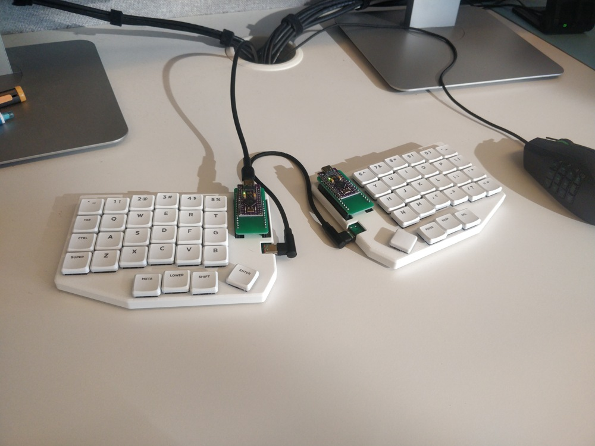
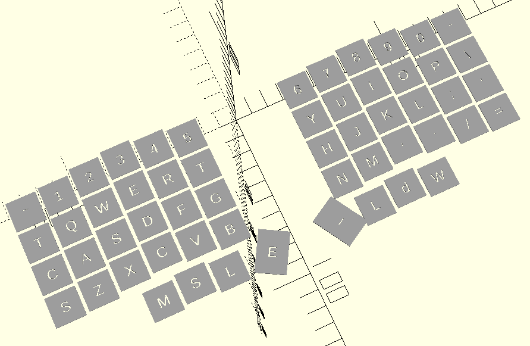
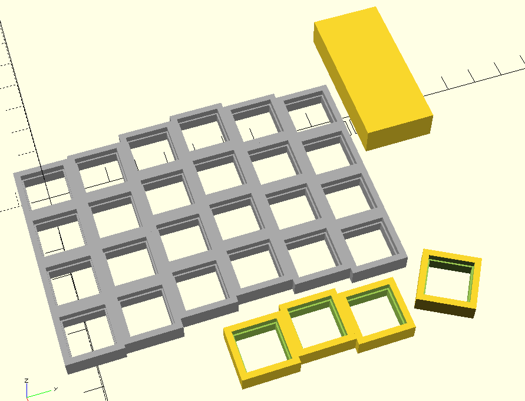
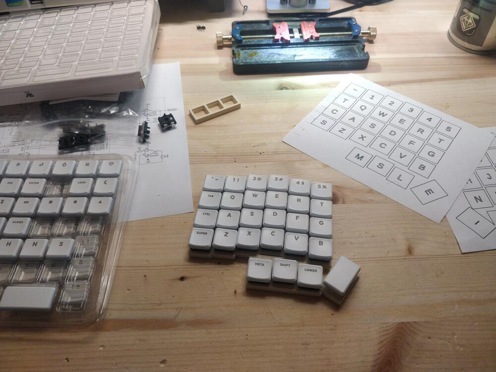
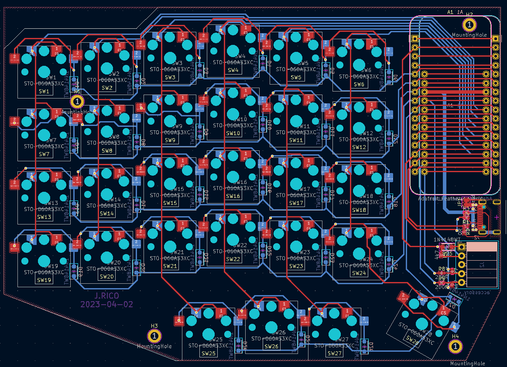
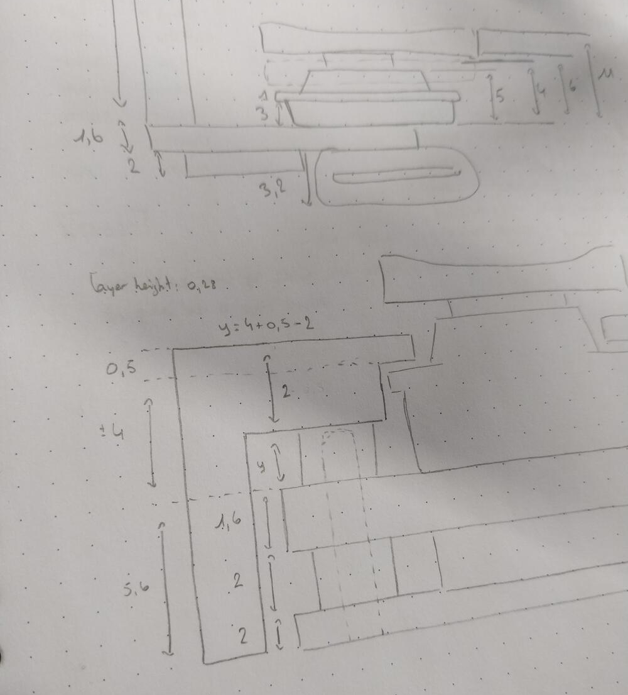
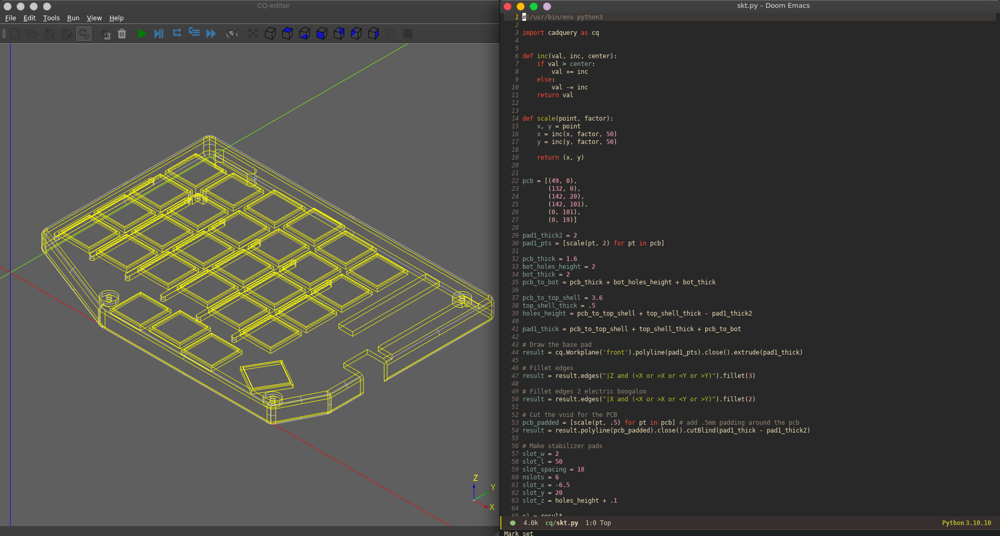
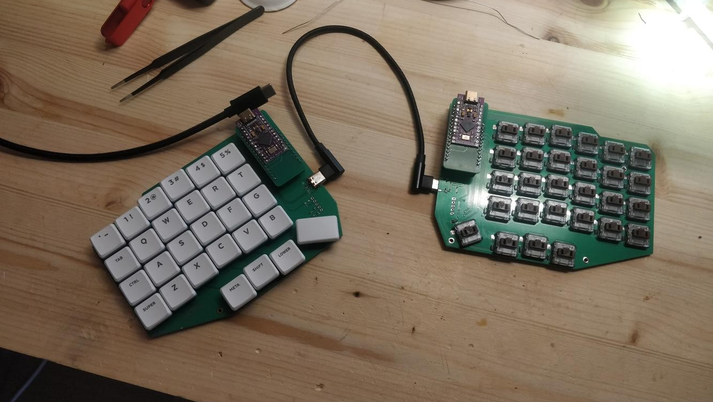

A split low-profile mechanical keyboard.
USB-only for now, but will be wireless in the near future.



# Why

I had already switched to a split keyboard to have a more relaxed wrist position, but that particular keyboard (r-go split) had some faults:
- pretty subpar domes, keys not registering sometimes
- flat keys, not super comfortable to type on
- weird function key positions (hidden behind fn, etc)
- weird connection scheme: the left part is actually a keyboard + usb hub

Okay, it did have some things going for it though:
- layout is basically a standard staggered keyboard split in half, no learning curve
- both halves snap together with a nifty magnetic lock
- pretty thin, easy to take in a backpack
- relatively inexpensive (vs mech)
- available in usual IT stores
- it did help a lot reducing pain in the wrists

I felt a bit unsatisfied, but at the same time really didn't want to fall into the endless money pit of mechanical keyboards. 
At first I was looking for a kit that I could build, but did not find anything that was in stock and good enough that it'd justify the expense.

Two keyboards caught my attention, those were the [sofle](https://github.com/josefadamcik/SofleKeyboard) and the [lily58](https://github.com/kata0510/Lily58).
But I also wanted to be able to add small accessories, like a small touchpad or trackpoint later.

So I set on designing a new keyboard based on these two layouts.

# How

I already had keycaps for gateron low-profile switches, but they were for a staggered layout. So it didn't have small modifier keys (like enter, space, etc). Since the kailh choc were used in a lot of keyboards, it was easier to source appropriate keycaps for them. So I settled on those switches.

## components

- switches: kailh choc browns
- sockets: kailh choc sockets
- caps: [MBK legends](https://fkcaps.com/keycaps/mbk/legend-glow)
- controller: [pro micro usb-c](https://www.aliexpress.com/item/32840365436.html)
- comm wire: [usb-c 90-degree](https://www.aliexpress.com/item/1005003320414981.html)
- software: [qmk](https://qmk.fm)

## layout

In order to test the layout, I recreated a crude 2d drawing using openscad, as I had some experience with it.
Then I printed it in full-scale on paper and tried to type on it. Made some slight adjustments, but it was overall comfortable.

The next step was ordering the components (got most from keycapsss.com) and printing a test jig to double-check the all the dimensions were correct. I first did two iterations with only 3 keys, then a full column and then a full keyboard half.

## electronics

Time for the circuit boards: once the dimensions in openscad were confirmed, I re-used them for routing the PCB. Designed with KiCad, which keeps getting better and better over the years.

The PCB can be used for both sides, by flipping it over.

In order to save time, I decided not to play with the various plugins that automate the placement and just do it by hand. Was a bit tedious but not that terrible. If I were still a student with lots of time, I'd probably have made a script to allow iterating :p

Initially it was supposed to have RGB lighting (useless but fun), but I realized only after routing half the PCB that I had put the switches in the wrong orientation. So I just deleted all the LEDs and associated traces, maybe v2 will have it :)

I chose to make the controller footprint adafruit feather form-factor (vs the pro-micro) as I want to make a feather board with an upcoming chip from nordicsemi. 
In order to have a working keyboard before that, I made a pro-micro-to-feather adapter PCB and bought a pro-micro clone (with usb-c) from aliexpress.

## accessory

At first I wanted to integrate a trackpoint module in the keyboard PCB itself, but decided this was scope creep and instead I put an accessory connector. It's a simple I2C 4-pin connector, but should be sufficient for a trackpad or small display.

The current case design doesn't have an opening for it, but I'm planning to buy a magnetic connector (like the one one watches and cordless phones) and design that in the next one.

## case design

The case would need fillets, ruling out openscad, so I tried modeling it in Freecad. 
That was okay, but doing minor adjustments proved tedious, having to do all the arithmetic every time and all.

I had heard of [cadquery](https://cadquery.readthedocs.io/en/latest/quickstart.html#quickstart), as an alternative to openscad.
For the longest time, I didn't want to commit to learning it, but it's got a lot going for it:
- fillets (the big one haha)
- STEP export, big plus for edits in traditional CAD packages
- python as the language. although the openscad language is not too bad

So I took the plunge and learned enough to re-create the case. I feel it's a pretty nice system overall. 

The only caveats were the installation, it was missing some libraries/flags (an Appimage/flatpak would've been nice), and rendering slowed down pretty fast.
I think the last point is not really fair, as I probably am doing a lot of useless operations.

## software

It uses [QMK](https://qmk.fm). The only big features I needed were:
- 1 more layer, to map the rest of the keys
- ctrl/esc double-duty key, useful for emacs

Started with the sofle keyboard folder in the qmk repo, and converted it to json-based layout. Was a bit tricky to figure out all the options, since it's pretty new in QMK, but pretty easy once we get the hang of it.

## problems

A few problems during development:

Mounted a diode backwards, and only found out after the keyboard was fully assembled, in its case and flashed, with only one key refusing to work on both sides. Found out by looking at a picture I had taken of the PCB.

The USB cable linking the two halves was supposed to be USB-C and include the SBU wires, but it didn't and it wasn't clear from the description that it wouldn't. So I ended up bodging one of the USB data lines instead of the SBU.  
This is slightly more dangerous as they run at ~3V and the pro micro at 5V, this could end up frying a PC's usb port if plugged in.

The space and enter keys were designed as 1.5U, but I messed up the rotation. The switches would have to be rotated 90 degrees. Instead I mounted normal sized caps.

## review

So far, I'm pretty pleased with the results, using it as my main keyboard had a bit of a learning curve, as I use a lot of shortcuts that make use of the modifier keys.  
Pinkies feel better though :p

## project files

DISCLAIMER:
I'm not liable if you decide to build this keyboard and it doesn't work!

With that said, here are the project files. The only real modification is the comms wire to the other half, it's moved from an SBU pin to the next Data pin.

[schematic](files/split.pdf)  
[keyboard PCB](files/split.zip)  
[adapter PCB](files/feather-adapter.zip)  

[3d files](files/3d.zip)  
[firmware](files/nv0.zip) (place this into the qmk/keyboards dir)

Dimensions for switches  
[kailh choc datasheet](files/kailh-choc.pdf)  
[kailh choc sockets datasheet](files/kailh-choc-sockets.pdf)

