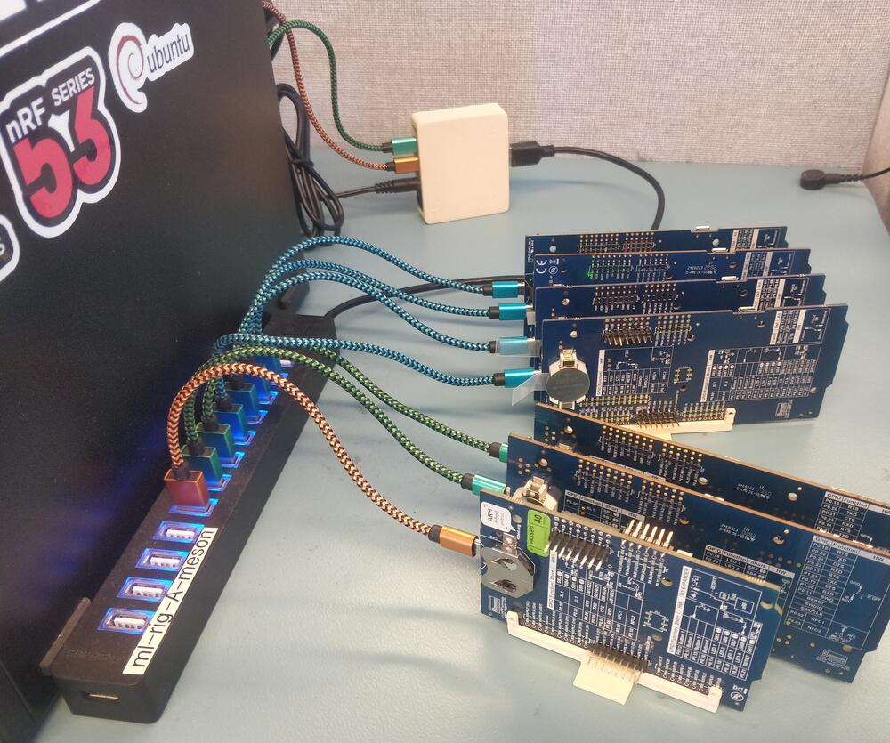
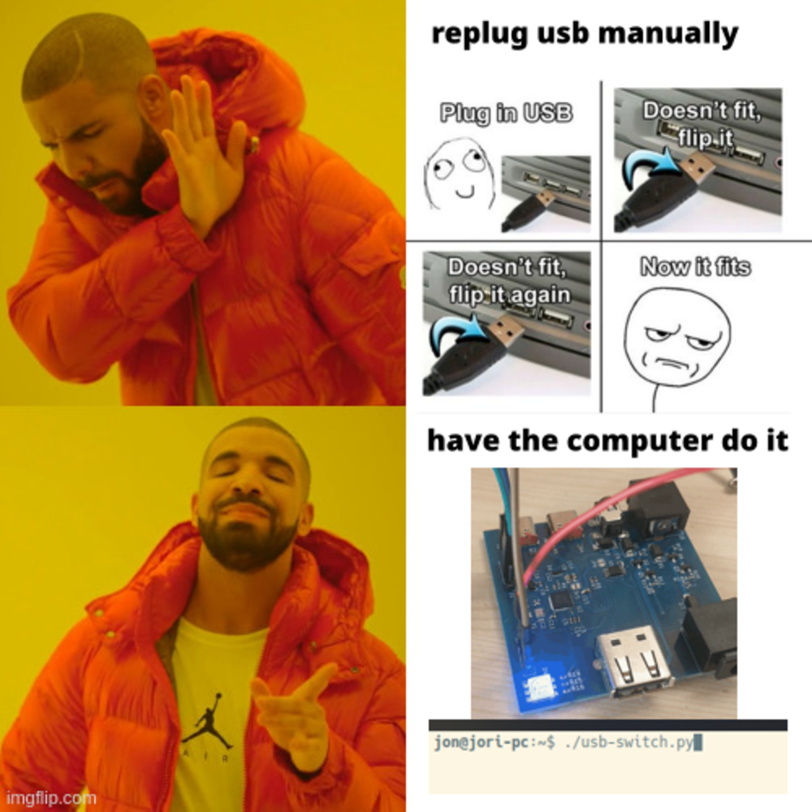
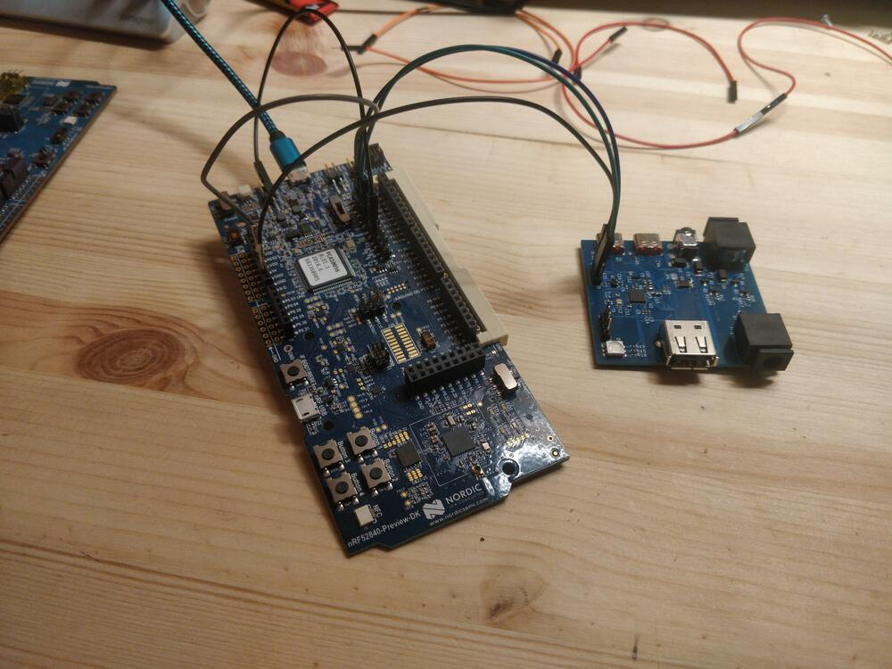
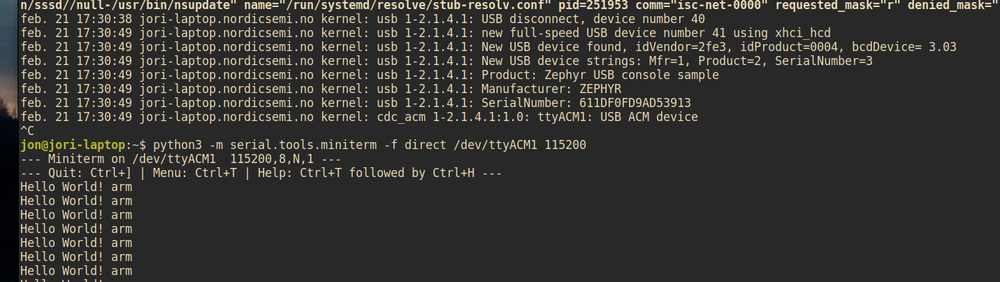

A USB-controlled USB power/data switch.

At my day job I usually have a bunch of development kits plugged in, used for hardware testing. I use a test framework/runner that used to be unstable, and put the DKs in a weird state. 

They had to be plugged out and back in before every test run. Which was super annoying, especially when working remotely. 
The software-only solutions, e.g. unbinding the driver were not enough, a full power-cycle was necessary.

So I made this device, that can cut the power AND the data lines of a USB port. It's controlled via another USB port (hence the two colored cables in the photo), over HID.

It can also switch an auxiliary power rail (up to 30V), in case the device is not powered from its USB port.

Hardware
--------

There are two configurations of the same PCB: one where the MCU is populated, and connects thru an USB control interface, and another which is only passive and is controlled by GPIOs. 
That way, a 'controller' board can control a bunch of 'peripheral' boards, that are cheaper and easier to build.

- Soc/MCU: nRF52820
- USB data switch: FSUSB30MUX

I also made a simple 3d-printed clamshell case.

Software
--------

The MCU uses zephyr RTOS - very much overkill, a simple attiny + V-USB would've been fine - and communicates to the PC using USB HID, which needs no drivers. 

A very basic python script then sends commands, e.g. 'reset', 'turn on aux', etc.

Flashed using another dev kit as jtag probe:

Apart from some hiccups with the DCDC and crystal configuration (has a diff cfg than the devkit), I was pretty happy to see it boot and see the blinky :)



Project files
-------------

[schematic](files/usb-switch.pdf)

[3d files](files/3d.zip)

[kicad project](files/kicad.zip)

[python script](files/usb-switch.py)

[firmware](files/app.zip)
